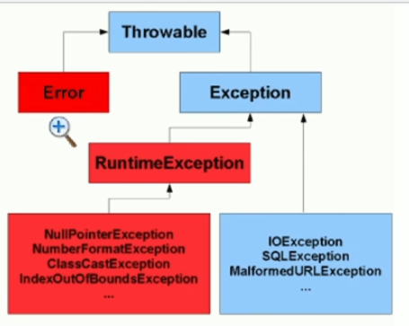
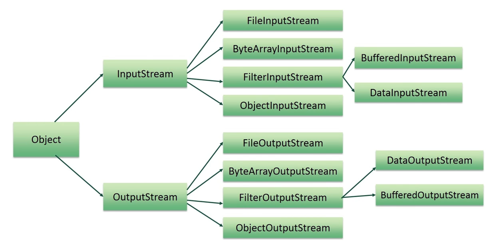
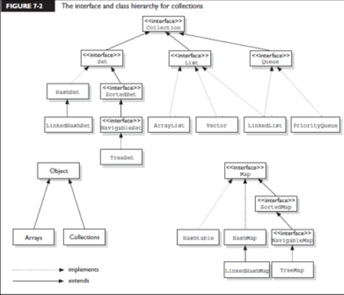
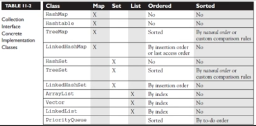

# Maratona Java - O maior curso Java em português.

[Canal Youtube DevDojo](https://www.youtube.com/playlist?list=PL62G310vn6nHrMr1tFLNOYP_c73m6nAzL)


---

### <a name="indice">Índice</a>

- [Aula 00: Introdução ao curso](#parte1)
- [Aula 01: Como JAVA funciona](#parte2)
- [Aula 02: Como instalar JAVA no windows](#parte3)
- [Aula 03: Executando o processo de compilação manualmente](#parte4)
- [Aula 04: Download do ambiente de desenvolvimento](#parte5)
- [Aula 05: Tipos primitivos, convenções de código e comentários](#parte6)
- [Aula 06: Continuação tipos primitivos, exercício e operadores](#parte7)
- [Aula 07: Operador resto e operadores de comparação](#parte8)
- [Aula 08: com.devdojo.introducao.br.com.abc.introducao.operadores.Operadores Lógicos](#parte9)
- [Aula 09: com.devdojo.introducao.br.com.abc.introducao.operadores.Operadores de Atribuição](#parte10)
- [Aula 10: Controle de fluxo if, else if e else](#parte11)
- [Aula 11: Controle de fluxo: Tabela verdade e mais.](#parte12)
- [Aula 12: Controle de fluxo Resolução do exercício if else](#parte13)
- [Aula 13: Controle de fluxo switch e exercícios](#parte14)
- [Aula 14: Controle de fluxo - Solução do exercício](#parte15)
- [Aula 15: Controle de fluxo for, while, do while](#parte16)
- [Aula 16: Exercício estrutura de repetição](#parte17)
- [Aula 17: Comando break and continue](#parte18)
- [Aula 18: Arrays parte 1](#parte19)
- [Aula 19: Arrays parte 2](#parte20)
- [Aula 20: Arrays parte 3 foreach](#parte21)
- [Aula 21: Arrays parte 4 arrays multidimencionais](#parte22)
- [Aula 22: Arrays parte 5 arrays multidimencionais](#parte23)
- [Aula 23: Introdução a pacotes](#parte24)
- [Aula 24: Introdução a classes parte 1](#parte25)
- [Aula 25: Introdução a classes parte 2 + exercício](#parte26)
- [Aula 26: Solução do exercício introdução a classes](#parte27)
- [Aula 27: Introdução a métodos](#parte28)
- [Aula 28: Métodos com parâmetros](#parte29)
- [Aula 29: Retorno de métodos parte 01](#parte30)
- [Aula 30: Retorno de métodos parte 02](#parte31)
- [Aula 31: Métodos com parâmetros tipo reference pt 01](#parte32)
- [Aula 32: Passagem de objeto como parâmetro e this pt 02](#parte33)
- [Aula 33: Passagem de parâmetros varargs](#parte34)
- [Aula 34: Introdução a UML](#parte35)
- [Aula 35: Exercício sobre métodos](#parte36)
- [Aula 36: Modificador de acesso private, get e set pt 01](#parte37)
- [Aula 37: Modificador de acesso private, get e set pt 02](#parte38)
- [Aula 38: Sobrecarga de métodos](#parte39)
- [Aula 39: Construtores e sobrecarga de construtores pt 01](#parte40)
- [Aula 40: Construtores e sobrecarga de construtores pt 02](#parte41)
- [Aula 41: Blocos de inicialização](#parte42)
- [Aula 42: Modificador static](#parte43)
- [Aula 43: Métodos Estáticos](#parte44)
- [Aula 44: Bloco de inicialização](#parte45)
- [Aula 45: UML e Associação de classes](#parte46)
- [Aula 46: Exercício associação pt 01](#parte47)
- [Aula 47: Exercício associação pt 02](#parte48)
- [Aula 48: Exercício associação de classes pt 03](#parte49)
- [Aula 49: Exercício associação pt 04](#parte50)
- [Aula 50: Herança pt 01](#parte51)
- [Aula 51: Herança parte 2 e referência super](#parte52)
- [Aula 52: Herança e Modificador Protected pt 03](#parte53)
- [Aula 53: Herança e construtores pt 04](#parte54)
- [Aula 54: Herança e Sequência de inicialização pt 05](#parte55)
- [Aula 55: Sobrescrita de métodos](#parte56)
- [Aula 56: Modificador Final](#parte57)
- [Aula 57: Enumeração pt 01](#parte58)
- [Aula 58: Enumeração pt 02](#parte59)
- [Aula 59: Enumeração pt 03](#parte60)
- [Aula 60: Classes abstratas pt 01](#parte61)
- [Aula 61: Classes abstratas pt 02](#parte62)
- [Aula 62: Interfaces pt 01](#parte63)
- [Aula 63: Interfaces pt 02](#parte64)
- [Aula 64: Polimorfismo pt 01](#parte65)
- [Aula 65: Polimorfismo pt 02](#parte66)
- [Aula 66: Polimorfismo pt 03](#parte67)
- [Aula 67: Exceptions pt 01](#parte68)
- [Aula 68: Exceptions pt 02](#parte69)
- [Aula 69: Exceptions: Exceções checked pt 03](#parte70)
- [Aula 70: Exceptions: lançamento de exceção pt 04](#parte71)
- [Aula 71: Exceptions: bloco finally pt 05](#parte72)
- [Aula 72: Tratamento de multiplas exceções pt 06](#parte73)
- [Aula 73: Exceptions: Multi-catch pt 07](#parte74)
- [Aula 74 : Exceptions: try-with-resources pt 08](#parte75)
- [Aula 75: Exceptions customizadas pt 09](#parte76)
- [Aula 76: Exceptions e regras para sobrescrita pt 10](#parte77)
- [Aula 77: Assertivas](#parte78)
- [Aula 78: Classes Wrapper pt 01](#parte79)
- [Aula 79: Classes Wrapper pt 02](#parte80)
- [Aula 80: String pt 01](#parte81)
- [Aula 81: String pt 02](#parte82)
- [Aula 82: Performance das Strings](#parte83)
- [Aula 83: StringBuilder and StringBuffer](#parte84)
- [Aula 84: Datas com Date e Calendar](#parte85)
- [Aula 85: Formatação de datas com DateFormat](#parte86)
- [Aula 86: Internacionalização com a classe Locale](#parte87)
- [Aula 87: Formatação de números e moeda com NumberFormat](#parte88)
- [Aula 88: Datas personalizadas com SimpleDateFormat](#parte89)
- [Aula 89: Expressões regulares pt 01](#parte90)
- [Aula 90: Expressões regulares pt 02](#parte91)
- [Aula 91: Expressões regulares pt 03](#parte92)
- [Aula 92: Expressões regulares pt 04](#parte93)
- [Aula 93: Expressões regulares pt 05](#parte94)
- [Aula 94: Expressões regulares pt 06](#parte95)
- [Aula 95: Tokens e Delimitadores com String e Scanner](#parte96)
- [Aula 96: Resource Bundles pt 01](#parte97)
- [Aula 97: Resource Bundles pt 02](#parte98)
- [Aula 98: IO pt 01 Classe File para arquivos](#parte99)
- [Aula 99: IO pt 02 FileWriter e FileReader](#parte100)
- [Aula 100: IO pt 03 BufferedWriter e BufferedReader](#parte101)
- [Aula 101: IO pt 04 Classe File para diretórios](#parte102)
- [Aula 102: IO pt 05 Classe Console](#parte103)
- [Aula 103: NIO pt 01 Introdução as novas classes Path, Paths, Files](#parte104)
- [Aula 104: NIO pt 02 Uso básico das classes Path, Paths, Files](#parte105)
- [Aula 105: NIO pt 03 Normalizando paths](#parte106)
- [Aula 106: NIO pt 04 Resolvendo paths](#parte107)
- [Aula 107: NIO pt 05 Relativizando paths](#parte108)
- [Aula 108: NIO pt 06 BasicFileAttributes e BasicFileAttributeView](#parte109)
- [Aula 109: NIO pt 07 DosFileAttributes e DosFileAttributeView](#parte110)
- [Aula 110: NIO pt 08 PosixFileAttributes e PosixFileAttributeView](#parte111)
- [Aula 111: NIO pt 09 DirectoryStream e SimpleFileVisitor](#parte112)
- [Aula 112: NIO pt 10 PathMacther](#parte113)
- [Aula 113: IO pt 06 InputStream e OutputStream](#parte114)
- [Aula 114: NIO pt 11 Zipando arquivos com Java](#parte115)
- [Aula 115: Serialização](#parte116)
- [Aula 116: Coleções pt 01 método equals()](#parte117)
- [Aula 117: Coleções pt 02 método hashCode](#parte118)
- [Aula 118: Coleções pt 03 Introdução as coleções](#parte119)
- [Aula 119: Coleções pt 04 Lists pt 01](#parte120)
- [Aula 120: Coleções pt 05 Lists pt 02](#parte121)
- [Aula 121: Coleções pt 06 Ordenação de listas com Comparable](#parte122)
- [Aula 122: Coleções pt 07 Ordenação de listas e arrays com Comparator](#parte123)
- [Aula 123: Coleções pt 08 Busca binária em Lists e Arrays](#parte124)
- [Aula 124: Coleções pt 09 Convertendo Arrays em List e List em Arrays](#parte125)
- [Aula 125: Coleções pt 10 Removendo elementos da lista com Iterator](#parte126)
- [Aula 126: Coleções pt 11 Set, HashSet e LinkedHashSet](#parte127)
- [Aula 127: Coleções pt 12 NavigableSet e TreeSet](#parte128)
- [Aula 128: Coleções pt 13 Map, HashMap e LinkedHashMap pt 01](#parte129)
- [Aula 129: Coleções pt 14 Map, HashMap e LinkedHashMap pt 02](#parte130)
- [Aula 130: Coleções pt 15 NavigableMap e TreeMap](#parte131)
- [Aula 131: Coleções pt 16 Queue e PriorityQueue](#parte132)
- [Aula 132: Generics pt 01 O que são Generics](#parte133)
- [Aula 133: Generics pt 02 Wildcard Caracter coringa](#parte134)
- [Aula 134: Generics pt 03 Classes genéricas](#parte135)
- [Aula 135: Generics pt 04 Métodos genéricos](#parte136)
- [Aula 136: Inner Classes pt 01 Classe Interna aninhada](#parte137)
- [Aula 137: Inner Classes pt 02 Classe Interna local](#parte138)
- [Aula 138: Inner Classes pt 03 Classes Anônimas](#parte139)
- [Aula 139: Inner Classes pt 04 Classes Internas Estáticas](#parte140)
- [Aula 140: JBDC pt 01 Instalando o banco de dados MySQL](#parte141)
- [Aula 141: JBDC pt 02 Criando o banco e as tabelas](#parte142)
- [Aula 142: JBDC pt 03 Criando conexão com o banco de dados](#parte143)
- [Aula 143: JBDC pt 04 Inserindo dados no banco com Statement](#parte144)
- [Aula 144: JBDC pt 05 Atualizando e excluindo dados com Statement](#parte145)
- [Aula 145: JBDC pt 06 ResultSet pt 01 - Selecionando registros](#parte146)
- [Aula 146: JBDC pt 07 ResultSet pt 02 - Tipos de ResultSet e metadados](#parte147)
- [Aula 147: JBDC pt 08 ResultSet pt 03 - Métodos para posicionamento do cursor](#parte148)
- [Aula 148: JBDC pt 09 RS pt 04 Atualizando registros através do ResultSet](#parte149)
- [Aula 149: JBDC pt 10 PreparedStatement](#parte150)
- [Aula 150: JBDC pt 11 Procedures e funções no banco com CallableStatement](#parte151)
- [Aula 151: JBDC pt 12 Connected RowSet - JdbcRowSet](#parte152)
- [Aula 152: JBDC pt 13 Disconnected RowSet - CachedRowSet](#parte153)
- [Aula 153: JBDC pt 14 Transações](#parte154)
- [Aula 154: JBDC pt 15 CRUD pt 01](#parte155)
- [Aula 155: JBDC pt 16 CRUD pt 02](#parte156)
- [Aula 156: Threads pt 01 O que são e como criar](#parte157)
- [Aula 157: Thread pt 02 Thread states](#parte158)
- [Aula 158: Threads pt 03 Parando a execução com Sleep, Yield e Join](#parte159)
- [Aula 159: Threads pt 04: Sincronismo de código pt 01](#parte160)
- [Aula 160: Sincronismo de código e Deadlock pt 02](#parte161)
- [Aula 161: Threads pt 06: Interação de Threads com wait, notify e notifyAll](#parte162)
- [Aula 162: Concorrência pt 01: Variáveis atômicas](#parte163)
- [Aula 163: Concorrência pt 02: Lock e ReentrantLock](#parte164)
- [Aula 164: Concorrência pt 03: Conditions](#parte165)
- [Aula 165: Concorrência pt 04 : ReentrantReadWriteLock](#parte166)
- [Aula 166: Concorrência pt 05: CopyOnWriteArrayList](#parte167)
- [Aula 167: Concorrência pt 06: Coleções Concorrentes](#parte168)
- [Aula 168: Concorrência pt 07: Blocking Queues](#parte169)
- [Aula 169: Concorrência pt 08: Executors pt 01 Thread Pools](#parte170)
- [Aula 170: Concorrência pt 09: Executors pt 02 Scheduled Thread Pool](#parte171)
- [Aula 171: Concorrência pt 10: Interface Callable](#parte172)
- [Aula 172: Padrões de projeto pt 01: Padrão Builder](#parte173)
- [Aula 173: Padrões de projeto pt 02: Padrão Singleton](#parte174)
- [Aula 174: Padrões de projeto pt 03: Padrão DAO](#parte175)
- [Aula 175: Padrões de projeto pt 04: Padrão Factory](#parte176)
- [Aula 176: Java 8 Parametrizando comportamentos](#parte177)
- [Aula 177: Java 8 Programação Funcional e Lambdas pt 01](#parte178)
- [Aula 178: Java 8 Programação Funcional e Lambdas pt 02](#parte179)
- [Aula 179: Java 8 Programação Funcional e Lambdas pt 03](#parte180)
- [Aula 180: Java 8 Programação Funcional e Lambdas pt 04 Method References](#parte181)
- [Aula 181: Java 8 Novas regras para Interfaces, métodos default](#parte182)
- [Aula 182: Java 8 Evitando NullPointerException com Optional pt 01](#parte183)
- [Aula 183: Java 8 Evitando NullPointerException com Optional pt 02](#parte184)
- [Aula 184: Java 8 Evitando NullPointerException com Optional pt 03](#parte185)
- [Aula 185: Java 8 Streams pt 01](#parte186)
- [Aula 186: Java 8 Streams pt 02](#parte187)
- [Aula 187: Java 8 Streams pt 03, map e flatmap](#parte188)
- [Aula 188: Java 8 Streams pt 04, Finding and matching](#parte189)
- [Aula 189: Java 8 Streams pt 05, Streams especializados (Streams primitivos)](#parte190)
- [Aula 190: Java 8 Streams pt 06, Gerando Streams](#parte191)
- [Aula 191: Java 8 Streams pt 07, Reduzindo e sumarizando Streams](#parte192)
- [Aula 192: Java 8 Streams pt 08, Agrupando Streams](#parte193)
- [Aula 193: Java 8 Parallel Streams pt 01, Introdução aos streams paralelos](#parte194)
- [Aula 194: Java 8 Parallel Streams pt 02, Quando utilizar streams paralelos](#parte195)
- [Aula 195: Java 8 CompletableFuture pt 01, Introdução a programação assíncrona](#parte196)
- [Aula 196: Java 8 CompletableFuture pt 02, Funcionamento do CompletableFuture](#parte197)
- [Aula 197: Java 8 CompletableFuture pt 03, Tratamento de exceções assíncronas](#parte198)
- [Aula 198: Java 8 CompletableFuture pt 04, Desempenho comparado aos Streams](#parte199)
- [Aula 199: Java 8 CompletableFuture pt 05, CompletableFuture Custom Executor](#parte200)
- [Aula 200: Java 8 CompletableFuture pt 06, Encadeando tarefas pt 01](#parte201)
- [Aula 201: Java 8 CompletableFuture pt 07, Encadeando tarefas pt 02](#parte202)
- [Aula 202: Java 8 CompletableFuture pt 08, Exibindo resultados dinamicamente](#parte203)
- [Aula 203: Java 8 Nova API DateTime LocalDate, LocalTime, LocalDateTime](#parte204)
- [Aula 204: Java 8 Nova API DateTime Instant, Duration and Period](#parte205)
- [Aula 205: Java 8 Nova API Manipulando datas de forma relativa](#parte206)
- [Aula 206: Java 8 Nova API DateTime, Fazendo ajustes temporais com TimeAdjuster](#parte207)
- [Aula 207: Java 8 Nova API DateTime, Formatação e parse](#parte208)
- [Aula 208: Java 8 Nova API DateTime, Trabalhando com Time Zones](#parte209)
- [FIM DO MARATONA?](#parte210)


---

## <a name="parte1">Aula 00: Introdução ao curso</a>

- https://www.youtube.com/watch?v=kkOSweUhGZM

[Voltar ao Índice](#indice)

---

## <a name="parte2">Aula 01: Como JAVA funciona</a>

- https://www.youtube.com/watch?v=DlZJw7TXj2g


[Voltar ao Índice](#indice)

---

## <a name="parte3">Aula 02: Como instalar JAVA no windows</a>

- https://www.youtube.com/watch?v=TcqICLuUuyA

[Voltar ao Índice](#indice)

---

## <a name="parte4">Aula 03: Executando o processo de compilação manualmente</a>

- https://www.youtube.com/watch?v=eV3mj1LOJqE

```java
public class OlaMundo {
    public static void main(String[] args) {
        System.out.println("Olá");
    }
}
```
1 - > javac OlaMundo.java  
2 - > java OlaMundo  


[Voltar ao Índice](#indice)

---

## <a name="parte5">Aula 04: Download do ambiente de desenvolvimento</a>

- https://www.youtube.com/watch?v=blYNhqo7yhk

- https://www.jetbrains.com/

```java
public class OlaMundo {
    public static void main(String[] args) {
        System.out.println("Olá na IDE");
    }
}
```

shift + F10 -> compila!


[Voltar ao Índice](#indice)

---

## <a name="parte6">Aula 05: Tipos primitivos, convenções de código e comentários</a>

- https://www.youtube.com/watch?v=g-_NSf0e0z8

```java
public class ImprimindoVariaveis {
    public static void main(String[] args) {
        /* Comentário
        * de várias
        * linhas
        * */
        //Comentário
        /***
         * Comentário de Doc oficial
         * @param parametro de entrada
         * */

        int idade = 34;
        int idadeDosPais = 66;
        System.out.println("Dados impressos");
        System.out.println(idade);
        System.out.println(idadeDosPais);
        System.out.println("Dados impressos" + idade);
    }
}

```

Crtl + Shift + F10 -> Compila .java atual


[Voltar ao Índice](#indice)

---

## <a name="parte7">Aula 06: Continuação tipos primitivos, exercício e operadores</a>

Prática

```java
public class RelatorioPendenci {
    public static void main(String[] args) {
        String nome = "Bulma";
        String endereco = "Rua Tal tal tal ";
        String telefone = "(91)9999-8888";
        System.out.println("O "+nome+" endereço "+ endereco + " e telefone: "+telefone+ " não possui pendencias");
    }
}

```

br.com.abc.introducao.operadores.Operadores

```java
public class br.com.abc.introducao.operadores.Operadores {
    public static void main(String[] args) {
        int numero1 = 10;
        int numero2 = 20;
        int soma = numero1 + numero2;
        System.out.println(numero1+ numero2+ " Soma antes depois " + numero1 + numero2);
        System.out.println(numero1+ numero2 + " soma antes");
        System.out.println("soma depois " + numero1+ numero2);
        System.out.println("Total " + (numero1/numero2));
    }
}

```

[Voltar ao Índice](#indice)

---

## <a name="parte8">Aula 07: Operador resto e operadores de comparação</a>

- https://www.youtube.com/watch?v=GRAKRcbzEpo

```java
public class br.com.abc.introducao.operadores.Operadores {
    public static void main(String[] args) {
        System.out.println("Resto da divisão = " + (21 % 2));
    }
}

```

```java
public class br.com.abc.introducao.operadores.OperadoresComparacao {
    public static void main(String[] args) {
        boolean dezMaiorQueVinte = 10 > 20;
        boolean dezMenorQueVinte = 10 < 20;

        System.out.println(dezMaiorQueVinte);
        System.out.println(dezMenorQueVinte);
        System.out.println( 5 == 5);
        System.out.println( 5 != 5);
    }
}

```


[Voltar ao Índice](#indice)

---

## <a name="parte9">Aula 08: br.com.abc.introducao.operadores.Operadores Lógicos</a>

- https://www.youtube.com/watch?v=8dlThWq56DM

```java
public class br.com.abc.introducao.operadores.OperadoresLogicos {
    public static void main(String[] args) {
        int idade = 18;
        float salario = 2000f;

        System.out.println(idade >= 16 && salario >= 2000);
        System.out.println(idade <= 16 && salario >= 2000);
        System.out.println(idade >= 16 || salario >= 2000);
    }
}

```

[Voltar ao Índice](#indice)

---

## <a name="parte10">Aula 09: br.com.abc.introducao.operadores.Operadores de Atribuição</a>

- https://www.youtube.com/watch?v=hp1iYAoywc8

```java
public class br.com.abc.introducao.operadores.OperadoresAtribuicao {
    public static void main(String[] args) {
        // = , -= , += , /= , %=

        int salario = 1000;
        //salario = salario + 200;
        //salario += 200;
        salario = salario + (int)(salario * 0.2);
        int numero = 11;
        numero %= 2;

        System.out.println(salario);
        System.out.println(numero);

    }
}

```

[Voltar ao Índice](#indice)

---

## <a name="parte11">Aula 10: Controle de fluxo if, else if e else</a>

- https://www.youtube.com/watch?v=JwNYr5HBYkI

```java
public class br.com.abc.introducao.controlefluxo.ControleFluxo1 {
    public static void main(String[] args) {
        // idade < 15 categoria infantil
        // idade >= 15 && idade < 18 juvenil
        // udade >= 18 adulto
        int idade = 18;
        String categoria = "";
        if(idade < 15){
            categoria = "Infantil";
        }else if(idade >= 15 && idade < 18){
            categoria = "Juvenil";
        }else{
            categoria = "Adulto";
        }
        System.out.println(categoria);

    }
}

```

[Voltar ao Índice](#indice)

---

## <a name="parte12">Aula 11: Controle de fluxo: Tabela verdade e mais</a>

```java
public class br.com.abc.introducao.controlefluxo.ControleFluxo2 {
    public static void main(String[] args) {
        int idade = 15;
        String status;
        status = idade < 10 ? "Não adulto" : "Adulto";
        System.out.println(status);
    }
}

```

[Voltar ao Índice](#indice)

---

## <a name="parte13">Aula 12: Controle de fluxo Resolução do exercício if else</a>

```java
public class br.com.abc.introducao.controlefluxo.ExercicioControleFluxo {
    public static void main(String[] args) {
        /*
         * Crie uma variável salario e imprima seu imposto
         * Imposto:
         * salario < 1000 5%
         * salario >= 1000 && salario < 2000 10$
         * salario >= 2000 && salario < 4000 15%
         * salario > 5000 20%
         * */
        double salario = 900;
        double totalImposto = 0;

        if (salario < 1000) {
            totalImposto = salario * 0.05;
        } else if (salario >= 1000 && salario < 2000) {
            totalImposto = salario * 0.1;
        } else if (salario >= 2000 && salario < 4000) {
            totalImposto = salario * 0.15;
        } else {
            totalImposto = salario * 0.2;
        }
        System.out.println("O total de impostos = " + totalImposto);

    }
}

```

[Voltar ao Índice](#indice)

---

## <a name="parte14">Aula 13: Controle de fluxo switch e exercícios</a>

```java
public class br.com.abc.introducao.controlefluxo.ControleFluxo3 {
    public static void main(String[] args) {
        byte dia = 2;
        switch (dia) {
            case 1:
                System.out.println("Domingo");
                break;
            case 2:
                System.out.println("Segunda");
                break;
            case 3:
                System.out.println("Terça");
                break;
            case 4:
                System.out.println("Quarta");
                break;
            case 5:
                System.out.println("Quinta");
                break;
            case 6:
                System.out.println("Sexta");
                break;
            case 7:
                System.out.println("Sábado");
                break;
            default:
                System.out.println("Opção Inválida!");
                break;
        }
    }
}

```

```java
public class br.com.abc.introducao.controlefluxo.ExercicioControleFluxo3 {
    /*  Crie um switch que dado um valor de 1 a 7
    *   considerando 1 domingo imprima se é dia util ou dia de semana 
    */
}

```

[Voltar ao Índice](#indice)

---

## <a name="parte15">Aula 14: Controle de fluxo - Solução do exercício</a>

```java
public class br.com.abc.introducao.controlefluxo.ExercicioControleFluxo3 {
    /*  Crie um switch que dado um valor de 1 a 7
     *   considerando 1 domingo imprima se é dia util ou dia de semana
     **/
    public static void main(String[] args) {
        byte dia = 7;
        switch (dia) {
            case 1:
            case 7:
                System.out.println("Final de semana");
                break;
            case 2:
            case 3:
            case 4:
            case 5:
            case 6:
                System.out.println("Dia Últil");
                break;
            default:
                System.out.println("Opção inválida");

        }
    }
}

```

- https://pastebin.com/R5daUuuL

```java
import java.util.Scanner;

public class br.com.abc.introducao.controlefluxo.ExercicioControleFluxo31 {
    static void show(String mensagem) {
        System.out.printf(mensagem + "\n");
    }

    static Scanner Scanner() {
        return new Scanner(System.in);
    }

    public static void main(String[] args) {
        String[] DiaDaSemana = {"Domingo", "Segunda", "Quarta", "Quinta", "Sexta", "Sábado"};
        show("Digite um dia da semana");

        int dia = Scanner().nextInt();

        System.out.println();

        switch (dia) {
            case 0:
            case 1:
            case 2:
            case 3:
            case 4:
                show("Dia útil");
                break;
            case 5:
                show("Final de Semana");
                break;
            case 6:
                show("Dia útil");
                break;
            default:
                show("Inválido");

        }

    }
}


```


[Voltar ao Índice](#indice)

---

## <a name="parte16">Aula 15: Controle de fluxo for, while, do while</a>

```java
public class br.com.abc.introducao.controlefluxo.ControleFluxo04 {
    public static void main(String[] args) {
        int contador = 9;

        while(contador < 10){
            System.out.println(++contador);
        }

        do{
            System.out.println("Dentro do DO while");
        }while (contador < 10);

        for(int i = 0; i < 10; i++){
            System.out.println("Vador do i =" + i);
        }
    }
}

```

[Voltar ao Índice](#indice)

---

## <a name="parte17">Aula 16: Exercício estrutura de repetição</a>


- br.com.abc.introducao.controlefluxo.ControleFluxo04.java 

```java
public class br.com.abc.introducao.controlefluxo.ControleFluxo04 {
    public static void main(String[] args) {
        int contador = 9;

        while (contador < 10) {
            System.out.println(++contador);
        }
        contador = 0;
        do {
            System.out.println("Dentro do DO while, cont = " + contador++);
        } while (contador < 10);

        for (int i = 0; i < 10; i++) {
            System.out.println("Vador do i =" + i);
            if (i == 5) {
                break;
            }
        }
    }
}

```
- br.com.abc.introducao.controlefluxo.ExercicioControleFluxo4.java

```java
public class br.com.abc.introducao.controlefluxo.ExercicioControleFluxo4 {

    public static void main(String[] args) {
        // imprima todos os numero pares de 0 até 100000

        int valor = 10000000;
        for (int i = 0 ; i<= valor ; i++){
            if(i % 2 == 0){
                System.out.println(i);
            }
        }

    }
}

```


[Voltar ao Índice](#indice)

---

## <a name="parte18">Aula 17: Comando break and continue</a>


- br.com.abc.introducao.controlefluxo.ControleFluxo5.java

```java
public class br.com.abc.introducao.controlefluxo.ControleFluxo5 {
    public static void main(String[] args) {
        /* Dado um valor de um carro, descubra em quantas vezes ele pode ser parcelado
         * Porém as parcelas não podem ser menores do que 1.000 */

        double valorTotal = 30000;
        for(int parcela = 1 ; parcela <= valorTotal ; parcela++){
            double valorParcela = valorTotal/parcela;
            if(valorParcela < 1000){
                break;
            }
            System.out.println("Parcela "+ parcela + " R$ "+ valorParcela);

        }

    }
}

```

- br.com.abc.introducao.controlefluxo.ControleFluxo6.java

```java
public class br.com.abc.introducao.controlefluxo.ControleFluxo6 {
    public static void main(String[] args) {
        /* Dado um valor de um carro, descubra em quantas vezes ele pode ser parcelado
         * Porém as parcelas não podem ser menores do que 1.000 */

        double valorTotal = 30000;
        for(int parcela = (int) valorTotal ; parcela >= 1 ; parcela--){
            double valorPacela = valorTotal / parcela;
            if(valorPacela <= 1000){
                continue;
            }
            System.out.println("Parcela "+ parcela + " R$ "+ valorPacela);

        }


    }
}

```

[Voltar ao Índice](#indice)

---


## <a name="parte19">Aula 18: Arrays parte 1</a>

```java
public class br.com.abc.introducao.arrays.Arrays1 {
    public static void main(String[] args) {
        int[] idades = new int[3];
        idades[0] = 10;
        idades[1] = 1;
        idades[2] = 30;

        System.out.println("Idade " + idades[0]);
        System.out.println("Idade " + idades[1]);
        System.out.println("Idade " + idades[2]);
    }

}

```

[Voltar ao Índice](#indice)

---

## <a name="parte20">Aula 19: Arrays parte 2</a>

```java
public class br.com.abc.introducao.arrays.Arrays2 {
    public static void main(String[] args) {
        // byte, short, int, long, float, double = 0
        // char '\u0000' = ' '
        // boolean false
        // reference null

        String[] nomes = new String[3];
        nomes[0] = "Jose";
        nomes[1] = "Luciana";
        nomes[2] = "Luan";

        for( int i = 0; i < nomes.length; i++){
            System.out.println((i+ 1) + " - nome: "+ nomes[i]);
        }

    }
}

```

[Voltar ao Índice](#indice)

---

## <a name="parte21">Aula 20: Arrays parte 3 foreach</a>

```java
public class br.com.abc.introducao.arrays.Arrays3 {
    public static void main(String[] args) {
        int[] numeros = new int[5];
        int[] numeros1 = {1,2,3,4,5}; // tam = 5, index = 0 até 4
        int[] numweoa3 = new int[]{1,2,3,4,5};

        for(int i = 0; i< numeros1.length; i++){
            System.out.println(numeros1[i]);
        }

        for (int num : numweoa3) {
            System.out.println(num);
        }

    }
}

```

```java
public class br.com.abc.introducao.arrays.Arrays4 {
    public static void main(String[] args) {
        String[] nomes = {"jose", "luciana", "Barbosa"};
        for(String nome : nomes){
            System.out.println(nome);
        }
    }
}

```

[Voltar ao Índice](#indice)

---

## <a name="parte22">Aula 21: Arrays parte 4 arrays multidimensionais</a>

```java
public class br.com.abc.introducao.arrays.Arrays5 {
    public static void main(String[] args) {
        int[][] dias = new int[2][2];
        dias[0][0] = 30;
        dias[0][1] = 31;
        dias[1][0] = 12;
        dias[1][1] = 13;

        for (int i = 0 ; i < dias.length; i++ ){
            System.out.println("End. Mem: " + dias[i]);
            for (int j = 0; j < dias[i].length; j++) {
                System.out.println(dias[i][j]);
            }
        }

        System.out.println("----------------------");

        for (int[] ref : dias) {
            System.out.println("End. Mem: " + ref);
            for (int dia : ref) {
                System.out.println(dia);
            }
        }
    }
}

```

[Voltar ao Índice](#indice)

---

## <a name="parte23">Aula 22: Arrays parte 5 arrays multidimencionais</a>

```java
public class br.com.abc.introducao.arrays.Arrays6 {
    public static void main(String[] args) {
        int[] arrInt = {1,2,3};
        int[] arrInt2 = new int[3];
        int[] arrInt3 = new int[]{1,2,3};

        /*
        int[][] dias = new int[3][];
        dias[0] = new int[2];
        dias[1] = new int[]{1,2,3};
        dias[2] = new int[4];
        */

        int[][] dias = {{0,0},{1,2,3},{0,0,0,0}};
        // qua é o valor da posição [1,2] = 3

        for(int[] arr : dias){
            System.out.println("ref: "+ arr);
            for(int num : arr){
                System.out.println(num);
            }
        }
    }
}

```

[Voltar ao Índice](#indice)

---

## <a name="parte24">Aula 23: Introdução a pacotes</a>


[Voltar ao Índice](#indice)

---

## <a name="parte25">Aula 24: Introdução a classes parte 1</a>

```java
package br.com.abc.javacore.introducaoclasses.classes;

public class Estudante {
    public String nome;
    public String matricula;
    public int idade;

}


```
```java
package br.com.abc.javacore.introducaoclasses.testes;

import br.com.abc.javacore.introducaoclasses.classes.Estudante;

public class EstudanteTest {
    public static void main(String[] args) {
        Estudante jose = new Estudante();

        jose.nome = "José Malcher";
        jose.matricula = "201901";
        jose.idade = 34;

        System.out.println(jose.nome);
        System.out.println(jose.matricula);
        System.out.println(jose.idade);

    }
}

```

[Voltar ao Índice](#indice)

---

## <a name="parte26"> Aula 25: Introdução a classes parte 2 + exercício</a>

```java
package br.com.abc.javacore.introducaoclasses.classes;

public class Carro {
    public String placa;
    public String modelo;
    public float velocidadeMaxima;
}

```

```java
package br.com.abc.javacore.introducaoclasses.testes;

import br.com.abc.javacore.introducaoclasses.classes.Carro;

public class CarroTest {
    public static void main(String[] args) {
        Carro carro = new Carro();
        carro.modelo = "KA";
        carro.placa = "oju0101";
        carro.velocidadeMaxima = 200f;
        System.out.println(carro.modelo);
        System.out.println(carro.placa);
        System.out.println(carro.velocidadeMaxima);
    }
}

```

```java
package br.com.abc.javacore.introducaoclasses.classes;

/*
*   Crie os seguintes atributos para essa clase
*   Nome, matricula, rg, cpf
* */

public class Professor {

}

```


[Voltar ao Índice](#indice)

---

## <a name="parte27">Aula 26: Solução do exercício introdução a classes</a>


```java
package br.com.abc.javacore.introducaoclasses.testes;

import br.com.abc.javacore.introducaoclasses.classes.Professor;

public class ProfessorTest {
    public static void main(String[] args) {
        Professor prof1 = new Professor();
        prof1.nome = "jose";
        prof1.matricula = "123";
        prof1.rg = 321;
        prof1.cpf = "123.123.123-55";

        Professor prof2 = new Professor();
        prof2.nome = "Mario";
        prof2.matricula = "222";
        prof2.rg = 314;
        prof2.cpf = "321.321.122-11";

        System.out.println(prof1.nome);
        System.out.println(prof1.matricula);
        System.out.println(prof1.cpf);
        System.out.println(prof1.rg);

        System.out.println(prof2.nome);
        System.out.println(prof2.matricula);
        System.out.println(prof2.cpf);
        System.out.println(prof2.rg);

    }
}

```


[Voltar ao Índice](#indice)

---

## <a name="parte28">Aula 27: Introdução a métodos</a>

```java
package br.com.abc.javacore.introducaoMetodos.classes;

public class Calculadora {

    public void somaDoisNumeros(){
        System.out.println(5+5);
    }

    public void subtraiDoisNumeros(){
        System.out.println(5-5);
    }
}

```

```java
package br.com.abc.javacore.introducaoMetodos.testes;

import br.com.abc.javacore.introducaoMetodos.classes.Calculadora;

public class CalculadoraTest {
    public static void main(String[] args) {
        Calculadora calc = new Calculadora();
        calc.somaDoisNumeros();
        System.out.println("Continua...");
        calc.subtraiDoisNumeros();
        System.out.println("fim!");
    }
}

```

[Voltar ao Índice](#indice)

---

## <a name="parte29">Aula 28: Métodos com parâmetros</a>

```java
package br.com.abc.javacore.introducaoMetodos.classes;

public class Calculadora {

    public void somaDoisNumeros() {
        System.out.println(5 + 5);
    }

    public void subtraiDoisNumeros() {
        System.out.println(5 - 5);
    }

    public void multiplicaDoisNumero(double num1, int num2) {
        System.out.println(num1 * num2);
    }
}

```

```java
package br.com.abc.javacore.introducaoMetodos.testes;

import br.com.abc.javacore.introducaoMetodos.classes.Calculadora;

public class CalculadoraTest {
    public static void main(String[] args) {
        Calculadora calc = new Calculadora();
        calc.somaDoisNumeros();
        System.out.println("Continua...");
        calc.subtraiDoisNumeros();
        calc.multiplicaDoisNumero(2.2, 100);
        System.out.println("fim!");
    }
}

```

[Voltar ao Índice](#indice)

---

## <a name="parte30">Aula 29: Retorno de métodos parte 01</a>

```java
package br.com.abc.javacore.introducaoMetodos.classes;

public class Calculadora {

    public void somaDoisNumeros() {
        System.out.println(5 + 5);
    }

    public void subtraiDoisNumeros() {
        System.out.println(5 - 5);
    }

    public void multiplicaDoisNumero(double num1, int num2) {
        System.out.println(num1 * num2);
    }

    public double divideDoisNumeros(double num1, double num2) {
        return num1 / num2;
    }
}

```

```java
package br.com.abc.javacore.introducaoMetodos.testes;

import br.com.abc.javacore.introducaoMetodos.classes.Calculadora;

public class CalculadoraTest {
    public static void main(String[] args) {
        Calculadora calc = new Calculadora();
        System.out.println("Soma");
        calc.somaDoisNumeros();
        System.out.println("Subatração");
        calc.subtraiDoisNumeros();
        System.out.println("Multiplicação");
        calc.multiplicaDoisNumero(2.2, 100);

        System.out.println("Divisão");
        double result = calc.divideDoisNumeros(10,2);
        System.out.println(result);
        System.out.println(calc.divideDoisNumeros(20,2));

        System.out.println("fim!");
    }
}

```

[Voltar ao Índice](#indice)

---

## <a name="parte31">Aula 30: Retorno de métodos parte 02</a>

```java
package br.com.abc.javacore.introducaoMetodos.classes;

public class Calculadora {

    public void somaDoisNumeros() {
        System.out.println(5 + 5);
    }

    public void subtraiDoisNumeros() {
        System.out.println(5 - 5);
    }

    public void multiplicaDoisNumero(double num1, int num2) {
        System.out.println(num1 * num2);
    }

    public double divideDoisNumeros(double num1, double num2) {
        if(num2 != 0){
            return num1 / num2;
        }
        return 0;
    }
    public void imprimeDoisNumerosDivididos(double num1, double num2) {
        if(num2 != 0){
            System.out.println(num1/num2);
            return; // funciona como um bream em métodos void
        }
        System.out.println("Não é possível dividir por 0");
    }
}

```

```java
package br.com.abc.javacore.introducaoMetodos.testes;

import br.com.abc.javacore.introducaoMetodos.classes.Calculadora;

public class CalculadoraTest {
    public static void main(String[] args) {
        Calculadora calc = new Calculadora();
        System.out.println("Soma");
        calc.somaDoisNumeros();
        System.out.println("Subatração");
        calc.subtraiDoisNumeros();
        System.out.println("Multiplicação");
        calc.multiplicaDoisNumero(2.2, 100);

        System.out.println("Divisão");
        double result = calc.divideDoisNumeros(10,2);
        System.out.println(result);
        System.out.println(calc.divideDoisNumeros(20,2));

        System.out.println("Divisão");
        calc.imprimeDoisNumerosDivididos(10,2);
        calc.imprimeDoisNumerosDivididos(10,0);

        System.out.println("fim!");
    }
}

```

[Voltar ao Índice](#indice)

---


## <a name="parte32">Aula 31: Métodos com parâmetros tipo reference pt 01</a>

```java
package br.com.abc.javacore.introducaoMetodos.classes;

public class Calculadora {

    public void somaDoisNumeros() {
        System.out.println(5 + 5);
    }

    public void subtraiDoisNumeros() {
        System.out.println(5 - 5);
    }

    public void multiplicaDoisNumero(double num1, int num2) {
        System.out.println(num1 * num2);
    }

    public double divideDoisNumeros(double num1, double num2) {
        if(num2 != 0){
            return num1 / num2;
        }
        return 0;
    }
    public void imprimeDoisNumerosDivididos(double num1, double num2) {
        if(num2 != 0){
            System.out.println(num1/num2);
            return; // funciona como um bream em métodos void
        }
        System.out.println("Não é possível dividir por 0");
    }
    public void alteraDoisNumeros(int a, int b){
        a = 20;
        b = 30;
        System.out.println("Dentro do método alteraDoisNumeros");
        System.out.println("num 1 = " + a);
        System.out.println("num 2 = " + b);
    }
}

```

```java
package br.com.abc.javacore.introducaoMetodos.testes;

import br.com.abc.javacore.introducaoMetodos.classes.Calculadora;

public class ParametrosTest {
    public static void main(String[] args) {
        Calculadora calcu = new Calculadora();
        int num1 = 100;
        int num2 = 500;

        calcu.alteraDoisNumeros(num1, num2);

        System.out.println("Dentro do método Principal de Teste");
        System.out.println("num1 = "+ num1);
        System.out.println("num2 = "+ num2);
    }
}

```

```java
package br.com.abc.javacore.introducaoMetodos.classes;

public class Professor {
    public String nome;
    public String matricula;
    public Integer rg;
    public String cpf;

    public void imprime(Professor prof){
        System.out.println(prof.nome);
        System.out.println(prof.matricula);
        System.out.println(prof.cpf);
        System.out.println(prof.rg);
    }

}

```

```java
package br.com.abc.javacore.introducaoMetodos.testes;

import br.com.abc.javacore.introducaoMetodos.classes.Professor;

public class ProfessorTest {
    public static void main(String[] args) {
        Professor prof1 = new Professor();
        prof1.nome = "jose";
        prof1.matricula = "123";
        prof1.rg = 321;
        prof1.cpf = "123.123.123-55";

        Professor prof2 = new Professor();
        prof2.nome = "Mario";
        prof2.matricula = "222";
        prof2.rg = 314;
        prof2.cpf = "321.321.122-11";

        prof1.imprime(prof1);
        prof1.imprime(prof2);

        /*
        System.out.println(prof1.nome);
        System.out.println(prof1.matricula);
        System.out.println(prof1.cpf);
        System.out.println(prof1.rg);

        System.out.println(prof2.nome);
        System.out.println(prof2.matricula);
        System.out.println(prof2.cpf);
        System.out.println(prof2.rg);
        */
    }
}

```

[Voltar ao Índice](#indice)

---


## <a name="parte33">Aula 32: Passagem de objeto como parâmetro e this pt 02</a>


```java
package br.com.abc.javacore.introducaoMetodos.classes;

public class Professor {
    public String nome;
    public String matricula;
    public Integer rg;
    public String cpf;

    public void imprime(){
        System.out.println(this.nome);
        System.out.println(this.matricula);
        System.out.println(this.cpf);
        System.out.println(this.rg);
    }

}

```

```java
package br.com.abc.javacore.introducaoMetodos.testes;

import br.com.abc.javacore.introducaoMetodos.classes.Professor;

public class ProfessorTest {
    public static void main(String[] args) {
        Professor prof1 = new Professor();
        prof1.nome = "jose";
        prof1.matricula = "123";
        prof1.rg = 321;
        prof1.cpf = "123.123.123-55";

        Professor prof2 = new Professor();
        prof2.nome = "Mario";
        prof2.matricula = "222";
        prof2.rg = 314;
        prof2.cpf = "321.321.122-11";

        prof1.imprime();
        prof2.imprime();
    }
}

```


[Voltar ao Índice](#indice)

---


## <a name="parte34">Aula 33: Passagem de parâmetros varargs</a>

```java
    public void somaArray(int[] numeros) {
        int soma = 0;
        for (int num : numeros) {
            soma += num;
        }
        System.out.println(soma);
    }

    //public void somaVarArgs(String valorDouble, int... numeros) {
    public void somaVarArgs(int... numeros) {
        int soma = 0;
        for (int num : numeros) {
            soma += num;
        }
        System.out.println(soma);
    }
```

```java
 System.out.println("Var Args");

        int[] numeros = {1,2,3,4,5};
        calc.somaArray(numeros);
        calc.somaVarArgs(1,2,3,4,5);

```


[Voltar ao Índice](#indice)

---


## <a name="parte35">Aula 34: Introdução a UML</a>

- http://www.agilemodeling.com/essays/umlDiagrams.htm

- https://www.devmedia.com.br/orientacoes-basicas-na-elaboracao-de-um-diagrama-de-classes/37224

[Voltar ao Índice](#indice)

---


## <a name="parte36"> Aula 35: Exercício sobre métodos</a>

q) Crie uma classe estudante com os seguintes atributos: nome, idade, notas (três notas)
Crie um métod opara imprimir os dados e tirar a média desse aluno,
caso a média seja maior que 6, imprimir aprovado, senão reprovado.

```java
package br.com.abc.javacore.introducaoMetodos.classes;

public class Estudante {
    public String nome;
    public int idade;
    public double[] notas;

    public void print(){
        System.out.println("Nome: " + this.nome);
        System.out.println("Idade: " + this.idade);
        if(notas != null){
            for (double nota: notas) {
                System.out.println("Notas: " + nota);
            }
        }
    }

    public void calcMedia(){
        if(notas == null){
            System.out.println("Esse aluno não possuí notas!!");
            return;
        }
        double media = 0;
        for (double nota : notas){
            media = media + nota; // media += nota
        }

        media = media / notas.length;

        if(media > 6){
            System.out.println("A média é: "+media+"   !!! APROVADO !!!");
        }else{
            System.out.println("A média é: "+media+" ...RERPROVADO!");
        }
    }
}

```

```java
package br.com.abc.javacore.introducaoMetodos.testes;

import br.com.abc.javacore.introducaoMetodos.classes.Estudante;

public class EstudanteTest {
    public static void main(String[] args) {
        Estudante estudante = new Estudante();
        estudante.nome =  "José Malcher JR;";
        estudante.idade = 34;
        //estudante.notas = new double[]{5,5,4.1};
        estudante.print();
        estudante.calcMedia();
    }
}

```


[Voltar ao Índice](#indice)

---


## <a name="parte37">Aula 36: Modificador de acesso private, get e set pt 01</a>

```java
package br.com.abc.javacore.introducaoMetodos.classes;

public class Estudante {
    private String nome;
    private int idade;
    private double[] notas;

    public void print(){
        System.out.println("Nome: " + this.getNome());
        System.out.println("Idade: " + this.getIdade());
        if(getNotas() != null){
            for (double nota: getNotas()) {
                System.out.println("Notas: " + nota);
            }
        }
    }

    public void calcMedia(){
        if(getNotas() == null){
            System.out.println("Esse aluno não possuí notas!!");
            return;
        }
        double media = 0;
        for (double nota : getNotas()){
            media = media + nota; // media += nota
        }

        media = media / getNotas().length;

        if(media > 6){
            System.out.println("A média é: "+media+"   !!! APROVADO !!!");
        }else{
            System.out.println("A média é: "+media+" ...RERPROVADO!");
        }
    }


    public String getNome() {
        return nome;
    }

    public void setNome(String nome) {
        this.nome = nome;
    }

    public int getIdade() {
        return idade;
    }

    public void setIdade(int idade) {
        this.idade = idade;
    }

    public double[] getNotas() {
        return notas;
    }

    public void setNotas(double[] notas) {
        this.notas = notas;
    }
}

```

```java
package br.com.abc.javacore.introducaoMetodos.testes;

import br.com.abc.javacore.introducaoMetodos.classes.Estudante;

public class EstudanteTest {
    public static void main(String[] args) {
        Estudante estudante = new Estudante();
        estudante.setNome("José Malcher JR");
        estudante.setIdade(34);
        estudante.setNotas(new double[]{5,10,4.1});
        estudante.print();
        estudante.calcMedia();
    }
}

```


[Voltar ao Índice](#indice)

---


## <a name="parte38">Aula 37: Modificador de acesso private, get e set pt 02</a>

```java
package br.com.abc.javacore.introducaoMetodos.classes;

public class Estudante {
    private String nome;
    private int idade;
    private double[] notas;
    private boolean situacao;

    public void print(){
        System.out.println("Nome: " + this.getNome());
        System.out.println("Idade: " + this.getIdade());
        if(getNotas() != null){
            for (double nota: getNotas()) {
                System.out.println("Notas: " + nota);
            }
        }
    }

    public void calcMedia(){
        if(getNotas() == null){
            System.out.println("Esse aluno não possuí notas!!");
            return;
        }
        double media = 0;
        for (double nota : getNotas()){
            media = media + nota; // media += nota
        }

        media = media / getNotas().length;

        if(media > 6){
            situacao = true;
            System.out.println("A média é: "+media+"   !!! APROVADO !!!");
        }else{
            situacao = false;
            System.out.println("A média é: "+media+" ...RERPROVADO!");
        }
    }


    public String getNome() {
        return nome;
    }

    public void setNome(String nome) {
        this.nome = nome;
    }

    public int getIdade() {
        return idade;
    }

    public void setIdade(int idade) {
        this.idade = idade;
    }

    public double[] getNotas() {
        return notas;
    }

    public void setNotas(double[] notas) {
        this.notas = notas;
    }

    public boolean isSituacao() {
        return situacao;
    }

//    public void setSituacao(boolean situacao) {
//        this.situacao = situacao;
//    }
}

```

```java
package br.com.abc.javacore.introducaoMetodos.testes;

import br.com.abc.javacore.introducaoMetodos.classes.Estudante;

public class EstudanteTest {
    public static void main(String[] args) {
        Estudante estudante = new Estudante();
        estudante.setNome("José Malcher JR");
        estudante.setIdade(34);
        estudante.setNotas(new double[]{5,10,4.1});
        estudante.print();
        estudante.calcMedia();
        estudante.calcMedia();
        System.out.println("APROVADO: " + estudante.isSituacao());

    }
}

```

[Voltar ao Índice](#indice)

---


## <a name="parte39">Aula 38: Sobrecarga de métodos</a>

```java
package br.com.abc.javacore.sobrecargametodos.classes;

public class Funcionario {
    private String nome;
    private String cpf;
    private double salario;
    private String rg;

    public void init(String nome, String cpf, double salario){
        this.nome = nome;
        this.cpf = cpf;
        this.salario = salario;
    }
    public void init(String nome, String cpf, double salario, String rg){
        init(nome, cpf, salario);
        this.rg = rg;
    }

    public void imprime(){
        System.out.println(this.nome);
        System.out.println(this.cpf);
        System.out.println(this.salario);
    }

    public String getNome() {
        return nome;
    }

    public void setNome(String nome) {
        this.nome = nome;
    }

    public String getCpf() {
        return cpf;
    }

    public void setCpf(String cpf) {
        this.cpf = cpf;
    }

    public double getSalario() {
        return salario;
    }

    public void setSalario(double salario) {
        this.salario = salario;
    }

    public String getRg() {
        return rg;
    }

    public void setRg(String rg) {
        this.rg = rg;
    }
}

```

```java
package br.com.abc.javacore.sobrecargametodos.teste;

import br.com.abc.javacore.sobrecargametodos.classes.Funcionario;

public class FuncionarioTest {
    public static void main(String[] args) {
        Funcionario funcionario = new Funcionario();
        funcionario.setNome("José");
        funcionario.setCpf("789.789.789.66");
        funcionario.setSalario(5000.25);
        funcionario.imprime();
    }
}

```

[Voltar ao Índice](#indice)

---


## <a name="parte40"> Aula 39 Construtores e sobrecarga de construtores pt 01</a>

```java
package br.com.abc.javacore.sobrecargametodos.classes;

public class Funcionario {
    private String nome;
    private String cpf;
    private double salario;
    private String rg;

    public Funcionario() {
    }

    public Funcionario(String nome, String cpf, double salario, String rg) {
        this.nome = nome;
        this.cpf = cpf;
        this.salario = salario;
        this.rg = rg;
    }
    //    public void init(String nome, String cpf, double salario){
//        this.nome = nome;
//        this.cpf = cpf;
//        this.salario = salario;
//    }
//    public void init(String nome, String cpf, double salario, String rg){
//        init(nome, cpf, salario);
//        this.rg = rg;
//    }

    public void imprime(){
        System.out.println(this.nome);
        System.out.println(this.cpf);
        System.out.println(this.salario);
    }

    public String getNome() {
        return nome;
    }

    public void setNome(String nome) {
        this.nome = nome;
    }

    public String getCpf() {
        return cpf;
    }

    public void setCpf(String cpf) {
        this.cpf = cpf;
    }

    public double getSalario() {
        return salario;
    }

    public void setSalario(double salario) {
        this.salario = salario;
    }

    public String getRg() {
        return rg;
    }

    public void setRg(String rg) {
        this.rg = rg;
    }
}

```

```java
package br.com.abc.javacore.sobrecargametodos.teste;

import br.com.abc.javacore.sobrecargametodos.classes.Funcionario;

public class FuncionarioTest {
    public static void main(String[] args) {
        Funcionario funcionario = new Funcionario("Jose", "789.123.123.22", 5000.59,"444422");
       /* funcionario.setNome("José");
        funcionario.setCpf("789.789.789.66");
        funcionario.setSalario(5000.25);*/
       //funcionario.init("Jose", "789.123.123.22", 5000.59,"444422");
       //funcionario.init("Jose", "789.123.123.22", 5000.59);
        funcionario.imprime();
    }
}

```


[Voltar ao Índice](#indice)

---


## <a name="parte41">Aula 40 Construtores e sobrecarga de construtores pt 02</a>

```java
package br.com.abc.javacore.sobrecargacontrutores.classes;

public class Estudante {
    private String matricula;
    private String nome;
    private double[] notas;
    private String rg;

    public Estudante() {
    }

    public Estudante(String matricula, String nome, double[] notas) {
        this.matricula = matricula;
        this.nome = nome;
        this.notas = notas;
    }

    public Estudante(String matricula, String nome, double[] notas, String rg) {
        this(matricula, nome, notas);
        this.rg = rg;
    }

    public void imprime() {
        System.out.println(this.nome);
        System.out.println(this.matricula);
        for (double nota : this.notas) {
            System.out.println(nota + " ");
        }
    }

    public String getMatricula() {
        return matricula;
    }

    public void setMatricula(String matricula) {
        this.matricula = matricula;
    }

    public String getNome() {
        return nome;
    }

    public void setNome(String nome) {
        this.nome = nome;
    }

    public double[] getNotas() {
        return notas;
    }

    public void setNotas(double[] notas) {
        this.notas = notas;
    }

    public String getRg() {
        return rg;
    }

    public void setRg(String rg) {
        this.rg = rg;
    }
}

```

```java
package br.com.abc.javacore.sobrecargacontrutores.test;

import br.com.abc.javacore.sobrecargacontrutores.classes.Estudante;

public class EstudanteTest {
    public static void main(String[] args) {
        Estudante est = new Estudante("123","José Malcher Jr.", new double[]{8.5,8.5,3.0}, "rg123");
        est.imprime();
    }
}

```

[Voltar ao Índice](#indice)

---


## <a name="parte42">Aula 41 Blocos de inicialização</a>

```java
package br.com.abc.javacore.blocodeinicializacao.classes;

public class Cliente {

    /*
    *   1 - Alocado espaço na memória para o objete que será criado
    *   2 - Cada atributo de classe é criado e inicializado com seus valores default ou valores explicitados
    *   3 - Bloco de inicialização é executado
    *   4 - o construtor é executado
    *
    * */

    //private int[] parcelas = {1,2,3,4,5,6,7,8,9,10,11,12,13,14,15};
    private int[] parcelas;

    // inicio do bloco de inicialização
    {
        parcelas = new int[100];
        System.out.println("Dentro do blobo de inicialização!");
        for(int i = 1 ; i <= 100; i++){
            parcelas[i - 1] = i;
        }
    }

    public Cliente() {
//        System.out.println("Dentro do construtor");
//        for (int parcela : this.parcelas){
//            System.out.print(parcela + " ");
//        }
    }

    public int[] getParcelas() {
        return parcelas;
    }

    public void setParcelas(int[] parcelas) {
        this.parcelas = parcelas;
    }
}

```

```java
package br.com.abc.javacore.blocodeinicializacao.test;

import br.com.abc.javacore.blocodeinicializacao.classes.Cliente;

public class ClienteTeste {
    public static void main(String[] args) {
        Cliente c = new Cliente();
        System.out.println("Exibindo quantidade de parcelas possíveis");
        for(int parcela : c.getParcelas()){
            System.out.print(parcela + " ");
        }
    }
}

```

[Voltar ao Índice](#indice)

---


## <a name="parte43">Aula 42  Modificador static</a>

```java
package br.com.abc.javacore.modificadorestatico;

public class Carro {
    // velocidade limite dece ser de 240 km/h

    private String nome;
    private double velocidadeMaxima;
    public static double velocidadeLimite = 240; 

    public Carro(String nome, double velocidadeMaxima) {
        this.nome = nome;
        this.velocidadeMaxima = velocidadeMaxima;
    }

    public String getNome() {
        return nome;
    }

    public void setNome(String nome) {
        this.nome = nome;
    }

    public double getVelocidadeMaxima() {
        return velocidadeMaxima;
    }

    public void setVelocidadeMaxima(double velocidadeMaxima) {
        this.velocidadeMaxima = velocidadeMaxima;
    }

    // Não pode em static
    /*public double getVelocidadeLimite() {
        return velocidadeLimite;
    }

    public void setVelocidadeLimite(double velocidadeLimite) {
        this.velocidadeLimite = velocidadeLimite;
    }*/

    public void imprime(){
        System.out.println("--------------------------------------------");
        System.out.println("Nome " + this.nome);
        System.out.println("Velocidade Máxima " + this.velocidadeMaxima);
        //System.out.println("Velocidade Limite " + this.velocidadeLimite);
        System.out.println("Velocidade Limite " + velocidadeLimite);
    }
}

```

```java
package br.com.abc.javacore.modificadorestatico;

public class CarroTest {
    public static void main(String[] args) {
        Carro c1 = new Carro("BMW", 210);
        Carro c2 = new Carro("Audi", 220);
        Carro c3 = new Carro("Mercedes", 230);

        c1.imprime();
        c2.imprime();
        c3.imprime();

        System.out.println("##################################################");

        //c1.setVelocidadeLimite(300);
        Carro.velocidadeLimite = 200;

        c1.imprime();
        c2.imprime();
        c3.imprime();


    }
}

```


[Voltar ao Índice](#indice)

---


## <a name="parte44">Aula 43 Métodos Estáticos</a>

```java
package br.com.abc.javacore.modificadorestatico;

public class Carro {
    // velocidade limite dece ser de 240 km/h

    private String nome;
    private double velocidadeMaxima;

    private static double velocidadeLimite = 240;

    public Carro(String nome, double velocidadeMaxima) {
        this.nome = nome;
        this.velocidadeMaxima = velocidadeMaxima;
    }

    public String getNome() {
        return nome;
    }

    public void setNome(String nome) {
        this.nome = nome;
    }

    public double getVelocidadeMaxima() {
        return velocidadeMaxima;
    }

    public void setVelocidadeMaxima(double velocidadeMaxima) {
        this.velocidadeMaxima = velocidadeMaxima;
    }

    /* Métodos estáticos */
    public static double getVelocidadeLimite() {
        return velocidadeLimite;
    }
    /* Métodos estáticos */
    public static void setVelocidadeLimite(double velocidadeLimite) {
        Carro.velocidadeLimite = velocidadeLimite;
    }

    public void imprime(){
        System.out.println("--------------------------------------------");
        System.out.println("Nome " + this.nome);
        System.out.println("Velocidade Máxima " + this.velocidadeMaxima);
        //System.out.println("Velocidade Limite " + this.velocidadeLimite);
        System.out.println("Velocidade Limite " + velocidadeLimite);
    }
}

```

```java
package br.com.abc.javacore.modificadorestatico;

public class CarroTest {
    public static void main(String[] args) {
        //Carro.velocidadeLimite = 200;
        Carro.setVelocidadeLimite(300);

        Carro c1 = new Carro("BMW", 210);
        Carro c2 = new Carro("Audi", 220);
        Carro c3 = new Carro("Mercedes", 230);

        c1.imprime();
        c2.imprime();
        c3.imprime();

        System.out.println("##################################################");

        //c1.setVelocidadeLimite(300);

        c1.imprime();
        c2.imprime();
        c3.imprime();


    }
}

```

[Voltar ao Índice](#indice)

---


## <a name="parte45">Aula 44  Bloco de inicialização (estático)</a>

```java
package br.com.abc.javacore.modificadorestatico;

public class Cliente {

    /*
     *   0 - Bloco de inicialização é executado quando a JVM carrega  a classe(static executa apenas uma vez e em primeiro)
     *   1 - Alocado espaço na memória para o objete que será criado
     *   2 - Cada atributo de classe é criado e inicializado com seus valores default ou valores explicitados
     *   3 - Bloco de inicialização é executado
     *   4 - o construtor é executado
     */

    //private int[] parcelas = {1,2,3,4,5,6,7,8,9,10,11,12,13,14,15};
    private static int[] parcelas;

    // inicio do bloco de inicialização
    {
        parcelas = new int[100];
        System.out.println("Dentro do blobo de inicialização NÃO ESTÁTICO");
        for (int i = 1; i <= 100; i++) {
            parcelas[i - 1] = i;
        }
    }


    static {
        System.out.println("Dentro do blobo de inicialização ESTÁTICO 1");
    }

    static {
        System.out.println("Dentro do blobo de inicialização ESTÁTICO 2");
    }

    public Cliente() {
//        System.out.println("Dentro do construtor");
//        for (int parcela : this.parcelas){
//            System.out.print(parcela + " ");
//        }
    }

    public static int[] getParcelas() {
        return parcelas;
    }

    /*
    public static void setParcelas(int[] parcelas) {
        Cliente.parcelas = parcelas;
    }
    */
}

```

```java
package br.com.abc.javacore.modificadorestatico;

public class ClienteTeste {
    public static void main(String[] args) {
        Cliente c = new Cliente();
        Cliente c1 = new Cliente();
        Cliente c2 = new Cliente();
        System.out.println("Exibindo quantidade de parcelas possíveis");
        /*for(int parcela : c.getParcelas()){
            System.out.print(parcela + " ");
        }*/
    }
}

```

```
Dentro do blobo de inicialização ESTÁTICO 1
Dentro do blobo de inicialização ESTÁTICO 2
Dentro do blobo de inicialização NÃO ESTÁTICO
Dentro do blobo de inicialização NÃO ESTÁTICO
Dentro do blobo de inicialização NÃO ESTÁTICO
Exibindo quantidade de parcelas possíveis

```

[Voltar ao Índice](#indice)

---


## <a name="parte46">Aula 45  UML e Associação de classes</a>

```java
package br.com.abc.javacore.associacao;

public class Pessoa {
    private Departamento departamento;

}

```

```java
package br.com.abc.javacore.associacao;

public class Departamento {
    private Pessoa[] pessoas;
}

```

```java
package br.com.abc.javacore.associacao;

public class Endereco {

    private String rua;
    private String cep;
    
    //private Pessoa[] pessoas;
    // Não "amarra" a classe pessoa a endereço
}

```


[Voltar ao Índice](#indice)

---


## <a name="parte47">Aula 46 Exercício associação pt 01</a>

Crie um sistema que gerencie seminários  
- Deverá cadastrar seminários, cadastrar os alunos, cadastrar professores e cadastrar locais    
    - Um aluno poderá estar em apenas um seminário  
    - Um seminário poderá ter nenhum ou varios alunos  
    - um professor poderá minitrar um ou vários seminários  
    - um Seminário so poderá ter um professor  
    - um seminário deverá ter um local  
- Seminário: titulo  
- Aluno: nome e idade  
- Professor: nome e especialidade  
- Local: Rua e Bairro  


[Voltar ao Índice](#indice)

---


## <a name="parte48">Aula 47 Exercício associação pt 02</a>


[Voltar ao Índice](#indice)

---


## <a name="parte49">Aula 48 Exercício associação de classes pt 03</a>

cont... próxima aula...

[Voltar ao Índice](#indice)

---


## <a name="parte50">Aula 49  Exercício associação pt 04</a>

```java
package br.com.abc.javacore.associacao.exercicio;

public class Aluno {
    private String nome;
    private int idade;
    private Seminario seminario;

    public void print(){
        System.out.println("----  RELATORIO ALUNO ---- ");
        System.out.println("Nome: " + this.nome);
        System.out.println("Idade: " + this.idade);
        if(this.seminario != null){
            System.out.println("Seminário Inscrito: " + this.seminario.getTitulo());
        }else{
            System.out.println("Aluno não está em nenum seminário");
        }
    }

    public Aluno() {
    }

    public Aluno(String nome, int idade) {
        this.nome = nome;
        this.idade = idade;
    }

    public String getNome() {
        return nome;
    }

    public void setNome(String nome) {
        this.nome = nome;
    }

    public int getIdade() {
        return idade;
    }

    public void setIdade(int idade) {
        this.idade = idade;
    }

    public Seminario getSeminario() {
        return seminario;
    }

    public void setSeminario(Seminario seminario) {
        this.seminario = seminario;
    }
}

```

```java
package br.com.abc.javacore.associacao.exercicio;

public class Professor {
    private String nome;
    private String especialidades;
    private Seminario[] seminarios;

    public void print(){
        System.out.println("----  RELATORIO PROFESSOR ---- ");
        System.out.println("Nome Professor: "+ this.nome);
        System.out.println("Especialidade "+ this.especialidades);
        System.out.println("Seminários: ");
        if(seminarios != null && seminarios.length != 0){
            for(Seminario sem: seminarios){
                System.out.println(sem.getTitulo() + " ");
            }
            return;
        }
        System.out.println("Professor não vinculado a nenhum seminário");
    }

    public Professor() {
    }

    public Professor(String nome, String especialidades) {
        this.nome = nome;
        this.especialidades = especialidades;
    }

    public String getNome() {
        return nome;
    }

    public void setNome(String nome) {
        this.nome = nome;
    }

    public String getEspecialidades() {
        return especialidades;
    }

    public void setEspecialidades(String especialidades) {
        this.especialidades = especialidades;
    }

    public Seminario[] getSeminarios() {
        return seminarios;
    }

    public void setSeminarios(Seminario[] seminarios) {
        this.seminarios = seminarios;
    }
}

```

```java
package br.com.abc.javacore.associacao.exercicio;

public class Local {
    private String rua;
    private String bairro;

    public void print(){
        System.out.println("----  RELATORIO LOCAL ---- ");
        System.out.println("Rua/Local: "+ this.rua);
        System.out.println("Rua/Local: "+ this.bairro);
    }

    public Local() {
    }

    public Local(String rua, String bairro) {
        this.rua = rua;
        this.bairro = bairro;
    }

    public String getRua() {
        return rua;
    }

    public void setRua(String rua) {
        this.rua = rua;
    }

    public String getBairro() {
        return bairro;
    }

    public void setBairro(String bairro) {
        this.bairro = bairro;
    }
}

```

```java
package br.com.abc.javacore.associacao.exercicio;

public class Seminario {
    private String titulo;
    private Aluno[] alunos;
    private Professor professor;
    private Local local;

    public void print() {
        System.out.println("----  RELATORIO SEMINARIO ---- ");
        System.out.println("Título: " + this.titulo);
        System.out.println("Professor palestrante " + this.getProfessor().getNome());

        if (this.local != null) {
            System.out.println("Local: " + this.local.getRua() + " Bairro: " + this.local.getBairro());
        } else {
            System.out.println("Não há local o Evento!");
        }

        if (alunos != null && alunos.length != 0) {
            System.out.println("ALunos: ");
            for (Aluno aluno : alunos) {
                System.out.println(aluno.getNome());
            }
            return;
        }
        System.out.println("Nenhum aluno cadastrado");
    }

    public Professor getProfessor() {
        return professor;
    }

    public void setProfessor(Professor professor) {
        this.professor = professor;
    }

    public Aluno[] getAlunos() {
        return alunos;
    }

    public void setAlunos(Aluno[] alunos) {
        this.alunos = alunos;
    }

    public Seminario() {
    }

    public Seminario(String titulo) {
        this.titulo = titulo;
    }

    public String getTitulo() {
        return titulo;
    }

    public void setTitulo(String titulo) {
        this.titulo = titulo;
    }

    public Local getLocal() {
        return local;
    }

    public void setLocal(Local local) {
        this.local = local;
    }
}


```

```java
package br.com.abc.javacore.associacao.exercicio;

public class AssociacaoTeste {
    public static void main(String[] args) {
        Aluno aluno1 = new Aluno("Jose", 34);
        Aluno aluno2 = new Aluno("Maria", 30);

        Seminario sem = new Seminario("Como ser um programador melhor");

        Professor prof = new Professor("Yoda", "JAVA MASTER STAR WARS");

        Local local = new Local("Lua JAVA", "Via Lactea");

        aluno1.setSeminario(sem);
        aluno2.setSeminario(sem);

        sem.setProfessor(prof);
        sem.setLocal(local);
        sem.setAlunos(new Aluno[]{aluno1, aluno2});

        Seminario[] semArray = new Seminario[1];
        semArray[0] = sem;
        prof.setSeminarios(semArray);

        sem.print();
        prof.print();


    }
}


```

```
----  RELATORIO SEMINARIO ---- 
Título: Como ser um programador melhor
Professor palestrante Yoda
Local: Lua JAVA Bairro: Via Lactea
ALunos: 
Jose
Maria
----  RELATORIO PROFESSOR ---- 
Nome Professor: Yoda
Especialidade JAVA MASTER STAR WARS
Seminários: 
Como ser um programador melhor 

Process finished with exit code 0
```


[Voltar ao Índice](#indice)

---


## <a name="parte51">Aula 50  Herança pt 01</a>

```java
package br.com.abc.javacore.heranca;

public class Pessoa {
    private String nome;
    private String cpf;
    private Endereco endereco;

    public String getNome() {
        return nome;
    }

    public void setNome(String nome) {
        this.nome = nome;
    }

    public String getCpf() {
        return cpf;
    }

    public void setCpf(String cpf) {
        this.cpf = cpf;
    }

    public Endereco getEndereco() {
        return endereco;
    }

    public void setEndereco(Endereco endereco) {
        this.endereco = endereco;
    }

    public void imprime(){
        System.out.println("Nome: " + this.nome);
        System.out.println("CPF: " + this.cpf);
        System.out.println("Rua : " + this.endereco.getRua());
    }
}

```

```java
package br.com.abc.javacore.heranca;

public class Funcionario extends Pessoa{
    private double salario;

    public double getSalario() {
        return salario;
    }

    public void setSalario(double salario) {
        this.salario = salario;
    }
}

```

```java
package br.com.abc.javacore.heranca;

public class Endereco {
    private String rua;
    private String bairro;

    public String getRua() {
        return rua;
    }

    public void setRua(String rua) {
        this.rua = rua;
    }

    public String getBairro() {
        return bairro;
    }

    public void setBairro(String bairro) {
        this.bairro = bairro;
    }
}

```

```java
package br.com.abc.javacore.heranca;

public class HerancaTest {
    public static void main(String[] args) {
        Pessoa p = new Pessoa();
        Endereco end = new Endereco();
        p.setNome("Jose");
        p.setCpf("789");
        end.setRua("Rua Tal");
        end.setBairro("Marco");
        p.setEndereco(end);
        p.imprime();

        System.out.println("------------------");

        Funcionario f = new Funcionario();
        f.setNome("Jose Funcionario");
        f.setCpf("916");
        f.setSalario(3000.00);
        f.setEndereco(end);
        f.imprime();
    }
}

```

```
Nome: Jose
CPF: 789
Rua : Rua Tal
------------------
Nome: Jose Funcionario
CPF: 916
Rua : Rua Tal

```

[Voltar ao Índice](#indice)

---


## <a name="parte52">Aula 51   Herança parte 2 e referência super</a>

```java
package br.com.abc.javacore.heranca;

public class Funcionario extends Pessoa{
    private double salario;

    public double getSalario() {
        return salario;
    }

    public void setSalario(double salario) {
        this.salario = salario;
    }

    @Override
    public void imprime() {
        super.imprime();
        System.out.println("Salario: "+ this.salario);
    }
}

```

[Voltar ao Índice](#indice)

---


## <a name="parte53">Aula 52 Herança e Modificador Protected pt 03</a>

```java
public class Pessoa {
    protected String nome;
    protected String cpf;
    protected Endereco endereco;

```

```java
public class Funcionario extends Pessoa{
//(...)
 @Override
    public void imprime() {
        super.imprime();
        System.out.println("Salario: "+ this.salario);
        imprimeReciboPagamento();
    }

    public void imprimeReciboPagamento(){
        System.out.println("Eu " + super.getNome() + " Recebi "+ this.salario);
    }
//(...)
}
```

```
Nome: Jose
CPF: 789
Rua : Rua Tal
------------------
Nome: Jose Funcionario
CPF: 916
Rua : Rua Tal
Salario: 3000.0
Eu Jose Funcionario Recebi 3000.0
```

[Voltar ao Índice](#indice)

---


## <a name="parte54">Aula 53 Herança e construtores pt 04</a>

```java
//(...)
public class Pessoa {
    protected String nome;
    protected String cpf;
    protected Endereco endereco;

    public Pessoa(String nome) {
        this.nome = nome;
    }

    public String getNome() {
        return nome;
    }

    public Pessoa(String nome, String cpf) {
        this(nome);
        this.cpf = cpf;
    }
//(...)
}
```

```java
//(...)
public class Funcionario extends Pessoa{
    private double salario;

    public Funcionario(String nome) {
        super(nome); // primeira linha sempre!
    }
//(...)
}
```

[Voltar ao Índice](#indice)

---


## <a name="parte55">Aula 54   Herança e Sequência de inicialização pt 05</a>

- Espaço em memória é alocado para o objeto sendo contruído;
- Cada um dos atributos do objeto é criado e inicializando com os valores default;
- o construtor da superclasse é chamado;
- A inicialização dos atributos via declaração e o codigo do bloco de inicialização de superclasse são executados na ordem qm que aparecem;
- O código do construtor da super classe é chamado;
- Passo 4 para a subclasse é executado;
- O código do construtor da classe é executado.

```java
package br.com.abc.javacore.heranca;

public class Pessoa {
    protected String nome;
    protected String cpf;
    protected Endereco endereco;

    public Pessoa(String nome) {
        this.nome = nome;
    }

    public String getNome() {
        return nome;
    }

    public Pessoa(String nome, String cpf) {
        this(nome);
        this.cpf = cpf;
    }

    static{
        System.out.println("BLoco de inicilização estático - PESSOA");
    }
    {
        System.out.println("BLoco de inicialização - 1 - pessoa");
    }
    {
        System.out.println("BLoco de inicialização - 2 - pessoa");
    }

    public void setNome(String nome) {
        this.nome = nome;
    }

    public String getCpf() {
        return cpf;
    }

    public void setCpf(String cpf) {
        this.cpf = cpf;
    }

    public Endereco getEndereco() {
        return endereco;
    }

    public void setEndereco(Endereco endereco) {
        this.endereco = endereco;
    }

    public void imprime(){
        System.out.println("Nome: " + this.nome);
        System.out.println("CPF: " + this.cpf);
        System.out.println("Rua : " + this.endereco.getRua());
    }
}

```


```java
package br.com.abc.javacore.heranca;

public class Funcionario extends Pessoa{
    private double salario;

    public Funcionario(String nome) {
        super(nome); // primeira linha sempre!
    }

    public double getSalario() {
        return salario;
    }

    public void setSalario(double salario) {
        this.salario = salario;
    }
    static{
        System.out.println("BLoco de inicilização estático - FUNCIONARIO");
    }
    {
        System.out.println("BLoco de inicialização - 1 - funcionario");
    }
    {
        System.out.println("BLoco de inicialização - 2 - funcionario");
    }

    @Override
    public void imprime() {
        super.imprime();
        System.out.println("Salario: "+ this.salario);
        imprimeReciboPagamento();
    }

    public void imprimeReciboPagamento(){
        System.out.println("Eu " + super.getNome() + " Recebi "+ this.salario);
    }
}

```


```java
package br.com.abc.javacore.heranca;

public class HerancaTest {
    public static void main(String[] args) {
        //Pessoa p = new Pessoa("Jose");
        Endereco end = new Endereco();
        //p.setNome("Jose");
        //p.setCpf("789");
        //end.setRua("Rua Tal");
        end.setBairro("Marco");
        //p.setEndereco(end);
        //p.imprime();

        System.out.println("------------------");

        Funcionario f = new Funcionario("Jose Funcionario");
        //f.setNome("Jose Funcionario");
        f.setCpf("916");
        f.setSalario(3000.00);
        f.setEndereco(end);
        //f.imprime();
    }
}

```


```
BLoco de inicilização estático - PESSOA
BLoco de inicilização estático - FUNCIONARIO
BLoco de inicialização - 1 - pessoa
BLoco de inicialização - 2 - pessoa
BLoco de inicialização - 1 - funcionario
BLoco de inicialização - 2 - funcionario

```

[Voltar ao Índice](#indice)

---


## <a name="parte56">Aula 55  Sobrescrita de métodos</a>

```java
package br.com.abc.javacore.sobreescrita;

public class Pessoa {
    private String nome;
    private int idade;

    public String getNome() {
        return nome;
    }

    public void setNome(String nome) {
        this.nome = nome;
    }

    public int getIdade() {
        return idade;
    }

    public void setIdade(int idade) {
        this.idade = idade;
    }

    @Override
    public String toString() {
        return "Pessoa{" +
                "nome='" + nome + '\'' +
                ", idade=" + idade +
                '}';
    }
}

```

```java
package br.com.abc.javacore.sobreescrita;

public class PessoaTest {
    public static void main(String[] args) {
        Pessoa p = new Pessoa();
        p.setNome("Jose Malcher jr");
        p.setIdade(34);
        System.out.println(p);
        System.out.println(p.toString());
    }
}

```

```
Pessoa{nome='Jose Malcher jr', idade=34}
Pessoa{nome='Jose Malcher jr', idade=34}
```

[Voltar ao Índice](#indice)

---


## <a name="parte57">Aula 56  Modificador Final</a>

```java
package br.com.abc.javacore.modificadorfinal;

public class Carro {
    private String nome;
    private String marca;
    public static final double VELOCIDADE_FINAL = 250;
    public final Comprador COMPRADOR = new Comprador();

    public Carro() {
    }

    public Comprador getComprador() {
        return COMPRADOR;
    }

    public Carro(String nome, String marca) {
        this.nome = nome;
        this.marca = marca;
    }

    public final void imprime(){
        System.out.println("imprimindo um carro");
    }

    public String getNome() {
        return nome;
    }

    public void setNome(String nome) {
        this.nome = nome;
    }

    public String getMarca() {
        return marca;
    }

    public void setMarca(String marca) {
        this.marca = marca;
    }

    @Override
    public String toString() {
        return "Carro{" +
                "nome='" + nome + '\'' +
                ", marca='" + marca + '\'' +
                '}';
    }
}

```

```java
package br.com.abc.javacore.modificadorfinal;

public class Comprador {
    private String nome;

    @Override
    public String toString() {
        return "Comprador{" +
                "nome='" + nome + '\'' +
                '}';
    }

    public String getNome() {
        return nome;
    }

    public void setNome(String nome) {
        this.nome = nome;
    }
}

```

```java
package br.com.abc.javacore.modificadorfinal;

public class CarroTest {
    public static void main(String[] args) {
        Carro c = new Carro();
        System.out.println(c);
    }
}

```

```
Carro{nome='null', marca='null'}
```


[Voltar ao Índice](#indice)

---


## <a name="parte58">Aula 57  Enumeração pt 01</a>

```java
package br.com.abc.javacore.exemploenum;

public class Cliente {
    private String nome;
    private TipoCliente tipo;

    public Cliente(String nome, TipoCliente tipo) {
        this.nome = nome;
        this.tipo = tipo;
    }

    public String getNome() {
        return nome;
    }

    public void setNome(String nome) {
        this.nome = nome;
    }

    public TipoCliente getTipo() {
        return tipo;
    }

    public void setTipo(TipoCliente tipo) {
        this.tipo = tipo;
    }

    @Override
    public String toString() {
        return "Cliente{" +
                "nome='" + nome + '\'' +
                ", tipo=" + tipo +
                '}';
    }
}

```

```java
package br.com.abc.javacore.exemploenum;

public enum TipoCliente {
    PESSOA_FISICA , PESSOA_JURIDICA;
}

```

```java
package br.com.abc.javacore.exemploenum;

public class ClienteTest {
    public static void main(String[] args) {
        Cliente cliente = new Cliente("Jose", TipoCliente.PESSOA_FISICA);
        System.out.println(cliente);
    }
}

```

```
Cliente{nome='Jose', tipo=PESSOA_FISICA}
```


[Voltar ao Índice](#indice)

---


## <a name="parte59">Aula 58 Enumeração pt 02</a>

```java
package br.com.abc.javacore.exemploenum;

public class Cliente {
    private String nome;
    private TipoCliente tipo;
    private TipoPagamento tipoPagamento;

    enum TipoPagamento{
        AVISTA, APRAZO;
    }

    public Cliente(String nome, TipoCliente tipo, TipoPagamento tipoPagamento) {
        this.nome = nome;
        this.tipo = tipo;
        this.tipoPagamento = tipoPagamento;
    }

    public String getNome() {
        return nome;
    }

    public void setNome(String nome) {
        this.nome = nome;
    }

    public TipoCliente getTipo() {
        return tipo;
    }

    public void setTipo(TipoCliente tipo) {
        this.tipo = tipo;
    }


    @Override
    public String toString() {
        return "Cliente{" +
                "nome='" + nome + '\'' +
                ", tipo=" + tipo +
                ", tipo Valor=" + tipo.getTipo() +
                ", tipo Nome=" + tipo.getNome() +
                ", tipoPagamento=" + tipoPagamento +
                '}';
    }
}

```

```java
package br.com.abc.javacore.exemploenum;

public enum TipoCliente {
    PESSOA_FISICA(1, "Pessoa Física") , PESSOA_JURIDICA(2, "Pessoa Juridica"); //sempre na primeira linha

    private int tipo;
    private String nome;

    TipoCliente(int tipo, String nome) {
        this.tipo = tipo;
        this.nome = nome;
    }

    public String getNome() {
        return nome;
    }

    public int getTipo() {
        return tipo;
    }

}

```

```java
package br.com.abc.javacore.exemploenum;

public class ClienteTest {
    public static void main(String[] args) {
        Cliente cliente = new Cliente("Jose", TipoCliente.PESSOA_FISICA, Cliente.TipoPagamento.AVISTA);
        Cliente cliente2 = new Cliente("Jose 2", TipoCliente.PESSOA_JURIDICA, Cliente.TipoPagamento.APRAZO);
        System.out.println(cliente);
        System.out.println(cliente2);
    }
}

```

```
Cliente{nome='Jose', tipo=PESSOA_FISICA, tipo Valor=1, tipo Nome=Pessoa Física, tipoPagamento=AVISTA}
Cliente{nome='Jose 2', tipo=PESSOA_JURIDICA, tipo Valor=2, tipo Nome=Pessoa Juridica, tipoPagamento=APRAZO}
```

[Voltar ao Índice](#indice)

---


## <a name="parte60">Aula 59   Enumeração pt 03</a>

As enum representam um conjunto fixo de valores, de uma forma mais ou menos autodocumentada. Tornam o código mais explícito, mais legível, e menos vulnerável a erros de programação.

Uma alternativa comum, é usar-se String ou int para valores constantes. As enum trazem algumas vantagens em relação a estes tipos:

- O compilador não permite erros tipográficos, como podem acontecer com literais de strings.

- O compilador não permite valores que estejam fora do conjunto enumerado, que é uma consequência das enumerações serem tipos elas próprias.

- Não é necessário escrever pré-condições, ou testes manuais, para assegurar que o argumento de um método está dentro da gama de valores aceite.

- O invariante de tipo é gratuito, novamente porque as enumerações são tipos, e definem à partida os valores válidos.

- Enumerações podem definir comportamento (métodos) para as suas constantes, como em qualquer classe habitual.

- As constantes de uma enumeração podem especializar o seu comportamento: cada constante pode ter a sua própria definição de um método.

- A máquina virtual dá garantias de thread safety ao carregar a enumeração.

- Podem igualmente ser usadas em switch.

FONTE: https://pt.stackoverflow.com/questions/7360/por-que-e-quando-usar-enum-em-java

```java
package br.com.abc.javacore.exemploenum;

public enum TipoCliente {
    PESSOA_FISICA(1, "Pessoa Física") , PESSOA_JURIDICA(2, "Pessoa Juridica"){
        public String getId(){
            return  "B"; //PESSOA_JURIDICA
        }
    };

    private int tipo;
    private String nome;

    TipoCliente(int tipo, String nome) {
        this.tipo = tipo;
        this.nome = nome;
    }

    public String getNome() {
        return nome;
    }

    public int getTipo() {
        return tipo;
    }

    classes

    public String getId(){
        return  "A";
    }

}

```

```java
package br.com.abc.javacore.exemploenum;

public class ClienteTest {
    public static void main(String[] args) {
        Cliente cliente = new Cliente("Jose", TipoCliente.PESSOA_FISICA, Cliente.TipoPagamento.AVISTA);
        Cliente cliente2 = new Cliente("Jose 2", TipoCliente.PESSOA_JURIDICA, Cliente.TipoPagamento.APRAZO);
        System.out.println(cliente);
        System.out.println(cliente2);
        System.out.println(TipoCliente.PESSOA_FISICA.getId());
        System.out.println(TipoCliente.PESSOA_JURIDICA.getId());
    }
}

```

```
Cliente{nome='Jose', tipo=PESSOA_FISICA, tipo Valor=1, tipo Nome=Pessoa Física, tipoPagamento=AVISTA}
Cliente{nome='Jose 2', tipo=PESSOA_JURIDICA, tipo Valor=2, tipo Nome=Pessoa Juridica, tipoPagamento=APRAZO}
A
B
```

[Voltar ao Índice](#indice)

---


## <a name="parte61">Aula 60   Classes abstratas pt 01</a>

```java
package br.com.abc.javacore.classesabstrata;

public abstract class Funcionario {
    protected String nome;
    protected String clt;
    protected double salario;

    public Funcionario() {
    }

    public Funcionario(String nome, String clt, double salario) {
        this.nome = nome;
        this.clt = clt;
        this.salario = salario;
    }

    public abstract void calculaSalario();
    /*{
        this.salario = salario + (salario * 0.1);
    }*/

    public String getNome() {
        return nome;
    }

    public void setNome(String nome) {
        this.nome = nome;
    }

    public String getClt() {
        return clt;
    }

    public void setClt(String clt) {
        this.clt = clt;
    }

    public double getSalario() {
        return salario;
    }

    public void setSalario(double salario) {
        this.salario = salario;
    }

    @Override
    public String toString() {
        return "Funcionario{" +
                "nome='" + nome + '\'' +
                ", clt='" + clt + '\'' +
                ", salario=" + salario +
                '}';
    }
}

```

```java
package br.com.abc.javacore.classesabstrata;

public class Gerente extends Funcionario {
    public Gerente() {
    }

    public Gerente(String nome, String clt, double salario) {
        super(nome, clt, salario);
    }

    @Override
    public void calculaSalario() {
        //super.calculaSalario();
        this.salario = salario + (salario * 0.2);
    }
}

```

```java
package br.com.abc.javacore.classesabstrata;

public class Vendedor extends Funcionario {

    private double vendas;

    @Override
    public void calculaSalario() {
        this.salario = salario + (vendas * 0.5);
    }

    public Vendedor() {
    }

    public Vendedor(String nome, String clt, double salario, double vendas) {
        super(nome, clt, salario);
        this.vendas = vendas;
    }

    public double getVendas() {
        return vendas;
    }

    public void setVendas(double vendas) {
        this.vendas = vendas;
    }
}

```

```java
package br.com.abc.javacore.classesabstrata;

public class FuncionarioTeste {
    public static void main(String[] args) {
        //Funcionario f = new Funcionario("Marcos", "2018", 2000);
        Gerente g = new Gerente("Ana", "123-123", 2000);
        Vendedor v = new Vendedor("Camila", "123", 2000, 5000);
        //f.calculaSalario();
        g.calculaSalario();
        v.calculaSalario();
        //System.out.println(f);
        System.out.println(v);
        System.out.println(g);
    }
}

```

```
Funcionario{nome='Camila', clt='123', salario=4500.0}
Funcionario{nome='Ana', clt='123-123', salario=2400.0}
```


[Voltar ao Índice](#indice)

---


## <a name="parte62">Aula 61   Classes abstratas pt 02</a>

```java
package br.com.abc.javacore.classesabstrata;

public abstract class Pessoa {
    protected String nome;

    public String getNome() {
        return nome;
    }

    public void setNome(String nome) {
        this.nome = nome;
    }

    public abstract void imprime();
}

```

```java
package br.com.abc.javacore.classesabstrata;

public class Gerente extends Funcionario {
    public Gerente() {
    }

    public Gerente(String nome, String clt, double salario) {
        super(nome, clt, salario);
    }

    @Override
    public void calculaSalario() {
        //super.calculaSalario();
        this.salario = salario + (salario * 0.2);
    }

    @Override
    public void imprime() {

    }
}

```

```java
package br.com.abc.javacore.classesabstrata;

public class Vendedor extends Funcionario {

    private double vendas;

    @Override
    public void calculaSalario() {
        this.salario = salario + (vendas * 0.5);
    }

    public Vendedor() {
    }

    public Vendedor(String nome, String clt, double salario, double vendas) {
        super(nome, clt, salario);
        this.vendas = vendas;
    }

    public double getVendas() {
        return vendas;
    }

    public void setVendas(double vendas) {
        this.vendas = vendas;
    }

    @Override
    public void imprime() {

    }
}

```

[Voltar ao Índice](#indice)

---


## <a name="parte63">Aula 62   Interfaces pt 01</a>

```java
package br.com.abc.javacore.interfaces;

public class Produto implements ITributavel, ITransportavel {
    private String nome;
    private double peso;
    private double preco;
    private double precoFinal;
    private double valorFrete;

    @Override
    public void calcularImposto() {
        this.precoFinal = this.preco + (this.preco * IMPOSTO);
    }

    @Override
    public void calculaFrete() {
        this.valorFrete = this.preco / peso * 0.1;
    }

    public Produto(String nome, double peso, double preco) {
        this.nome = nome;
        this.peso = peso;
        this.preco = preco;

    }

    public String getNome() {
        return nome;
    }

    public void setNome(String nome) {
        this.nome = nome;
    }

    public double getPeso() {
        return peso;
    }

    public void setPeso(double peso) {
        this.peso = peso;
    }

    public double getPreco() {
        return preco;
    }

    public void setPreco(double preco) {
        this.preco = preco;
    }

    public double getPrecoFinal() {
        return precoFinal;
    }

    public double getValorFrete() {
        return valorFrete;
    }

    @Override
    public String toString() {
        return "Produto{" +
                "nome='" + nome + '\'' +
                ", peso=" + peso +
                ", preco=" + preco +
                ", precoFinal=" + precoFinal +
                ", valorFrete=" + valorFrete +
                '}';
    }
}

```

```java
package br.com.abc.javacore.interfaces;

public interface ITransportavel {
    public void calculaFrete();
}

```


```java
package br.com.abc.javacore.interfaces;

public interface ITributavel {

    // Atributos
    //public static final double IMPOSTO = 0.2;
    double IMPOSTO = 0.2;

    // Métodos
    //public abstract void calcularImposto();
    void calcularImposto();
}

```

```java
package br.com.abc.javacore.interfaces;

public class ProdutoTeste {
    public static void main(String[] args) {
        Produto p = new Produto("Notebook", 4, 2000);
        p.calcularImposto();
        p.calculaFrete();
        System.out.println(p);
    }
}

```

```
Produto{nome='Notebook', peso=4.0, preco=2000.0, precoFinal=2400.0, valorFrete=50.0}
```


[Voltar ao Índice](#indice)

---


## <a name="parte64">Aula 63   Interfaces pt 02</a>

https://pt.stackoverflow.com/questions/62885/quando-usar-interfaces

na uml


[Voltar ao Índice](#indice)

---


## <a name="parte65">Aula 64  Polimorfismo pt 01</a>

```java
package br.com.abc.javacore.polimorfismo;

public abstract class Funcionario {
    protected String nome;
    protected double salario;

    public Funcionario(String nome, double salario) {
        this.nome = nome;
        this.salario = salario;
    }

    public String getNome() {
        return nome;
    }

    public void setNome(String nome) {
        this.nome = nome;
    }

    public double getSalario() {
        return salario;
    }

    public void setSalario(double salario) {
        this.salario = salario;
    }

    @Override
    public String toString() {
        return "Funcionario{" +
                "nome='" + nome + '\'' +
                ", salario=" + salario +
                '}';
    }

    public abstract void calcularPagamento();
}

```

```java
package br.com.abc.javacore.polimorfismo;

public class Vendedor  extends Funcionario{
    private double totalVendas;

    public Vendedor(String nome, double salario, double totalVendas) {
        super(nome, salario);
        this.totalVendas = totalVendas;
    }

    public double getTotalVendas() {
        return totalVendas;
    }

    public void setTotalVendas(double totalVendas) {
        this.totalVendas = totalVendas;
    }

    @Override
    public void calcularPagamento() {
        this.salario = this.salario + (totalVendas * 0.05);
    }
}

```

```java
package br.com.abc.javacore.polimorfismo;

public class Gerente extends Funcionario{
    private double pnl;

    public Gerente(String nome, double salario, double pnl) {
        super(nome, salario);
        this.pnl = pnl;
    }

    public double getPnl() {
        return pnl;
    }

    public void setPnl(double pnl) {
        this.pnl = pnl;
    }

    @Override
    public void calcularPagamento() {
        this.salario = this.salario + pnl;
    }
}

```

```java
package br.com.abc.javacore.polimorfismo;

public class RelatorioPagamento {

    /*public void relatorioPagamentoGerente(Gerente gerente){
        System.out.println("RELATORIO PARAMENTO GERENTE");
        gerente.calcularPagamento();
        System.out.println("Nome: "+ gerente.getNome());
        System.out.println("Salario do mes "+ gerente.getSalario());
    }

    public void relatorioPagamentoVendedor(Vendedor vendedor){
        System.out.println("RELATORIO PARAMENTO VENDEDOR");
        vendedor.calcularPagamento();
        System.out.println("Nome: "+ vendedor.getNome());
        System.out.println("Salario do mes "+ vendedor.getSalario());
    }*/

    public void relatorioPagamentoGenerico(Funcionario funcionario){
        System.out.println("RELATORIO PARAMENTO VENDEDOR");
        funcionario.calcularPagamento();
        System.out.println("Nome: "+ funcionario.getNome());
        System.out.println("Salario do mes "+ funcionario.getSalario());
    }

}

```

```java
package br.com.abc.javacore.polimorfismo;

public class PolimorfismoTeste {
    public static void main(String[] args) {
        Gerente g = new Gerente("Jose", 5000 , 2000);
        Vendedor v = new Vendedor("Mario", 2000, 20000);

        RelatorioPagamento relatorioPagamento = new RelatorioPagamento();
//        relatorioPagamento.relatorioPagamentoGerente(g);
//        System.out.println("------------------------------------------------------");
//        relatorioPagamento.relatorioPagamentoVendedor(v);
        relatorioPagamento.relatorioPagamentoGenerico(g);
        System.out.println("------------------------------------------------------");
        relatorioPagamento.relatorioPagamentoGenerico(v);

//        Funcionario f = g;
//        System.out.println("##########################");
//        System.out.println(f.getSalario());

    }
    
    /*
    RELATORIO PARAMENTO VENDEDOR
    Nome: Jose
    Salario do mes 7000.0
    ------------------------------------------------------
    RELATORIO PARAMENTO VENDEDOR
    Nome: Mario
    Salario do mes 3000.0
    * */

}

```

[Voltar ao Índice](#indice)

---


## <a name="parte66">Aula 65   Polimorfismo pt 02</a>

```java
package br.com.abc.javacore.polimorfismo;

public class RelatorioPagamento {

    /*public void relatorioPagamentoGerente(Gerente gerente){
        System.out.println("RELATORIO PARAMENTO GERENTE");
        gerente.calcularPagamento();
        System.out.println("Nome: "+ gerente.getNome());
        System.out.println("Salario do mes "+ gerente.getSalario());
    }

    public void relatorioPagamentoVendedor(Vendedor vendedor){
        System.out.println("RELATORIO PARAMENTO VENDEDOR");
        vendedor.calcularPagamento();
        System.out.println("Nome: "+ vendedor.getNome());
        System.out.println("Salario do mes "+ vendedor.getSalario());
    }*/

    public void relatorioPagamentoGenerico(Funcionario funcionario){ // Parâmetros polimorficos
        System.out.println("RELATORIO PARAMENTO VENDEDOR");
        funcionario.calcularPagamento();
        System.out.println("Nome: "+ funcionario.getNome());
        System.out.println("Salario do mes "+ funcionario.getSalario());

        if(funcionario instanceof Gerente){
            Gerente g = (Gerente) funcionario;
            System.out.println("Participação nos lucros " + g.getPnl());
        }
        if(funcionario instanceof Vendedor){
            //Vendedor v = (Vendedor) funcionario;
            System.out.println("Total vendas " + ((Vendedor) funcionario).getTotalVendas() );
        }

    }

}

```

```
RELATORIO PARAMENTO VENDEDOR
Nome: Jose
Salario do mes 7000.0
Participação nos lucros 2000.0
------------------------------------------------------
RELATORIO PARAMENTO VENDEDOR
Nome: Mario
Salario do mes 3000.0
Total vendas 20000.0
```


[Voltar ao Índice](#indice)

---


## <a name="parte67">Aula 66  Polimorfismo pt 03</a>

```java
package br.com.abc.javacore.polimorfismo;

public interface GenericDAO {
     public abstract void save();
}

```

```java
package br.com.abc.javacore.polimorfismo;

public class DataBaseDAOImpl implements GenericDAO {
    @Override
    public void save() {
        System.out.println("Salvando dados no BANCO DE DADOS");
    }
}

```

```java
package br.com.abc.javacore.polimorfismo;

public class ArquivoDaoImpl implements GenericDAO {
    @Override
    public void save() {
        System.out.println("Salvando dados no arquivos");
    }
}

```

```java
package br.com.abc.javacore.polimorfismo;

public class DAOTest {
    public static void main(String[] args) {
        //GenericDAO dao = new ArquivoDaoImpl();
        GenericDAO dao = new DataBaseDAOImpl();
        dao.save();

    }
}

```

[Voltar ao Índice](#indice)

---


## <a name="parte68">Aula 67  Exceptions pt 01</a>



```java

package br.com.abc.javacore.exception;

public class ErrorTest {
    public static void main(String[] args) {
        stackOverFlowError();
    }
    public static void stackOverFlowError(){
        stackOverFlowError();
    }
}


```

```
	at br.com.abc.javacore.exception.error.ErrorTest.stackOverFlowError(ErrorTest.java:8)
	at br.com.abc.javacore.exception.error.ErrorTest.stackOverFlowError(ErrorTest.java:8)
	at br.com.abc.javacore.exception.error.ErrorTest.stackOverFlowError(ErrorTest.java:8)

```


[Voltar ao Índice](#indice)

---


## <a name="parte69">Aula 68   Exceptions pt 02</a>

```java
package br.com.abc.javacore.exception.runtimeexception;

public class RuntimeExceptionTest {
    public static void main(String[] args) {

        int a = 10;
        int b = 0;
        //if(b != 0){
            int c = a/b;
            System.out.println(c);
       // }
        //Exception in thread "main" java.lang.ArithmeticException: / by zero

        //Object o  =  null;
        //System.out.println(o.toString());
        // Exception in thread "main" java.lang.NullPointerException

        //int[] a = new int[2];
        //System.out.println(a[2]);
        // Exception in thread "main" java.lang.ArrayIndexOutOfBoundsException: 2
    }
}

```


[Voltar ao Índice](#indice)

---


## <a name="parte70">Aula 69   Exceptions  Exceções checked pt 03</a>

```java
package br.com.abc.javacore.exception.checkedexception;

import java.io.File;
import java.io.IOException;

public class CheckedExceptionTeste {
    public static void main(String[] args) {
        criarArquivo();
    }

    private static void criarArquivo() {
        File file = new File("testeCheckedException.txt");

        try {
            file.createNewFile();
            System.out.println("Arquivo Criado");
        } catch (IOException e) {
            e.printStackTrace();
        }
    }
}

```

```java
package br.com.abc.javacore.exception.runtimeexception;

public class RuntimeExceptionTest {
    public static void main(String[] args) {
        /*
        int a = 10;
        int b = 0;
        if(b != 0){
            int c = a/b;
            System.out.println(c);
        }
        */
        //Exception in thread "main" java.lang.ArithmeticException: / by zero

        //Object o  =  null;
        //System.out.println(o.toString());
        // Exception in thread "main" java.lang.NullPointerException

        try{
            int[] a = new int[2];
            System.out.println(a[2]);
        }catch (ArrayIndexOutOfBoundsException e ){
            e.printStackTrace();
        }
        System.out.println("Fora do bloco");

        // Exception in thread "main" java.lang.ArrayIndexOutOfBoundsException: 2
    }
}

```


[Voltar ao Índice](#indice)

---


## <a name="parte71">Aula 70 Exceptions lançamento de exceção pt 04</a>

```java
package br.com.abc.javacore.exception.runtimeexception;

public class RuntimeExceptionTest {
    public static void main(String[] args) {
        try{
            divisao(10,0);
        }catch (RuntimeException e){
            System.out.println(e.getMessage());
            e.printStackTrace();
        }
    }

    private static void divisao(int num1, int num2) {
        if(num2 == 0){
            throw new IllegalArgumentException("Passe um valor diferente de zero");
        }
        int result = num1/num2;
        System.out.println(result);
    }
}

```

```java
package br.com.abc.javacore.exception.checkedexception;

import java.io.File;
import java.io.IOException;

public class CheckedExceptionTeste {
    public static void main(String[] args) {
        try{
            criarArquivo();

        }catch (IOException e ){
            e.printStackTrace();
        }
    }

    private static void criarArquivo() throws IOException {
        /*File file = new File("testeCheckedException.txt");
        try {
            file.createNewFile();
            System.out.println("Arquivo Criado");
        } catch (IOException e) {
            e.printStackTrace();
        }*/

        // Relançar a exception ex1
        /*
        File file = new File("testeCheckedException.txt");
        file.createNewFile();
        System.out.println("Arquivo Criado");
        */

        // Relançar a exception ex2
        File file = new File("testeCheckedException.txt");
        try{
            file.createNewFile();
            System.out.println("Arquivo Criado");

        }catch (IOException e){
            e.printStackTrace();
            throw e;
        }
    }
}

```


[Voltar ao Índice](#indice)

---


## <a name="parte72">Aula 71 Exceptions bloco finally pt 05</a>

```java
package br.com.abc.javacore.exception.checkedexception;

import java.io.File;
import java.io.IOException;

public class CheckedExceptionTeste {
    public static void main(String[] args) {
        abrirArquivo();
    }

      public static String abrirArquivo(){
        try{
            System.out.println("Abrindo arquivo");
            System.out.println("Executando o aquivo e leitura");
            //throw new Exception();
            return "valor";
        }catch (Exception e){
            System.out.println("Dentro do catch");
            e.printStackTrace();
        }finally {// bloco sempre será executado
            System.out.println("Fechar o arquivo");
        }
        return null;
    }
}

```

[Voltar ao Índice](#indice)

---


## <a name="parte73">Aula 72 Tratamento de multiplas exceções pt 06</a>

```java
package br.com.abc.javacore.exception.runtimeexception;

import java.nio.file.FileAlreadyExistsException;
import java.sql.SQLClientInfoException;

public class MultiplasRuntimeExceptionTest {
    public static void main(String[] args) {
        try{
            throw new IndexOutOfBoundsException();
        }catch (ArrayIndexOutOfBoundsException e){
            System.out.println("dentro do ArrayIndexOutOfBoundsException");
        }catch (IndexOutOfBoundsException  e){
            System.out.println("dentro do IndexOutOfBoundsException");
        }catch (IllegalArgumentException e){
            System.out.println(" dentro do IllegalArgumentException");
        }catch (ArithmeticException e){
            System.out.println(" dentro do ArithmeticException");
        }
        System.out.println("final do programa");

        try {
            talvezLanceException();
        } catch (SQLClientInfoException e) {
            e.printStackTrace();
        } catch (FileAlreadyExistsException e) {
            e.printStackTrace();
        }

    }

    private static void talvezLanceException() throws SQLClientInfoException, FileAlreadyExistsException {
        

    }
}

```

[Voltar ao Índice](#indice)

---


## <a name="parte74">Aula 73 Exceptions Multi catch pt 07</a>

```java
package br.com.abc.javacore.exception.runtimeexception;

import java.io.IOException;
import java.nio.file.FileAlreadyExistsException;
import java.sql.SQLClientInfoException;

public class MultiplasRuntimeExceptionTest {
    public static void main(String[] args) {
        /*try{
            throw new IndexOutOfBoundsException();
        }catch (ArrayIndexOutOfBoundsException e){
            System.out.println("dentro do ArrayIndexOutOfBoundsException");
        }catch (IndexOutOfBoundsException  e){
            System.out.println("dentro do IndexOutOfBoundsException");
        }catch (IllegalArgumentException e){
            System.out.println(" dentro do IllegalArgumentException");
        }catch (ArithmeticException e){
            System.out.println(" dentro do ArithmeticException");
        }*/

        try{
            throw new IndexOutOfBoundsException();
        }catch (IllegalArgumentException | IndexOutOfBoundsException | ArithmeticException e){
            System.out.println("dentro do ArrayIndexOutOfBoundsException");
        }


        System.out.println("final do programa");

        /*
        try {
            talvezLanceException();
        } catch (SQLClientInfoException e) {
            e.printStackTrace();
        } catch (FileAlreadyExistsException e) {
            e.printStackTrace();
        }
        */

        try {
            talvezLanceException();
        //} catch (SQLClientInfoException | IOException e) {
        } catch (Exception e) {
            //e = new Exception(); // não é mais possível
            e.printStackTrace();
        }

    }

    private static void talvezLanceException() throws SQLClientInfoException, FileAlreadyExistsException {


    }
}

```

[Voltar ao Índice](#indice)

---


## <a name="parte75">Aula 74  Exceptions try with resources pt 08</a>

```java
package br.com.abc.javacore.exception.checkedexception;

import java.io.*;

public class TryWithResoursesTest {
    public static void main(String[] args) {

        leitorTeste();
        
        /*
           Fechando leitor 2
           Fechando Leitor 1
       */

    }
    public static void lerArquivoAntigo(){
        Reader reader = null;
        try{
            reader = new BufferedReader(new FileReader("testeCheckedException.txt"));
        }catch (FileNotFoundException e){
            e.printStackTrace();
        }finally {
            try {
                if(reader != null){
                    reader.close();
                }
            } catch (IOException e) {
                e.printStackTrace();
            }
        }
    }

    public static void lerArquivoAtual(){
        try(Reader reader = new BufferedReader(new FileReader("testeCheckedException.txt"))){

        } catch (FileNotFoundException e) {
            e.printStackTrace();
        } catch (IOException e) {
            e.printStackTrace();
        }
    }

    public static void leitorTeste(){
        try(Leitor1 leitor1 = new Leitor1();
            Leitor2 leitor2 = new Leitor2()){

        } catch (Exception e) {
            e.printStackTrace();
        }
        
    }
}

```

[Voltar ao Índice](#indice)

---


## <a name="parte76">Aula 75  Exceptions customizadas pt 09</a>

```java
package br.com.abc.javacore.exception.checkedexception;

public class LoginInvalidoExceptionTeste {
    public static void main(String[] args) {
        try {
            logar();
        } catch (LoginInvalidoException e) {
            e.printStackTrace();
        }
        /*
        br.com.abc.javacore.exception.checkedexception.LoginInvalidoException: Usuario ou senha inválidos
        */
    }

    private static void logar()throws LoginInvalidoException{
        String usuarioBD = "jose";
        String usuarioSenha = "123";
        String usuarioDigitado = "jose";
        String usuarioSenhaDigitado = "1233";

        if(!usuarioBD.equals(usuarioDigitado) || !usuarioSenha.equals(usuarioSenhaDigitado)){
            throw new LoginInvalidoException();
        }else{
            System.out.println("Logado");
        }
    }
}

```

[Voltar ao Índice](#indice)

---


## <a name="parte77">Aula 76 Exceptions e regras para sobrescrita pt 10</a>

```java
package br.com.abc.javacore.exception.checkedexception;

import java.io.FileNotFoundException;
import java.io.IOException;

public class Pessoa {
    /*public void salvar() throws LoginInvalidoException, FileNotFoundException{

    }*/
    public void salvar() throws LoginInvalidoException, IOException {

    }
}

```

```java
package br.com.abc.javacore.exception.checkedexception;

import java.io.FileNotFoundException;

public class Funcionario extends Pessoa{

    /*
    @Override
    public void salvar() throws LoginInvalidoException {

    }
    */
    /*
    @Override
    public void salvar() throws LoginInvalidoException, FileNotFoundException {

    }
    */
    // pode declarar "filhas" (IOException)
    public void salvar() throws FileNotFoundException {

    }
}

```

```java
package br.com.abc.javacore.exception.checkedexception;

import java.io.FileNotFoundException;

public class SobreescritaComExceptionTeste {
    public static void main(String[] args) {
        Funcionario fun = new Funcionario();
        Pessoa p = new Pessoa();
        try {
            fun.salvar();
        } catch (FileNotFoundException e) {
            e.printStackTrace();
        }
    }
}

```

[Voltar ao Índice](#indice)

---


## <a name="parte78">Aula 77  Assertivas</a>

```java
package br.com.abc.javacore.assertions;

public class AssertTest {
    public static void main(String[] args) {
        calcSalario(-100);
    }

    private static void calculaSalario(double salario){
        assert(salario > 0): "Salario deve Ser maior que ZERO";
        // Run configuration - VM
        // -ea
    }
    public static void calcSalario(double salario){
        if(salario < 0){
            throw new IllegalArgumentException();
        }
    }

    public static void diasDaSemana(int dia){
        switch (dia){
            case 1:
                break;
            case 2:
                break;
                default: assert false;
        }
    }
}

```

[Voltar ao Índice](#indice)

---


## <a name="parte79">Aula 78  Classes Wrapper pt 01</a>

```java
package br.com.abc.javacore.wrappers;

public class WrappersTeste {
    public static void main(String[] args) {
        byte bytePrimitivo = 1;
        short shortPrimitivo = 1;
        int intPrimitivo = 1;
        long longPrimitivo = 10L;
        float floatPrimitivo = 10F;
        double doublePrimitivo = 10D;
        char charPrimitivo = 'A';
        boolean booleanPrimitivo = true;

        Byte byteWrapper = 1;
        Short shortWrapper = 1;
        Integer integerWrapper = 1;
        Long longWrapper = 10L;
        Float floadWrapper = 10F;
        Double doubleWrapper = 10D;
        Character characterWrapper = 'A';
        Boolean booleanWrapper = true;
    }
}

```

[Voltar ao Índice](#indice)

---


## <a name="parte80">Aula 79   Classes Wrapper pt 02</a>

```java
package br.com.abc.javacore.wrappers;

public class WrappersTeste {
    public static void main(String[] args) {
 
        String valor = "10";
        Float f = Float.parseFloat(valor);
        System.out.println(f);

        System.out.println(Character.isDigit('9'));
        System.out.println(Character.isLetter('l'));
        System.out.println(Character.isLetterOrDigit('#'));
        System.out.println(Character.isUpperCase('A'));
        System.out.println(Character.isLowerCase('A'));
        System.out.println(Character.toUpperCase('a'));
        System.out.println(Character.toUpperCase('9'));
    }
}

```

[Voltar ao Índice](#indice)

---
## <a name="parte81">Aula 80  String pt 01</a>

```java
package br.com.abc.javacore.strings;

public class StringTestes {
    public static void main(String[] args) {
        String nome = "jose";

        //nome.concat("Malcher Jr.");
        nome = nome.concat("Malcher Jr.");

        String nome2 = " Malcher Jr.";
        String nome3 = new String("jose");
        // 1 Variavel de referencia 2-um obj do tipo String 3- uma String no pool de String

        System.out.println(nome);
    }
}

```

[Voltar ao Índice](#indice)

---
## <a name="parte82">Aula 81   String pt 02</a>

```java
package br.com.abc.javacore.strings;

public class StringTestes {
    public static void main(String[] args) {
        String nome = "jose";

        //nome.concat("Malcher Jr.");
        nome = nome.concat("Malcher Jr.");

        String nome2 = " Malcher Jr.";
        String nome3 = new String("jose");
        // 1 Variavel de referencia 2-um obj do tipo String 3- uma String no pool de String

        System.out.println(nome);

        String teste  = "Maria";
        String teste2 = "maria";
        String teste3 = "AAaaaaoooooii";
        String teste4 = "     meio      ";

        System.out.println(teste.charAt(3)); // i
        System.out.println(teste.equalsIgnoreCase(teste2)); // true
        System.out.println(teste.length()); // 5
        

        System.out.println(teste3.replace('a', 'B')); // AABBBBoooooii
        System.out.println(teste3.toUpperCase()); // AAAAAAOOOOOII
        System.out.println(teste3.toLowerCase()); // aaaaaaoooooii

        System.out.println(teste.substring(0,3)); // Mar
        System.out.println(teste4.trim()); //meio


    }
}

```

[Voltar ao Índice](#indice)

---
## <a name="parte83">Aula 82   Performance das Strings</a>

```java
package br.com.abc.javacore.strings;

public class StringPerformaceTeste {
    public static void main(String[] args) {
        long inicio = System.currentTimeMillis();
        concatString(30000);
        long fim = System.currentTimeMillis();
        System.out.println("Tempo gasto String "+ (fim-inicio) + " ms");

        inicio = System.currentTimeMillis();
        concatStringBuilder(10000000);
        fim = System.currentTimeMillis();
        System.out.println("Tempo gasto StringBuild "+ (fim-inicio) + " ms");

        inicio = System.currentTimeMillis();
        concatStringBuffer(10000000);
        fim = System.currentTimeMillis();
        System.out.println("Tempo gasto StringBuffer "+ (fim-inicio) + " ms");

        /*
           Tempo gasto String 3079 ms
           Tempo gasto StringBuild 286 ms
           Tempo gasto StringBuffer 523 ms
        */

    }

    private static void concatString(int tam){
        String string = "";
        for(int i = 0; i< tam; i++){
            string += i;
        }
    }
    private static void concatStringBuilder(int tam){
        StringBuilder sb = new StringBuilder(tam);
        for(int i = 0; i< tam; i++){
            sb.append(i);
        }
    }
    private static void concatStringBuffer(int tam){
        StringBuffer sb = new StringBuffer(tam);
        for(int i = 0; i< tam; i++){
            sb.append(i);
        }
    }
}

```

[Voltar ao Índice](#indice)

---
## <a name="parte84">Aula 83   StringBuilder and StringBuffer</a>

```java
package br.com.abc.javacore.strings;

public class StringBuildTeste {
    public static void main(String[] args) {
        String s = "Uma Frase COmum";
        StringBuilder sb = new StringBuilder(16);
        // = StringBuffer
        sb.append("0123456789");
        System.out.println(sb);
        System.out.println(sb.reverse());
        System.out.println(sb.delete(0,2));
        System.out.println(sb.insert(2,"###"));

    }
}

```

[Voltar ao Índice](#indice)

---
## <a name="parte85">Aula 84 Datas com  Date e Calendar</a>

```java
package br.com.abc.javacore.datas;

import java.util.Calendar;
import java.util.Date;

public class ManipulacaoDatas {

    public static void main(String[] args) {
        Date date = new Date();
        date.setTime(date.getTime() + 3_600_000L);
        System.out.println(date);

        Calendar c = Calendar.getInstance();
        c.setTime(date);
        System.out.println(c);

        if(Calendar.SUNDAY == c.getFirstDayOfWeek()){
            System.out.println("Domingo é o primeiro dia da semana");
        }

        System.out.println(Calendar.DAY_OF_MONTH);
        System.out.println(Calendar.DAY_OF_WEEK);
        System.out.println(Calendar.DAY_OF_YEAR);

        c.roll(Calendar.HOUR, 24); // so mexe no dado hora
        c.add(Calendar.HOUR, 24); // ajusta relogio geral

        Date date2 = c.getTime();
        System.out.println(date2);


    }
}

```

[Voltar ao Índice](#indice)

---
## <a name="parte86">Aula 85 Formatação de datas com DateFormat</a>

```java
package br.com.abc.javacore.datas;

import java.text.DateFormat;
import java.util.Calendar;

public class DateFormatTeste {
    public static void main(String[] args) {
        Calendar c = Calendar.getInstance();
        DateFormat[] dfa = new DateFormat[6];

        dfa[0] = DateFormat.getInstance();
        dfa[1] = DateFormat.getDateInstance();
        dfa[2] = DateFormat.getDateInstance(DateFormat.SHORT);
        dfa[3] = DateFormat.getDateInstance(DateFormat.MEDIUM);
        dfa[4] = DateFormat.getDateInstance(DateFormat.LONG);
        dfa[5] = DateFormat.getDateInstance(DateFormat.FULL);

        for(DateFormat df: dfa){
            System.out.println(df.format(c.getTime()));
        }
        /*
        22/09/18 23:29
        22/09/2018
        22/09/18
        22/09/2018
        22 de Setembro de 2018
        Sábado, 22 de Setembro de 2018
        */

    }
}

```

[Voltar ao Índice](#indice)

---
## <a name="parte87">Aula 86 Internacionalização com a classe Locale</a>

```java
package br.com.abc.javacore.datas;

import java.text.DateFormat;
import java.util.Calendar;
import java.util.Locale;

public class LocaleTeste {
    public static void main(String[] args) {

        //ISO 639 pt= portugues BR - Brazil, en - ingles, US - Estados Unidos
        Locale locItaly = new Locale("it", "IT");
        Locale locSuica = new Locale("it", "CH");
        Locale locIndia = new Locale("hi", "IN");
        Locale locJapao = new Locale("ja");

        Calendar c = Calendar.getInstance();
        DateFormat df = DateFormat.getDateInstance(DateFormat.FULL, locItaly);
        DateFormat df2 = DateFormat.getDateInstance(DateFormat.FULL, locSuica);
        DateFormat df3 = DateFormat.getDateInstance(DateFormat.FULL, locIndia);
        DateFormat df4 = DateFormat.getDateInstance(DateFormat.FULL, locJapao);

        System.out.println("Italia " + df.format(c.getTime()));
        System.out.println("Suica " + df2.format(c.getTime()));
        System.out.println("India " + df3.format(c.getTime()));
        System.out.println("Japao " + df4.format(c.getTime()));

        //1.000,00 brasil
        // 1,000.00 EUA
        System.out.println(locItaly.getDisplayLanguage(locJapao));
        System.out.println(locJapao.getDisplayLanguage(locItaly));
        System.out.println(locSuica.getDisplayCountry(locItaly));
    }
}

```

```
Italia domenica 23 settembre 2018
Suica domenica, 23. settembre 2018
India रविवार, २३ सितंबर, २०१८
Japao 2018年9月23日
イタリア語
giapponese
Svizzera
```

[Voltar ao Índice](#indice)

---

## <a name="parte88">Aula 87 Formatação de números e moeda com NumberFormat</a>

```java
package br.com.abc.javacore.datas;

import java.util.Locale;
import java.text.NumberFormat;
import java.text.ParseException;


public class NumberFormatTeste {
    public static void main(String[] args) {
        float valor = 212.4567f;
        Locale locJP = new Locale("jp");
        Locale locFR = new Locale("fr");
        Locale locIT = new Locale("it");
        NumberFormat[] nfa = new NumberFormat[4];
        nfa[0] = NumberFormat.getInstance();
        nfa[1] = NumberFormat.getInstance(locIT);
        nfa[2] = NumberFormat.getCurrencyInstance();
        nfa[3] = NumberFormat.getCurrencyInstance(locIT);
        for(NumberFormat nf : nfa){
            System.out.println(nf.format(valor));
        }
        NumberFormat nf = NumberFormat.getInstance();
        System.out.println(nf.getMaximumFractionDigits());
        nf.setMaximumFractionDigits(1);
        System.out.println(nf.format(valor));
        String valorString = "212,4567"; 
        try {
            System.out.println(nf.parse(valorString));
            nf.setParseIntegerOnly(true);
            System.out.println(nf.parse(valorString));
        } catch (ParseException e) {
            e.printStackTrace();
        }
    }
}

```

```
212,457
212,457
R$ 212,46
¤ 212,46
3
212,5
212.4567
212
```

[Voltar ao Índice](#indice)

---

## <a name="parte89">Aula 88  Datas personalizadas com SimpleDateFormat</a>

- https://docs.oracle.com/javase/6/docs/api/java/text/SimpleDateFormat.html

```java
package br.com.abc.javacore.datas;

import java.text.SimpleDateFormat;
import java.util.Calendar;

public class SimpleDateFormatTeste {
    public static void main(String[] args) {
        Calendar c = Calendar.getInstance();
        String mascara = "'Belém/PA,' dd 'de' MMMM 'de' yyyy";
        SimpleDateFormat formatador = new SimpleDateFormat(mascara);
        System.out.println(formatador.format(c.getTime()));
    }
}

```

```
Belém/PA, 23 de Setembro de 2018
```

[Voltar ao Índice](#indice)

---

## <a name="parte90">Aula 89 Expressões regulares pt 01</a>

```java
package br.com.abc.javacore.expressoesregulares;

import java.util.regex.Matcher;
import java.util.regex.Pattern;

public class ExpressoesRegularesTest {
    public static void main(String[] args) {
        String regex = "aba";
        String texto = "ababababa";

        Pattern pattern = Pattern.compile(regex);
        Matcher matcher = pattern.matcher(texto);

        System.out.println("Texto: " + texto);
        System.out.println("Indice: 0123456789 ");
        System.out.println("Expressão: " + matcher.pattern());
        System.out.println("Posições encontradas: ");
        while(matcher.find()){
            System.out.print(matcher.start() + " ");
        }

    }
}

```

```
Texto: ababababa
Indice: 0123456789 
Expressão: aba
Posições encontradas: 
0 4 
```

[Voltar ao Índice](#indice)

---

## <a name="parte91">Aula 90 Expressões regulares pt 02</a>

```java
package br.com.abc.javacore.expressoesregulares;

import java.util.regex.Matcher;
import java.util.regex.Pattern;

public class ExpressoesRegularesTest {
    public static void main(String[] args) {

        /*
        *  \d - todos os dígitos
        *  \D - Tudo que não for dígito
        *  \s - espaços em branco \t \n \f \r
        *  \S - caracteres que naõ é branco
        *  \w - caracteres de palavras a-z A-Z, digitos e _
        *  \W - tudo o que não for caractere de palavra
        */

        String regex = "\\W";
        String texto = "0a  #$ ba1ba2baba345 ";

        Pattern pattern = Pattern.compile(regex);
        Matcher matcher = pattern.matcher(texto);

        System.out.println("Texto: " + texto);
        System.out.println("Indice: 0123456789 ");
        System.out.println("Expressão: " + matcher.pattern());
        System.out.println("Posições encontradas: ");
        while(matcher.find()){
            System.out.print(matcher.start() + " ");
        }

    }
}

```

[Voltar ao Índice](#indice)

---

## <a name="parte92">Aula 91 Expressões regulares pt 03</a>

```java
package br.com.abc.javacore.expressoesregulares;

import java.util.regex.Matcher;
import java.util.regex.Pattern;

public class ExpressoesRegularesTest {
    public static void main(String[] args) {

        /*
        *  \d - todos os dígitos
        *  \D - Tudo que não for dígito
        *  \s - espaços em branco \t \n \f \r
        *  \S - caracteres que naõ é branco
        *  \w - caracteres de palavras a-z A-Z, digitos e _
        *  \W - tudo o que não for caractere de palavra
        *  []
        */

        String regex = "0[xX][0-9a-fA-F]";
        String texto = "'1 0x 0xF 0X10G 0x1";

        Pattern pattern = Pattern.compile(regex);
        Matcher matcher = pattern.matcher(texto);

        System.out.println("Texto: " + texto);
        System.out.println("Indice: 0123456789 ");
        System.out.println("Expressão: " + matcher.pattern());
        System.out.println("Posições encontradas: ");
        while(matcher.find()){
            System.out.println(matcher.start() + " " + matcher.group());
        }

    }
}

```

```
Texto: '1 0x 0xF 0X10G 0x1
Indice: 0123456789 
Expressão: 0[xX][0-9a-fA-F]
Posições encontradas: 
6 0xF
10 0X1
16 0x1

```

[Voltar ao Índice](#indice)

---

## <a name="parte93">Aula 92 Expressões regulares pt 04</a>

```java
package br.com.abc.javacore.expressoesregulares;

import java.util.regex.Matcher;
import java.util.regex.Pattern;

public class ExpressoesRegularesTest {
    public static void main(String[] args) {

        /*
        *  \d - todos os dígitos
        *  \D - Tudo que não for dígito
        *  \s - espaços em branco \t \n \f \r
        *  \S - caracteres que naõ é branco
        *  \w - caracteres de palavras a-z A-Z, digitos e _
        *  \W - tudo o que não for caractere de palavra
        *  []
        *
        *  ? zero ou uma
        *  * zero ou mais
        *  + uma ou mais
        *  {n,m} de n até m
        *  ()
        *  |
        *  &
        *  o(v|c)o = ovo, oco
        *  maca(rr|c)ão = macarrão ou macação
        *
        */

        String regex = "0[xX]([0-9a-fA-F])+(\\s|$)";
        String texto = "12 0x 0X 0X01FFABC 0x10G 0x1";

        Pattern pattern = Pattern.compile(regex);
        Matcher matcher = pattern.matcher(texto);

        System.out.println("Texto: " + texto);
        System.out.println("Indice: 0123456789 ");
        System.out.println("Expressão: " + matcher.pattern());
        System.out.println("Posições encontradas: ");
        while(matcher.find()){
            System.out.println(matcher.start() + " " + matcher.group());
        }

    }
}

```

```
Texto: 12 0x 0X 0X01FFABC 0x10G 0x1
Indice: 0123456789 
Expressão: 0[xX]([0-9a-fA-F])+(\s|$)
Posições encontradas: 
9 0X01FFABC 
25 0x1
```

[Voltar ao Índice](#indice)

---

## <a name="parte94">Aula 93   Expressões regulares pt 05</a>

```java
package br.com.abc.javacore.expressoesregulares;

import java.util.regex.Matcher;
import java.util.regex.Pattern;

public class ExpressoesRegularesTest {
    public static void main(String[] args) {

        /*
        *  \d - todos os dígitos
        *  \D - Tudo que não for dígito
        *  \s - espaços em branco \t \n \f \r
        *  \S - caracteres que naõ é branco
        *  \w - caracteres de palavras a-z A-Z, digitos e _
        *  \W - tudo o que não for caractere de palavra
        *  []
        *
        *  ? zero ou uma
        *  * zero ou mais
        *  + uma ou mais
        *  {n,m} de n até m
        *  ()
        *  |
        *  &
        *  o(v|c)o = ovo, oco
        *  maca(rr|c)ão = macarrão ou macação
        *
        */

//        String regex = "0[xX]([0-9a-fA-F])+(\\s|$)";
//        String texto = "12 0x 0X 0X01FFABC 0x10G 0x1";

        //String regex = "([a-zA-Z0-9\\._-])+@([a-zA-Z])+(\\.([a-zA-Z])+)+"; //([\\w\\.])+@([a-zA-Z])+(\.([a-zA-Z])+)+
        //String texto = "fulano@hotmail.com, 123abc@gmail.com, @#te@gmail.com, teste@teste.com.br, teste@teste.com, teste@mail";

        String regex = "\\d{2}/\\d{2}/\\d{2,4}";
        String texto = "05/10/2010 05/05/2015 1/1/01 01/05/95"; // dd/MM/yyyy

        Pattern pattern = Pattern.compile(regex);
        Matcher matcher = pattern.matcher(texto);

        System.out.println("Texto: " + texto);
        System.out.println("Indice: 0123456789 ");
        System.out.println("Expressão: " + matcher.pattern());
        System.out.println("Posições encontradas: ");
        while(matcher.find()){
            System.out.println(matcher.start() + " " + matcher.group());
        }

    }
}

```

[Voltar ao Índice](#indice)

---

## <a name="parte95">Aula 94 Expressões regulares pt 06</a>

```java
//  ^ - negação 
        String regex = "proj([^,])*";
        String texto = "proj1.bkp, proj1.java, proj1.class, proj1final.java, proj2.bkp, proj3.java, diagrama, texto, foto";

```


```
Texto: proj1.bkp, proj1.java, proj1.class, proj1final.java, proj2.bkp, proj3.java, diagrama, texto, foto
Indice: 0123456789 
Expressão: proj([^,])*
Posições encontradas: 
0 proj1.bkp
11 proj1.java
23 proj1.class
36 proj1final.java
53 proj2.bkp
64 proj3.java
```

[Voltar ao Índice](#indice)

---

## <a name="parte96">Aula 95 Tokens e Delimitadores com String e Scanner</a>

```java
package br.com.abc.javacore.expressoesregulares;

public class TokenTeste {
    public static void main(String[] args) {
        String str = "José Malcher Joanna Camila Anna John Matheus junior";
        String[] tokens = str.split(" ");
        for(String arr: tokens){
            System.out.println(arr.trim());
        }
    }
}

```

```
José
Malcher
Joanna
Camila
Anna
John
Matheus
junior
```

```java
package br.com.abc.javacore.expressoesregulares;

import java.util.Scanner;

public class ScannerTeste {
    public static void main(String[] args) {

        Scanner scanner = new Scanner("1 true 100 oi");

        while (scanner.hasNext()) {
            System.out.println(scanner.next());
        }

        System.out.println("####################");

        Scanner scanner2 = new Scanner("1 true 100 oi");

        while (scanner2.hasNext()) {
            if (scanner2.hasNextInt()) {
                int i = scanner2.nextInt();
                System.out.println("int " + i);
            } else if (scanner2.hasNextBoolean()) {
                boolean b = scanner2.nextBoolean();
                System.out.println(b);
            } else {
                System.out.println(scanner2.next());
            }
        }
    }
}

```

```
1
true
100
oi
####################
int 1
true
int 100
oi
```

[Voltar ao Índice](#indice)

---

## <a name="parte97">Aula 96 Resource Bundles pt 01</a>


- messages_en_US.properties
```
# comentario
hello = Hello
good.morning = Good morning
```

- messages_pt_BR.properties
```
hello = Oi
good.morning = Bom dia!
```

- messages.properties
```
show = show
```

```java
package br.com.abc.javacore.resourcerbundle;

import java.util.Locale;
import java.util.ResourceBundle;

public class ResourceBundleTeste {
    public static void main(String[] args) {
        System.out.println(Locale.getDefault());

        ResourceBundle rb = ResourceBundle.getBundle("messages", new Locale("en", "US"));
        System.out.println(rb.getString("hello"));
        System.out.println(rb.getString("good.morning"));
        System.out.println(rb.getString("show"));

        rb = ResourceBundle.getBundle("messages", new Locale("pt", "BR"));
        System.out.println(rb.getString("hello"));
        System.out.println(rb.getString("good.morning"));
        System.out.println(rb.getString("show"));

        //Locale locale = new Locale("fr","CA");
        //ResourceBundle.getBundle("messages",locale);

        //messages_fr_CA.properties
        //messages_fr.properties
        //messages_en_US.properties
        //messages_en.properties
        //messages.properties
    }
}

```

```
pt_BR
Hello
Good morning
show
Oi
Bom dia!
show
```


[Voltar ao Índice](#indice)

---

## <a name="parte98">Aula 97 Resource Bundles pt 02</a>

- Usando o IntelliJ para criar os Bundles

[Voltar ao Índice](#indice)

---

## <a name="parte99">Aula 98 IO pt 01 Classe File para arquivos</a>

```java
package br.com.abc.javacore.io.test;

import java.io.File;
import java.io.IOException;

public class FileTest {
    public static void main(String[] args) {
        File file =  new File("io_File.txt");
        try {
            System.out.println(file.createNewFile());

            boolean exists = file.exists();
            System.out.println("Permissão de leitura " + file.canRead());
            System.out.println("PATH " + file.getPath());
            System.out.println("PATH " + file.getAbsolutePath());
            System.out.println("Diretório " + file.isDirectory());
            System.out.println("Hidden? " + file.isHidden());
            System.out.println("Ultima modificação " + file.lastModified());
            if(exists){
                System.out.println("DELETADO? " + file.delete());
            }

        }catch (IOException e){
            e.printStackTrace();
        }
    }
}

```

```
true
Permissão de leitura true
PATH io_File.txt
PATH C:\Users\josemalcher\Documents\09-Workspaces\devdojo-maratona-java\io_File.txt
Diretório false
Hidden? false
Ultima modificação 1538699950288
DELETADO? true
```

[Voltar ao Índice](#indice)

---

## <a name="parte100">Aula 99 IO pt 02 FileWriter e FileReader</a>

```java
package br.com.abc.javacore.io.test;

import java.io.File;
import java.io.FileReader;
import java.io.FileWriter;
import java.io.IOException;

public class FileWriterReaderTeste {
    public static void main(String[] args) {
        File file = new File("fileWriteReader.txt");

        try (FileWriter fw = new FileWriter(file);
             FileReader fr = new FileReader(file)){

            fw.write("\nEscrevendo uma mensagem no arquivo\nPulando Lina");
            fw.flush();


            char[] in = new char[500];
            int size = fr.read(in);
            System.out.println("Tamanho do arquivo: "+ size);

            for (char c : in){
                System.out.print(c);
            }

            fr.close();


        }catch (IOException e){
            e.printStackTrace();
        }

        /*try {
            //FileWriter fw = new FileWriter(file, true); // true = append char
            fw.write("\nEscrevendo uma mensagem no arquivo\nPulando Lina");
            fw.flush();
            fw.close();

            FileReader fr = new FileReader(file);
            char[] in = new char[500];
            int size = fr.read(in);
            System.out.println("Tamanho do arquivo: "+ size);

            for (char c : in){
                System.out.print(c);
            }

            fr.close();


        }catch (IOException e){
            e.printStackTrace();
        }*/
    }
}

```

```
Tamanho do arquivo: 48

Escrevendo uma mensagem no arquivo
Pulando Lina    
```

[Voltar ao Índice](#indice)

---

## <a name="parte101">Aula 100 IO pt 03 BufferedWriter e BufferedReader</a>

```java
package br.com.abc.javacore.io.test;

import java.io.*;

public class BufferedTest {

    public static void main(String[] args) {
        File file = new File("file_buffered.txt");

        try(BufferedWriter bw = new BufferedWriter(new FileWriter(file));
            BufferedReader br = new BufferedReader(new FileReader(file))){

            bw.write("Escrevendo uma mensagem");
            bw.newLine();
            bw.write("Outra Linha 3");
            bw.flush();

            String s = null;
            while ((s = br.readLine()) != null){
                System.out.println(s);
            }

        }catch (IOException e){
            e.printStackTrace();
        }

        /*try{
            FileWriter fw = new FileWriter(file);
            BufferedWriter bw = new BufferedWriter(fw);

            bw.write("Escrevendo uma mensagem");
            bw.newLine();
            bw.write("Outra Linha 3");
            bw.flush();
            bw.close();

            FileReader fr = new FileReader(file);
            BufferedReader br = new BufferedReader(fr);
            String s = null;
            while ((s = br.readLine()) != null){
                System.out.println(s);
            }
            br.close();


        }catch(IOException e){
            e.printStackTrace();
        }*/

    }

}

```

```
Escrevendo uma mensagem
Outra Linha 3

```

[Voltar ao Índice](#indice)

---

## <a name="parte102">Aula 101 IO pt 04 Classe File para diretórios</a>

```java
package br.com.abc.javacore.io.test;

import java.io.File;
import java.io.IOException;

public class FileDiretorioTest {
    public static void main(String[] args) throws IOException {
/*

        File diretorio = new File("io_folder");
        boolean mkdir = diretorio.mkdir();
        System.out.println("Diretório CRIADO "+ mkdir);

        File arquivo = new File(diretorio, "arquivo.txt");
        boolean newFile = arquivo.createNewFile();
        System.out.println("Arquivo criado " + newFile);

        File arquivoNovoNome = new File(diretorio, "arquivo_renomeado.txt");
        boolean renammed = arquivo.renameTo(arquivoNovoNome);
        System.out.println("RENOMEADO " + renammed);


        File diretorioRenomeado = new File("folder2");
        boolean diretorioReno = diretorio.renameTo(diretorioRenomeado);
        System.out.println("Diretorio Renomeado" + diretorioReno);
*/

        buscarArquivos();

    }

    public static void buscarArquivos(){
        File file = new File("C:\\Users\\josemalcher\\Documents\\09-Workspaces\\devdojo-maratona-java\\folder2");
        String[] list = file.list();
        for(String arquivo : list){
            System.out.println(arquivo);
        }
    }
}


```

[Voltar ao Índice](#indice)

---


## <a name="parte103">Aula 102 IO pt 05 Classe Console</a>

```java
package br.com.abc.javacore.io.test;

import java.io.Console;

public class ConsoleTest {
    public static void main(String[] args) {
        Console c = System.console();
        char[] pw = c.readPassword("%s", "pw:");
        for(char pass : pw){
            c.format("%c", pass);
        }
        c.format("\n");

        String texto;
        while(true){
            texto = c.readLine("%s", "Digite: ");
            c.format("Ese texto %s foi digitado", retorno(texto));
        }

    }

    private static String retorno(String texto) {
        return texto;
    }
}

```

[Voltar ao Índice](#indice)

---

## <a name="parte104">Aula 103  NIO pt 01 Introdução as novas classes Path, Paths, Files</a>

```java
package br.com.abc.javacore.nio;

import java.nio.file.Path;
import java.nio.file.Paths;

public class CriandoPathTest {
    public static void main(String[] args) {
        // C:\Users\josemalcher\Documents\09-Workspaces\devdojo-maratona-java\src\Teste.txt
        Path p1 = Paths.get("C:\\Users\\josemalcher\\Documents\\09-Workspaces\\devdojo-maratona-java\\src\\Teste.txt");
        Path p2 = Paths.get("C:\\Users\\josemalcher\\Documents\\09-Workspaces\\devdojo-maratona-java\\src","Teste.txt");
        Path p3 = Paths.get("C:","Users\\josemalcher\\Documents\\09-Workspaces\\devdojo-maratona-java\\src","Teste.txt");
        Path p4 = Paths.get("C:","Users","josemalcher","Documents\\09-Workspaces","devdojo-maratona-java\\src","Teste.txt");
    }
}

```


[Voltar ao Índice](#indice)

---

## <a name="parte105">Aula 104 NIO pt 02 Uso básico das classes Path, Paths, Files</a>


```java
package br.com.abc.javacore.nio;

import java.io.File;
import java.io.IOException;
import java.nio.file.Files;
import java.nio.file.Path;
import java.nio.file.Paths;
import java.nio.file.StandardCopyOption;

public class CriandoPathTest {
    public static void main(String[] args) {
        // C:\Users\josemalcher\Documents\09-Workspaces\devdojo-maratona-java\src\Teste.txt
        Path p1 = Paths.get("C:\\Users\\josemalcher\\Documents\\09-Workspaces\\devdojo-maratona-java\\src\\Teste.txt");
        Path p2 = Paths.get("C:\\Users\\josemalcher\\Documents\\09-Workspaces\\devdojo-maratona-java\\src","Teste.txt");
        Path p3 = Paths.get("C:","Users\\josemalcher\\Documents\\09-Workspaces\\devdojo-maratona-java\\src","Teste.txt");
        Path p4 = Paths.get("C:","Users","josemalcher","Documents\\09-Workspaces","devdojo-maratona-java\\src","Teste.txt");

        System.out.println(p4.toAbsolutePath());
        File file = p4.toFile();
        Path path = file.toPath();

        Path path1 = Paths.get("pasta_nio");
        Path path2 = Paths.get(  "pasta_nio\\subpasta\\subsubPasta\\");
        Path arquivo = Paths.get("pasta_nio\\subpasta\\subsubPasta\\file_nio.txt");

        try {
//            if(Files.notExists(path1)){
//                Files.createDirectory(path1);
//            }
            if(Files.notExists(path2.getParent())){
                Files.createDirectories(path2.getParent());
            }
            if(Files.notExists(arquivo)){
                Files.createFile(arquivo);
            }
        }catch (IOException e){
            e.printStackTrace();
        }

        Path source = Paths.get("folder2\\arquivo_renomeado.txt");
        Path target = Paths.get(path2.toString()+"\\arquivo_copiado.txt");
        try{
            Files.copy(source, target, StandardCopyOption.REPLACE_EXISTING);
            //Files.delete(target);
        }catch (IOException e){
            e.printStackTrace();
        }


    }
}

```

[Voltar ao Índice](#indice)

---

## <a name="parte106">Aula 105 NIO pt 03 Normalizando paths</a>

```java
package br.com.abc.javacore.nio;

import java.nio.file.Path;
import java.nio.file.Paths;

public class NormalizacaoTest {
    public static void main(String[] args) {

        String diretorioProjeto = "JavaOnline\\home\\josemalcher\\dev";
        String arquivoTxt = "..\\..\\arquivo.txt";

        Path p1 = Paths.get(diretorioProjeto, arquivoTxt);
        System.out.println(p1);
        System.out.println(p1.normalize());

        Path p2 = Paths.get("a/./b/./b");
        System.out.println(p2);
        System.out.println(p2.normalize());
    }
}

```

```
JavaOnline\home\josemalcher\dev\..\..\arquivo.txt
JavaOnline\home\arquivo.txt
a\.\b\.\b
a\b\b
```

[Voltar ao Índice](#indice)

---

## <a name="parte107">Aula 106 NIO pt 04 Resolvendo paths</a>

```java
package br.com.abc.javacore.nio;

import java.nio.file.Path;
import java.nio.file.Paths;

public class ResolvendoPaths {
    public static void main(String[] args) {
        Path dir = Paths.get("home\\josemalcher");
        Path arquivo = Paths.get("dev\\arquivo.txt");
        Path result = dir.resolve(arquivo);
        System.out.println(result);

        System.out.println("-----------------------------");

        Path absoluto = Paths.get("home/josemalcher");
        Path relativo = Paths.get("dev");
        Path file = Paths.get("file.txt");

        System.out.println("1: " + absoluto.resolve(relativo));
        System.out.println("2: " + absoluto.resolve(file));
        System.out.println("3: " + relativo.resolve(file));
        System.out.println("4: " + relativo.resolve(absoluto));
        System.out.println("5: " + file.resolve(absoluto));
        System.out.println("6: " + file.resolve(relativo));
    }
}

```

```
home\josemalcher\dev\arquivo.txt
-----------------------------
1: home\josemalcher\dev
2: home\josemalcher\file.txt
3: dev\file.txt
4: dev\home\josemalcher
5: file.txt\home\josemalcher
6: file.txt\dev
```


[Voltar ao Índice](#indice)

---

## <a name="parte108">Aula 107 NIO pt 05 Relativizando paths</a>

```java
package br.com.abc.javacore.nio;

import java.nio.file.Path;
import java.nio.file.Paths;

public class RelativizarTest {
    public static void main(String[] args) {
        Path dir = Paths.get("/home/josemalcher");
        Path classe = Paths.get("/home/josemalcher/java/Pessoa.java");
        Path pathToClasse = dir.relativize(classe);
        System.out.println(pathToClasse);

        Path absoluto1 = Paths.get("/home/josemalcher");
        Path absoluto2 = Paths.get("/usr/local");
        Path absoluto3 = Paths.get("/home/josemalcher/java/Pessoa.java");

        Path relativo1 = Paths.get("temp");
        Path relativo2 = Paths.get("home/Funcionario.java");

        System.out.println("1: " + absoluto1.relativize(absoluto3));
        System.out.println("2: " + absoluto3.relativize(absoluto1));
        System.out.println("3: " + absoluto1.relativize(absoluto2));

        System.out.println("4: " + relativo1.relativize(relativo2));
        System.out.println("5: " + absoluto1.relativize(relativo1));

    }
}

```

```
java\Pessoa.java
1: java\Pessoa.java
2: ..\..
3: ..\..\usr\local
4: ..\home\Funcionario.java
Exception in thread "main" java.lang.IllegalArgumentException: 'other' is different type of Path
	at sun.nio.fs.WindowsPath.relativize(WindowsPath.java:388)
	at sun.nio.fs.WindowsPath.relativize(WindowsPath.java:44)
	at br.com.abc.javacore.nio.RelativizarTest.main(RelativizarTest.java:25)

```

[Voltar ao Índice](#indice)

---

## <a name="parte109">Aula 108 NIO pt 06 BasicFileAttributes e BasicFileAttributeView</a>

```java
package br.com.abc.javacore.nio;

import com.sun.org.apache.xalan.internal.xsltc.runtime.BasisLibrary;

import java.io.File;
import java.io.IOException;
import java.nio.file.Files;
import java.nio.file.Path;
import java.nio.file.Paths;
import java.nio.file.attribute.BasicFileAttributeView;
import java.nio.file.attribute.BasicFileAttributes;
import java.nio.file.attribute.FileTime;
import java.util.Calendar;
import java.util.Date;
import java.util.GregorianCalendar;

public class AtributosBasicos {
    public static void main(String[] args) throws IOException {

        Date primeiroDeDezembro = new GregorianCalendar(2017, Calendar.DECEMBER, 1).getTime();

        File file = new File("folder_nio_1\\arquivo.txt");
        file.createNewFile();
        file.setLastModified(primeiroDeDezembro.getTime());
        System.out.println(file.lastModified());
        file.delete();
        System.out.println("---------------------------------");
        Path path = Paths.get("folder_nio_1\\arquivo.txt");
        Files.createFile(path);
        FileTime fileTime = FileTime.fromMillis(primeiroDeDezembro.getTime());
        Files.setLastModifiedTime(path,fileTime);
        System.out.println(Files.getLastModifiedTime(path));
        Files.delete(path);
        System.out.println("---------------------------------");
        path = Paths.get("C:\\Users\\josemalcher\\Documents\\09-Workspaces\\devdojo-maratona-java\\src\\Teste.txt");
        System.out.println(Files.isReadable(path));
        System.out.println(Files.isWritable(path));
        System.out.println(Files.isExecutable(path));
        System.out.println("---------------------------------");
        // BasicFileattributes, posixFileAttributes, DosFileAttributes
        BasicFileAttributes atributosBasicos = Files.readAttributes(path, BasicFileAttributes.class);
        System.out.println("Create "+ atributosBasicos.creationTime());
        System.out.println("LastAcess "+ atributosBasicos.lastAccessTime());
        System.out.println("LastModified "+ atributosBasicos.lastModifiedTime());
        System.out.println(atributosBasicos.isDirectory());
        System.out.println(atributosBasicos.isSymbolicLink());
        System.out.println(atributosBasicos.isRegularFile());
        System.out.println("---------------------------------");
        // BasicFileAttributeView, PosixFileAttibuteView, DosFileAttributeView, FileOwnerAttributeView, AclFileAttributeView
        FileTime lastModified = atributosBasicos.lastModifiedTime();
        FileTime created = atributosBasicos.creationTime();
        FileTime lastAcess = FileTime.fromMillis(System.currentTimeMillis());

        BasicFileAttributeView basicView = Files.getFileAttributeView(path, BasicFileAttributeView.class);
        basicView.setTimes(lastModified, lastAcess, created);
        atributosBasicos = Files.readAttributes(path, BasicFileAttributes.class);
        System.out.println("CREATE: " + atributosBasicos.creationTime());
        System.out.println("LAST ACESS: " + atributosBasicos.lastAccessTime());
        System.out.println("Last Modific: " + atributosBasicos.lastModifiedTime());


    }
}

```

```
"C:\Program Files\Java\jdk1.8.0_144\bin\java.exe" "-javaagent:C:\Program Files\JetBrains\IntelliJ IDEA 2018.2.3\lib\idea_rt.jar=56638:C:\Program Files\JetBrains\IntelliJ IDEA 2018.2.3\bin" -Dfile.encoding=UTF-8 -classpath "C:\Program Files\Java\jdk1.8.0_144\jre\lib\charsets.jar;C:\Program Files\Java\jdk1.8.0_144\jre\lib\deploy.jar;C:\Program Files\Java\jdk1.8.0_144\jre\lib\ext\access-bridge-64.jar;C:\Program Files\Java\jdk1.8.0_144\jre\lib\ext\cldrdata.jar;C:\Program Files\Java\jdk1.8.0_144\jre\lib\ext\dnsns.jar;C:\Program Files\Java\jdk1.8.0_144\jre\lib\ext\jaccess.jar;C:\Program Files\Java\jdk1.8.0_144\jre\lib\ext\jfxrt.jar;C:\Program Files\Java\jdk1.8.0_144\jre\lib\ext\localedata.jar;C:\Program Files\Java\jdk1.8.0_144\jre\lib\ext\nashorn.jar;C:\Program Files\Java\jdk1.8.0_144\jre\lib\ext\sunec.jar;C:\Program Files\Java\jdk1.8.0_144\jre\lib\ext\sunjce_provider.jar;C:\Program Files\Java\jdk1.8.0_144\jre\lib\ext\sunmscapi.jar;C:\Program Files\Java\jdk1.8.0_144\jre\lib\ext\sunpkcs11.jar;C:\Program Files\Java\jdk1.8.0_144\jre\lib\ext\zipfs.jar;C:\Program Files\Java\jdk1.8.0_144\jre\lib\javaws.jar;C:\Program Files\Java\jdk1.8.0_144\jre\lib\jce.jar;C:\Program Files\Java\jdk1.8.0_144\jre\lib\jfr.jar;C:\Program Files\Java\jdk1.8.0_144\jre\lib\jfxswt.jar;C:\Program Files\Java\jdk1.8.0_144\jre\lib\jsse.jar;C:\Program Files\Java\jdk1.8.0_144\jre\lib\management-agent.jar;C:\Program Files\Java\jdk1.8.0_144\jre\lib\plugin.jar;C:\Program Files\Java\jdk1.8.0_144\jre\lib\resources.jar;C:\Program Files\Java\jdk1.8.0_144\jre\lib\rt.jar;C:\Users\josemalcher\Documents\09-Workspaces\devdojo-maratona-java\out\production\devdojo-maratona-java" br.com.abc.javacore.nio.AtributosBasicos
1512097200000
---------------------------------
2017-12-01T03:00:00Z
---------------------------------
true
true
true
---------------------------------
Create 2018-10-03T02:42:57.615453Z
LastAcess 2018-10-16T23:32:14.854Z
LastModified 2018-10-03T02:42:57.615453Z
false
false
true
---------------------------------
CREATE: 2018-10-03T02:42:57.615453Z
LAST ACESS: 2018-10-16T23:37:08.576Z
Last Modific: 2018-10-03T02:42:57.615453Z

Process finished with exit code 0


```

[Voltar ao Índice](#indice)

---

## <a name="parte110">Aula 109  NIO pt 07 DosFileAttributes e DosFileAttributeView</a>

```java
package br.com.abc.javacore.nio;

import java.io.IOException;
import java.nio.file.Files;
import java.nio.file.Path;
import java.nio.file.Paths;
import java.nio.file.attribute.DosFileAttributeView;
import java.nio.file.attribute.DosFileAttributes;

public class DosFileAttributesTest {
    public static void main(String[] args) {
        Path path = Paths.get("C:\\Users\\josemalcher\\Documents\\09-Workspaces\\devdojo-maratona-java\\folder_nio_1\\arquivo_dosFile.txt");

        try {
            Files.createFile(path);
            Files.setAttribute(path, "dos:hidden", true);
            Files.setAttribute(path, "dos:readonly", true);

            DosFileAttributes dos = Files.readAttributes(path, DosFileAttributes.class);
            System.out.println(dos.isHidden());
            System.out.println(dos.isReadOnly());
            System.out.println("--------------------------------");

            DosFileAttributeView dosView = Files.getFileAttributeView(path,DosFileAttributeView.class);
            dosView.setHidden(false);
            dosView.setReadOnly(false);
            dos = Files.readAttributes(path, DosFileAttributes.class);
            System.out.println(dos.isHidden());
            System.out.println(dos.isReadOnly());


        }catch (IOException e){
            e.printStackTrace();
        }

    }
}

```

```
"C:\Program Files\Java\jdk1.8.0_144\bin\java.exe" "-javaagent:C:\Program Files\JetBrains\IntelliJ IDEA 2018.2.3\lib\idea_rt.jar=57160:C:\Program Files\JetBrains\IntelliJ IDEA 2018.2.3\bin" -Dfile.encoding=UTF-8 -classpath "C:\Program Files\Java\jdk1.8.0_144\jre\lib\charsets.jar;C:\Program Files\Java\jdk1.8.0_144\jre\lib\deploy.jar;C:\Program Files\Java\jdk1.8.0_144\jre\lib\ext\access-bridge-64.jar;C:\Program Files\Java\jdk1.8.0_144\jre\lib\ext\cldrdata.jar;C:\Program Files\Java\jdk1.8.0_144\jre\lib\ext\dnsns.jar;C:\Program Files\Java\jdk1.8.0_144\jre\lib\ext\jaccess.jar;C:\Program Files\Java\jdk1.8.0_144\jre\lib\ext\jfxrt.jar;C:\Program Files\Java\jdk1.8.0_144\jre\lib\ext\localedata.jar;C:\Program Files\Java\jdk1.8.0_144\jre\lib\ext\nashorn.jar;C:\Program Files\Java\jdk1.8.0_144\jre\lib\ext\sunec.jar;C:\Program Files\Java\jdk1.8.0_144\jre\lib\ext\sunjce_provider.jar;C:\Program Files\Java\jdk1.8.0_144\jre\lib\ext\sunmscapi.jar;C:\Program Files\Java\jdk1.8.0_144\jre\lib\ext\sunpkcs11.jar;C:\Program Files\Java\jdk1.8.0_144\jre\lib\ext\zipfs.jar;C:\Program Files\Java\jdk1.8.0_144\jre\lib\javaws.jar;C:\Program Files\Java\jdk1.8.0_144\jre\lib\jce.jar;C:\Program Files\Java\jdk1.8.0_144\jre\lib\jfr.jar;C:\Program Files\Java\jdk1.8.0_144\jre\lib\jfxswt.jar;C:\Program Files\Java\jdk1.8.0_144\jre\lib\jsse.jar;C:\Program Files\Java\jdk1.8.0_144\jre\lib\management-agent.jar;C:\Program Files\Java\jdk1.8.0_144\jre\lib\plugin.jar;C:\Program Files\Java\jdk1.8.0_144\jre\lib\resources.jar;C:\Program Files\Java\jdk1.8.0_144\jre\lib\rt.jar;C:\Users\josemalcher\Documents\09-Workspaces\devdojo-maratona-java\out\production\devdojo-maratona-java" br.com.abc.javacore.nio.DosFileAttributesTest
   true
   true
   --------------------------------
   false
   false
   
   Process finished with exit code 0


```

[Voltar ao Índice](#indice)

---

## <a name="parte111">Aula 110  NIO pt 08 PosixFileAttributes e PosixFileAttributeView</a>

```java
package br.com.abc.javacore.nio;

import java.io.IOException;
import java.nio.file.Files;
import java.nio.file.Path;
import java.nio.file.Paths;
import java.nio.file.attribute.PosixFileAttributes;
import java.nio.file.attribute.PosixFilePermission;
import java.nio.file.attribute.PosixFilePermissions;
import java.util.Set;

public class PosixFileAttributesTest {
    public static void main(String[] args) throws IOException {

        /* PARA USAR NO OS LINUX  */
        
        Path path = Paths.get("/home/josemalcher/dev/arquivo");

        PosixFileAttributes posix = Files.readAttributes(path, PosixFileAttributes.class);
        System.out.println(posix.permissions());

        System.out.println("Alterando as permissões");
        Set<PosixFilePermission> permissions = PosixFilePermissions.fromString("rw-rw-rw-");
        Files.setPosixFilePermissions(path, permissions);

        posix = Files.readAttributes(path, PosixFileAttributes.class);
        System.out.println(posix.permissions());


    }
}

```

[Voltar ao Índice](#indice)

---

## <a name="parte112">Aula 111 NIO pt 09 DirectoryStream e SimpleFileVisitor</a>

```java
package br.com.abc.javacore.nio;

import java.io.IOException;
import java.nio.file.DirectoryStream;
import java.nio.file.Files;
import java.nio.file.Path;
import java.nio.file.Paths;

public class DiretoryStreamTest {
    public static void main(String[] args) {
        Path dir = Paths.get("folder_nio_1");
        try(DirectoryStream<Path> stream = Files.newDirectoryStream(dir)) {
            for(Path path: stream){
                System.out.println(path.getFileName());
            }
        } catch (IOException e) {
            e.printStackTrace();
        }
    }
}

```

```java
package br.com.abc.javacore.nio;

import java.io.IOException;
import java.nio.file.*;
import java.nio.file.attribute.BasicFileAttributes;
import java.util.Objects;

class AcharTodosOsBkp extends SimpleFileVisitor<Path> {
    @Override
    public FileVisitResult visitFile(Path file, BasicFileAttributes attrs) {
        if (file.getFileName().toString().endsWith(".bkp")) {
            System.out.println(file.getFileName());
        }
        return FileVisitResult.CONTINUE;
    }
}

public class FileVisitorTest {
    public static void main(String[] args) throws IOException {
        Files.walkFileTree(Paths.get("folder_nio_1"), new PrintDirs());
    }
}


class PrintDirs extends SimpleFileVisitor<Path> {
    public FileVisitResult preVisitDirectory(Path dir, BasicFileAttributes attrs) {
        System.out.println("pre: " + dir);
//        if(dir.getFileName().toString().equals("subsubpasta")){
//            return FileVisitResult.SKIP_SIBLINGS;
//        }
        return FileVisitResult.CONTINUE;
    }

    @Override
    public FileVisitResult visitFile(Path file, BasicFileAttributes attrs) {
        System.out.println("file " + file.getFileName());
        return FileVisitResult.CONTINUE;
    }

    @Override
    public FileVisitResult visitFileFailed(Path file, IOException exc)
            throws IOException {
        return FileVisitResult.CONTINUE;
    }

    public FileVisitResult postVisitDirectory(Path dir, IOException exc) {
        System.out.println("post: " + dir);
        return FileVisitResult.CONTINUE;
    }
}
```

[Voltar ao Índice](#indice)

---

## <a name="parte113">Aula 112 NIO pt 10 PathMacther</a>

```java
package br.com.abc.javacore.nio;

import java.io.IOException;
import java.nio.file.*;
import java.nio.file.attribute.BasicFileAttributes;

class FindAllTest extends SimpleFileVisitor<Path>{
    private PathMatcher matcher = FileSystems.getDefault().getPathMatcher("glob:**/*{Test*}.{java,class}");
    @Override
    public FileVisitResult visitFile(Path file, BasicFileAttributes attrs) throws IOException {
        if(matcher.matches(file)){
            System.out.println(file.getFileName());
        }
        return FileVisitResult.CONTINUE;
    }
}
public class PathMatcherTest {
    public static void main(String[] args) throws IOException{
        Path path1 = Paths.get("folder_nio_1/subpasta/teste.bkp");
        Path path2 = Paths.get("teste.bkp");
        Path path3 = Paths.get("jose malcher");
        PathMatcher matcher = FileSystems.getDefault().getPathMatcher("glob:*.bkp");
        System.out.println(matcher.matches(path1));
        System.out.println(matcher.matches(path2));
        System.out.println("-------------------");
        matches(path1,"glob:*.bkp");
        matches(path1,"glob:**/*.bkp");
        matches(path1,"glob:*");
        matches(path1,"glob:**");
        System.out.println("-------------------");
        matches(path1,"glob:*.???");
        matches(path1,"glob:**/*.???");
        matches(path1,"glob:**.???");
        System.out.println("-------------------");
        matches(path3,"glob:{jose*,malcher*}");
        matches(path3,"glob:{jose,malcher}*");
        matches(path3,"glob:{jose,malcher}");
        Files.walkFileTree(Paths.get("./"), new FindAllTest());
    }
    private static void matches(Path path, String glob){
        PathMatcher matcher = FileSystems.getDefault().getPathMatcher(glob);
        System.out.println(glob+": "+matcher.matches(path));

    }
}

```

```
"C:\Program Files\Java\jdk1.8.0_144\bin\java.exe" "-javaagent:C:\Program Files\JetBrains\IntelliJ IDEA 2018.2.3\lib\idea_rt.jar=56934:C:\Program Files\JetBrains\IntelliJ IDEA 2018.2.3\bin" -Dfile.encoding=UTF-8 -classpath "C:\Program Files\Java\jdk1.8.0_144\jre\lib\charsets.jar;C:\Program Files\Java\jdk1.8.0_144\jre\lib\deploy.jar;C:\Program Files\Java\jdk1.8.0_144\jre\lib\ext\access-bridge-64.jar;C:\Program Files\Java\jdk1.8.0_144\jre\lib\ext\cldrdata.jar;C:\Program Files\Java\jdk1.8.0_144\jre\lib\ext\dnsns.jar;C:\Program Files\Java\jdk1.8.0_144\jre\lib\ext\jaccess.jar;C:\Program Files\Java\jdk1.8.0_144\jre\lib\ext\jfxrt.jar;C:\Program Files\Java\jdk1.8.0_144\jre\lib\ext\localedata.jar;C:\Program Files\Java\jdk1.8.0_144\jre\lib\ext\nashorn.jar;C:\Program Files\Java\jdk1.8.0_144\jre\lib\ext\sunec.jar;C:\Program Files\Java\jdk1.8.0_144\jre\lib\ext\sunjce_provider.jar;C:\Program Files\Java\jdk1.8.0_144\jre\lib\ext\sunmscapi.jar;C:\Program Files\Java\jdk1.8.0_144\jre\lib\ext\sunpkcs11.jar;C:\Program Files\Java\jdk1.8.0_144\jre\lib\ext\zipfs.jar;C:\Program Files\Java\jdk1.8.0_144\jre\lib\javaws.jar;C:\Program Files\Java\jdk1.8.0_144\jre\lib\jce.jar;C:\Program Files\Java\jdk1.8.0_144\jre\lib\jfr.jar;C:\Program Files\Java\jdk1.8.0_144\jre\lib\jfxswt.jar;C:\Program Files\Java\jdk1.8.0_144\jre\lib\jsse.jar;C:\Program Files\Java\jdk1.8.0_144\jre\lib\management-agent.jar;C:\Program Files\Java\jdk1.8.0_144\jre\lib\plugin.jar;C:\Program Files\Java\jdk1.8.0_144\jre\lib\resources.jar;C:\Program Files\Java\jdk1.8.0_144\jre\lib\rt.jar;C:\Users\josemalcher\Documents\09-Workspaces\devdojo-maratona-java\out\production\devdojo-maratona-java" br.com.abc.javacore.nio.PathMatcherTest
false
true
-------------------
glob:*.bkp: false
glob:**/*.bkp: true
glob:*: false
glob:**: true
-------------------
glob:*.???: false
glob:**/*.???: true
glob:**.???: true
-------------------
glob:{jose*,malcher*}: true
glob:{jose,malcher}*: true
glob:{jose,malcher}: false
AssertTest.class
AssociacaoTeste.class
ClienteTeste.class
FuncionarioTeste.class
DateFormatTeste.class
LocaleTeste.class
(...) // diversos arquivos 
WrappersTeste.java

Process finished with exit code 0

```

[Voltar ao Índice](#indice)

---

## <a name="parte114">Aula 113 IO pt 06  InputStream e OutputStream</a>



```java

package br.com.abc.javacore.io;

import java.io.*;

public class StreamsTest {
    public static void main(String[] args) {
        leitorTunado();
    }

    private static void gravador() {
        byte[] dados = {65, 66, 67, 68, 69, 70};
        try (FileOutputStream gravador = new FileOutputStream("folder_nio_1/stream.txt")) {
            gravador.write(dados);
            gravador.flush();
            System.out.println("Dados gravados com sucesso!");
        } catch (IOException e) {
            e.printStackTrace();
        }
    }

    private static void gravadorTunado() {
        byte[] dados = {65, 66, 67, 68, 69, 70};
        try (BufferedOutputStream gravadorBuffer = new BufferedOutputStream (new FileOutputStream("folder_nio_1/stream.txt"),4098)) {
            gravadorBuffer.write(dados);
            gravadorBuffer.flush();
            System.out.println("Dados gravados com sucesso!");
        } catch (IOException e) {
            e.printStackTrace();
        }
    }

    private static void leitor() {
        try (FileInputStream leitor = new FileInputStream("folder_nio_1/stream.txt")) {
            int leitura;
            while ((leitura = leitor.read()) != -1) {
                byte b = (byte) leitura;
                System.out.println(" "+b);
            }
        } catch (IOException e) {
            e.printStackTrace();
        }
    }
    private static void leitorTunado() {
        try (BufferedInputStream leitorBuffer = new BufferedInputStream (new FileInputStream("folder_nio_1/stream.txt"),4098)) {
            int leitura;
            while ((leitura = leitorBuffer.read()) != -1) {
                byte b = (byte) leitura;
                System.out.println(" "+b);
            }
        } catch (IOException e) {
            e.printStackTrace();
        }
    }

}


```

```
 65
 66
 67
 68
 69
 70
```

[Voltar ao Índice](#indice)

---

## <a name="parte115">Aula 114 NIO pt 11 Zipando arquivos com Java</a>

```java

package br.com.abc.javacore.nio;

import java.io.BufferedInputStream;
import java.io.FileInputStream;
import java.io.FileOutputStream;
import java.io.IOException;
import java.nio.file.DirectoryStream;
import java.nio.file.Files;
import java.nio.file.Path;
import java.nio.file.Paths;
import java.util.zip.ZipEntry;
import java.util.zip.ZipOutputStream;

public class ZipandoTest {
    public static void main(String[] args) {

        /* Esse é o path em que será salvo o arquivo.zip, lembre-se como o path não começa com / estamos trabalhando com o
         * path relativo. Isso significa que dentro da pasta do meu projeto existe o diretório pasta/subpasta
         * ex: C:\MeuProjetoJava\pasta\subpasta
         * No final ficará C:\MeuProjetoJava\pasta\subpasta\arquivo.zip
         */
        Path dirZip = Paths.get("folder_nio_1/zip");

        /* Dentro deste diretório estão todos os arquivos que queremos zipar. Vamos zipar todos os arquivos que estiverem
         * no diretório C:\MeuProjetoJava\pasta\subpasta\subsubpasta
         */
        Path dirFiles = Paths.get("folder_nio_1/subpasta");
        /* O resolve vai juntar o primeiro path "pasta/subpasta" com o "arquivo.zip"
         * e utilizaremos a variável de referência zipFile para criar o arquivo.zip dentro do diretório pasta/subpasta.
         */
        Path zipFile = dirZip.resolve("arquivo_1.zip");
        // Ao ser executado esse try-with-resources vai criar o arquivo.zip imediatamente
        try (ZipOutputStream zip = new ZipOutputStream(new FileOutputStream(zipFile.toFile()));
             // Comos vamos zipar todos os arquivos do diretório dirFiles apenas iteramos sobre eles usando DirectoryStream
             DirectoryStream<Path> stream = Files.newDirectoryStream(dirFiles)) {
            for (Path path : stream) {
                //Adicionamos ao arquivo.zip uma entrada ZipEntry, que será o arquivo que será copiado para dentro do zip
                zip.putNextEntry(new ZipEntry(path.getFileName().toString()));
                // O código abaixo copiará os dados do arquivo para o arquivo dentro do zip
                BufferedInputStream bf = new BufferedInputStream(new FileInputStream(path.toFile()));
                byte[] buff = new byte[2048];
                int bytesRead;
                while ((bytesRead = bf.read(buff)) > 0) {
                    zip.write(buff, 0, bytesRead);
                }
                zip.flush();
                zip.closeEntry();
                bf.close();
            }
        } catch (IOException e) {
            e.printStackTrace();
        }
    }
}


```

[Voltar ao Índice](#indice)

---

## <a name="parte116">Aula 115 Serialização</a>

```java
package br.com.abc.javacore.serializacao.classes;

public class Turma{
    private String nome;

    public Turma(String nome) {
        this.nome = nome;
    }

    public String getNome() {
        return nome;
    }

    public void setNome(String nome) {
        this.nome = nome;
    }

    @Override
    public String toString() {
        return "Turma{" +
                "nome='" + nome + '\'' +
                '}';
    }
}

```

```java
package br.com.abc.javacore.serializacao.classes;

import java.io.IOException;
import java.io.ObjectInputStream;
import java.io.ObjectOutputStream;
import java.io.Serializable;

public class Aluno extends Pessoa implements Serializable {

    private Long id;
    private String nome;
    private transient String password;
    private static String  nomeEscola = "DEVDOJO";

    private transient Turma turma;

    public Aluno(Long id, String nome, String password) {
        super();
        this.id = id;
        this.nome = nome;
        this.password = password;
    }

    public Long getId() {
        return id;
    }

    public void setId(Long id) {
        this.id = id;
    }

    public String getNome() {
        return nome;
    }

    public void setNome(String nome) {
        this.nome = nome;
    }

    public String getPassword() {
        return password;
    }

    public void setPassword(String password) {
        this.password = password;
    }

    public static String getNomeEscola() {
        return nomeEscola;
    }

    public static void setNomeEscola(String nomeEscola) {
        Aluno.nomeEscola = nomeEscola;
    }

    @Override
    public String toString() {
        return "Aluno{" +
                "id=" + id +
                ", nome='" + nome + '\'' +
                ", password='" + password + '\'' +
                ", nomeEscola='" + nomeEscola + '\'' +
                ", Turma='" + turma + '\'' +
                '}';
    }

    public Turma getTurma() {
        return turma;
    }

    public void setTurma(Turma turma) {
        this.turma = turma;
    }

    private void writeObject(ObjectOutputStream oss){
        try{
            oss.defaultWriteObject();
            oss.writeUTF(turma.getNome());
        }catch (IOException e){
            e.printStackTrace();
        }
    }
    private void readObject(ObjectInputStream ois){
        try{
            ois.defaultReadObject();
            turma = new Turma(ois.readUTF());
        }catch (IOException | ClassNotFoundException e){
            e.printStackTrace();
        }
    }

}

```

```java
package br.com.abc.javacore.serializacao.testes;

import br.com.abc.javacore.serializacao.classes.Aluno;
import br.com.abc.javacore.serializacao.classes.Turma;

import java.io.*;

public class SerializacaoTest {
    public static void main(String[] args) {
        gravadorObjeto();
        leitorObjeto();
    }

    public static void gravadorObjeto(){

        Turma t = new Turma("MARATONA JAVA");

        Aluno aluno = new Aluno(1L, "josé Malcher", "123456");

        aluno.setTurma(t);

        try(ObjectOutputStream oss = new ObjectOutputStream(new FileOutputStream("aluno.ser"))){
            oss.writeObject(aluno);
        }catch (IOException e){
            e.printStackTrace();
        }
    }
    public static void leitorObjeto(){
        try(ObjectInputStream osi = new ObjectInputStream(new FileInputStream("aluno.ser"))){
            Aluno aluno = (Aluno) osi.readObject();
            System.out.println(aluno);
        }catch (IOException | ClassNotFoundException e){
            e.printStackTrace();
        }
    }
}

```

```
Aluno{id=1, nome='josé Malcher', password='null', nomeEscola='DEVDOJO', Turma='Turma{nome='MARATONA JAVA'}'}
```

[Voltar ao Índice](#indice)

---

## <a name="parte117">Aula 116 Coleções pt 01 método equals()</a>

```java
package br.com.abc.javacore.colecoes.classes;

public class Celular {
    private String nome;
    private String IMEI;

    public Celular(String nome, String IMEI) {
        this.nome = nome;
        this.IMEI = IMEI;
    }

    // Reflexivo = x.equals(x) tem que ser true para tudo que for diferente de null
    // Simetrico para xe y diferentes de null, se x.equals(y) == true logo y.equals(x) tem que ser true

    // Transitividade para x, y, z diferentes de null, se x.equals(y) == true, logo y.equals(x) == true e x.equals(z) == true logo y.equals(z) também tem que ser true
    // Consistente x.equals(y) deve sempre retornar o mesmo valor para x diferente de null x.equals(null) tem que retornar false;

    // Para hashcode
    // Se x.equals(y) == true y.hashCode() == x.hashCode();
    // y.hashCode() == x.hashCode() não necessariamente o equals deverá retornar true
    // x.equals(y) == false
    // y.hashCode() != x.hashCode() x.equals(y) deverá ser false


    @Override
    public int hashCode() {
        return IMEI != null ? IMEI.hashCode() : 1;
    }

    @Override
    public boolean equals(Object obj) {
        if (obj == null) return false;
        if (this == obj) return true;
        if (this.getClass() != obj.getClass()) return false;
        Celular outroCelular = (Celular) obj;
        return IMEI != null && IMEI.equals(outroCelular.getIMEI());
    }

    @Override
    public String toString() {
        return "Celular{" +
                "nome='" + nome + '\'' +
                ", IMEI='" + IMEI + '\'' +
                '}';
    }

    public String getNome() {
        return nome;
    }

    public void setNome(String nome) {
        this.nome = nome;
    }

    public String getIMEI() {
        return IMEI;
    }

    public void setIMEI(String IMEI) {
        this.IMEI = IMEI;
    }
}

```

```java
package br.com.abc.javacore.colecoes.testes;

import br.com.abc.javacore.colecoes.classes.Celular;

public class EqualsTest {
    public static void main(String[] args) {
        String nome1 = "Jose Malcher Jr";
        String nome2 = new String("Jose Malcher Jr");

        Integer int1 = 5;
        Integer int2 = new Integer(5);

        System.out.println(nome1.equals(nome2));
        System.out.println(int1.equals(int2));

        Celular c1 = new Celular("iPhone", "1234");
        Celular c2 = new Celular("iPhone", "1234");
        System.out.println(c2.equals(c1));

    }
}

```

```
true
true
true
```

[Voltar ao Índice](#indice)

---

## <a name="parte118">Aula 117 Coleções pt 02 método hashCode</a>

```java
 @Override
    public int hashCode() {
        return IMEI != null ? IMEI.hashCode() : 1;
    }
```

[Voltar ao Índice](#indice)

---

## <a name="parte119">Aula 118 Coleções pt 03 Introdução as coleções</a>



- https://www.javacodegeeks.com/2011/04/simple-big-o-notation-post.html

- http://bigocheatsheet.com/

[Voltar ao Índice](#indice)

---

## <a name="parte120">Aula 119  Coleções pt 04 Lists pt 01</a>



```java
package br.com.abc.javacore.colecoes.testes;

import java.util.ArrayList;
import java.util.List;

public class ListTest {
    public static void main(String[] args) {

        List<String> nomes = new ArrayList<>();
        List<String> nomes2 = new ArrayList<>();

        nomes.add("Jose");
        nomes.add("DevDojo");
        nomes2.add("jose2");
        nomes2.add("DevDojo2");
        System.out.println("size: "+ nomes.size());
        System.out.println(nomes.remove("DevDojo"));
        System.out.println("size: "+ nomes.size());

        nomes.clear();
        nomes.addAll(nomes2);

        int size = nomes.size();

        for (int i = 0; i < size; i++) {
            System.out.println(nomes.get(i));
        }

        List<Integer> numeros = new ArrayList<>();
        numeros.add(10);

        for (Integer num : numeros) {
            System.out.println(num);
        }
    }

}

```

```
size: 2
true
size: 1
jose2
DevDojo2
10
```

[Voltar ao Índice](#indice)

---

## <a name="parte121">Aula 120 Coleções pt 05 Lists pt 02</a>

```java
package br.com.abc.javacore.colecoes.testes;

import br.com.abc.javacore.colecoes.classes.Celular;

import java.util.ArrayList;
import java.util.List;

public class ListCelularTest {
    public static void main(String[] args) {

        Celular celular1 = new Celular("Galaxy S7", "123456");
        Celular celular2 = new Celular("iPhone 6S", "981821");
        Celular celular3 = new Celular("Sony Xperia", "019212");

        List<Celular> celularList = new ArrayList<>();
        celularList.add(celular1);
        celularList.add(celular2);
        celularList.add(celular3);

        for (Celular celular : celularList) {
            System.out.println(celular);
        }

        Celular celular4 = new Celular("Galaxy S7", "123456");
        System.out.println(celularList.contains(celular4));
    }
}
```

[Voltar ao Índice](#indice)

---

## <a name="parte122">Aula 121 Coleções pt 06 Ordenação de listas com Comparable</a>

```java
package br.com.abc.javacore.colecoes.testes;

import java.util.ArrayList;
import java.util.Collections;
import java.util.List;

public class SortListTest {
    public static void main(String[] args) {
        List<String> nomes = new ArrayList<>();
        nomes.add("Jose");
        nomes.add("Luci");
        nomes.add("DevDojo");
        nomes.add("Breno");
        nomes.add("Caio");
        nomes.add(0, "Anna");

        Collections.sort(nomes);

        List<Double> numeros = new ArrayList<>();
        numeros.add(1.6);
        numeros.add(1.1);
        numeros.add(0.6);
        numeros.add(1.0);
        numeros.add(2d);

        Collections.sort(numeros);

        for(String nome: nomes){
            System.out.println(nome);
        }

        for(Double numero : numeros){
            System.out.println(numero);
        }

        /*
        *   Anna
            Breno
            Caio
            DevDojo
            Jose
            Luci
            0.6
            1.0
            1.1
            1.6
            2.0
        *
        * */

    }
}

```

```java
package br.com.abc.javacore.colecoes.classes;

import java.util.Objects;

public class Produto implements Comparable<Produto> {

    private String serialNumero;
    private String nome;
    private Double preco;


    public Produto(String serialNumero, String nome, Double preco) {
        this.serialNumero = serialNumero;
        this.nome = nome;
        this.preco = preco;
    }


    @Override
    public boolean equals(Object o) {
        if (this == o) return true;
        if (o == null || getClass() != o.getClass()) return false;
        Produto produto = (Produto) o;
        return Objects.equals(serialNumero, produto.serialNumero);
    }

    @Override
    public int hashCode() {
        return Objects.hash(serialNumero);
    }

    @Override
    public String toString() {
        return "Produto{" +
                "serialNumero='" + serialNumero + '\'' +
                ", nome='" + nome + '\'' +
                ", preco=" + preco +
                '}';
    }

    public String getSerialNumero() {
        return serialNumero;
    }

    public void setSerialNumero(String serialNumero) {
        this.serialNumero = serialNumero;
    }

    public String getNome() {
        return nome;
    }

    public void setNome(String nome) {
        this.nome = nome;
    }

    public Double getPreco() {
        return preco;
    }

    public void setPreco(Double preco) {
        this.preco = preco;
    }


    @Override
    public int compareTo(Produto o) {

        Double d = preco;

        //return this.serialNumero.compareTo(o.getSerialNumero());
        return d.compareTo(o.getPreco());
    }
}

```

```java
package br.com.abc.javacore.colecoes.testes;

import br.com.abc.javacore.colecoes.classes.Produto;

import java.util.ArrayList;
import java.util.Collections;
import java.util.List;

public class SortProdutoTest {
    public static void main(String[] args) {

        List<Produto> produtos = new ArrayList<>();
        Produto produto1 = new Produto("123", "Laptop Lenovo", 2000.0);
        Produto produto2 = new Produto("321", "Picanha", 26.4);
        Produto produto3 = new Produto("879", "Teclado Razer", 1000.0);
        Produto produto4 = new Produto("012", "Samsung galaxy S7 64Gb", 3250.5);

        produtos.add(produto1);
        produtos.add(produto2);
        produtos.add(produto3);
        produtos.add(produto4);

        Collections.sort(produtos);

        for(Produto produto: produtos){
            System.out.println(produto);
        }

    }
}

```

[Voltar ao Índice](#indice)

---

## <a name="parte123">Aula 122   Coleções pt 07 Ordenação de listas e arrays com Comparator</a>

```java
package br.com.abc.javacore.colecoes.testes;

import br.com.abc.javacore.colecoes.classes.Produto;

import java.util.*;

class ProdutoNomeComparator implements Comparator<Produto>{


    @Override
    public int compare(Produto o1, Produto o2) {
        return o1.getNome().compareTo(o2.getNome());
    }
}

public class SortProdutoTest {
    public static void main(String[] args) {

        List<Produto> produtos = new ArrayList<>();

        Produto[] produtoArrays = new Produto[4];

        Produto produto1 = new Produto("123", "Laptop Lenovo", 2000.0);
        Produto produto2 = new Produto("321", "Picanha", 26.4);
        Produto produto3 = new Produto("879", "Teclado Razer", 1000.0);
        Produto produto4 = new Produto("012", "Samsung galaxy S7 64Gb", 3250.5);

        produtos.add(produto1);
        produtos.add(produto2);
        produtos.add(produto3);
        produtos.add(produto4);

        produtoArrays[0] = produto1;
        produtoArrays[1] = produto2;
        produtoArrays[2] = produto3;
        produtoArrays[3] = produto4;

        Collections.sort(produtos);

        for(Produto produto: produtos){
            System.out.println(produto);
        }
        System.out.println("--------------------------");


        Arrays.sort(produtoArrays, new ProdutoNomeComparator());
        for (Produto produto : produtoArrays){
            System.out.println(produto);
        }


    }
}

```

```
"C:\Program Files\Java\jdk1.8.0_144\bin\java.exe" "-javaagent:C:\Program Files\JetBrains\IntelliJ IDEA 2018.2.3\lib\idea_rt.jar=63551:C:\Program Files\JetBrains\IntelliJ IDEA 2018.2.3\bin" -Dfile.encoding=UTF-8 -classpath "C:\Program Files\Java\jdk1.8.0_144\jre\lib\charsets.jar;C:\Program Files\Java\jdk1.8.0_144\jre\lib\deploy.jar;C:\Program Files\Java\jdk1.8.0_144\jre\lib\ext\access-bridge-64.jar;C:\Program Files\Java\jdk1.8.0_144\jre\lib\ext\cldrdata.jar;C:\Program Files\Java\jdk1.8.0_144\jre\lib\ext\dnsns.jar;C:\Program Files\Java\jdk1.8.0_144\jre\lib\ext\jaccess.jar;C:\Program Files\Java\jdk1.8.0_144\jre\lib\ext\jfxrt.jar;C:\Program Files\Java\jdk1.8.0_144\jre\lib\ext\localedata.jar;C:\Program Files\Java\jdk1.8.0_144\jre\lib\ext\nashorn.jar;C:\Program Files\Java\jdk1.8.0_144\jre\lib\ext\sunec.jar;C:\Program Files\Java\jdk1.8.0_144\jre\lib\ext\sunjce_provider.jar;C:\Program Files\Java\jdk1.8.0_144\jre\lib\ext\sunmscapi.jar;C:\Program Files\Java\jdk1.8.0_144\jre\lib\ext\sunpkcs11.jar;C:\Program Files\Java\jdk1.8.0_144\jre\lib\ext\zipfs.jar;C:\Program Files\Java\jdk1.8.0_144\jre\lib\javaws.jar;C:\Program Files\Java\jdk1.8.0_144\jre\lib\jce.jar;C:\Program Files\Java\jdk1.8.0_144\jre\lib\jfr.jar;C:\Program Files\Java\jdk1.8.0_144\jre\lib\jfxswt.jar;C:\Program Files\Java\jdk1.8.0_144\jre\lib\jsse.jar;C:\Program Files\Java\jdk1.8.0_144\jre\lib\management-agent.jar;C:\Program Files\Java\jdk1.8.0_144\jre\lib\plugin.jar;C:\Program Files\Java\jdk1.8.0_144\jre\lib\resources.jar;C:\Program Files\Java\jdk1.8.0_144\jre\lib\rt.jar;C:\Users\josemalcher\Documents\09-Workspaces\devdojo-maratona-java\out\production\devdojo-maratona-java" br.com.abc.javacore.colecoes.testes.SortProdutoTest
Produto{serialNumero='321', nome='Picanha', preco=26.4}
Produto{serialNumero='879', nome='Teclado Razer', preco=1000.0}
Produto{serialNumero='123', nome='Laptop Lenovo', preco=2000.0}
Produto{serialNumero='012', nome='Samsung galaxy S7 64Gb', preco=3250.5}
--------------------------
Produto{serialNumero='123', nome='Laptop Lenovo', preco=2000.0}
Produto{serialNumero='321', nome='Picanha', preco=26.4}
Produto{serialNumero='012', nome='Samsung galaxy S7 64Gb', preco=3250.5}
Produto{serialNumero='879', nome='Teclado Razer', preco=1000.0}

Process finished with exit code 0

```

[Voltar ao Índice](#indice)

---

## <a name="parte124">Aula 123 Coleções pt 08 Busca binária em Lists e Arrays</a>

```java
package br.com.abc.javacore.colecoes.testes;

import br.com.abc.javacore.colecoes.classes.Produto;

import java.util.ArrayList;
import java.util.Arrays;
import java.util.Collections;
import java.util.List;

public class BinarySearchTest {
    public static void main(String[] args) {
        List<Integer> numeros = new ArrayList<>();
        numeros.add(2);
        numeros.add(0);
        numeros.add(4);
        numeros.add(3);

        // (-(ponto de insersão) -1), -1, -1 = -2
        Collections.sort(numeros);
        // 0,1,2,3
        // 0,2,3,4
        System.out.println(Collections.binarySearch(numeros,1));

        List<Produto> produtos = new ArrayList<>();
        Produto produto1 = new Produto("123", "Laptop Lenovo", 2000.0);
        Produto produto2 = new Produto("321", "Picanha", 26.4);
        Produto produto3 = new Produto("879", "Teclado Razer", 1000.0);
        Produto produto4 = new Produto("012", "Samsung galaxy S7 64Gb", 3250.5);
        produtos.add(produto1);
        produtos.add(produto2);
        produtos.add(produto3);
        produtos.add(produto4);

        Collections.sort(produtos, new ProdutoNomeComparator());

        Produto produto5 = new Produto("000", "Antena", 50.0);

        for (Produto produto : produtos) {
            System.out.println(produto);
        }

        System.out.println(Collections.binarySearch(produtos, produto5, new ProdutoNomeComparator()));

        Integer[] arrayInteger = new Integer[4];
        arrayInteger[0] = 2;
        arrayInteger[1] = 0;
        arrayInteger[2] = 4;
        arrayInteger[3] = 3;
        Arrays.sort(arrayInteger);
        System.out.println(Arrays.binarySearch(arrayInteger,1));


    }
}

```

```
-2
Produto{serialNumero='123', nome='Laptop Lenovo', preco=2000.0}
Produto{serialNumero='321', nome='Picanha', preco=26.4}
Produto{serialNumero='012', nome='Samsung galaxy S7 64Gb', preco=3250.5}
Produto{serialNumero='879', nome='Teclado Razer', preco=1000.0}
-1
-2

```

[Voltar ao Índice](#indice)
"C:\Program Files\Java\jdk1.8.0_144\bin\java.exe" "-javaagent:C:\Program Files\JetBrains\IntelliJ IDEA 2018.2.3\lib\idea_rt.jar=64848:C:\Program Files\JetBrains\IntelliJ IDEA 2018.2.3\bin" -Dfile.encoding=UTF-8 -classpath "C:\Program Files\Java\jdk1.8.0_144\jre\lib\charsets.jar;C:\Program Files\Java\jdk1.8.0_144\jre\lib\deploy.jar;C:\Program Files\Java\jdk1.8.0_144\jre\lib\ext\access-bridge-64.jar;C:\Program Files\Java\jdk1.8.0_144\jre\lib\ext\cldrdata.jar;C:\Program Files\Java\jdk1.8.0_144\jre\lib\ext\dnsns.jar;C:\Program Files\Java\jdk1.8.0_144\jre\lib\ext\jaccess.jar;C:\Program Files\Java\jdk1.8.0_144\jre\lib\ext\jfxrt.jar;C:\Program Files\Java\jdk1.8.0_144\jre\lib\ext\localedata.jar;C:\Program Files\Java\jdk1.8.0_144\jre\lib\ext\nashorn.jar;C:\Program Files\Java\jdk1.8.0_144\jre\lib\ext\sunec.jar;C:\Program Files\Java\jdk1.8.0_144\jre\lib\ext\sunjce_provider.jar;C:\Program Files\Java\jdk1.8.0_144\jre\lib\ext\sunmscapi.jar;C:\Program Files\Java\jdk1.8.0_144\jre\lib\ext\sunpkcs11.jar;C:\Program Files\Java\jdk1.8.0_144\jre\lib\ext\zipfs.jar;C:\Program Files\Java\jdk1.8.0_144\jre\lib\javaws.jar;C:\Program Files\Java\jdk1.8.0_144\jre\lib\jce.jar;C:\Program Files\Java\jdk1.8.0_144\jre\lib\jfr.jar;C:\Program Files\Java\jdk1.8.0_144\jre\lib\jfxswt.jar;C:\Program Files\Java\jdk1.8.0_144\jre\lib\jsse.jar;C:\Program Files\Java\jdk1.8.0_144\jre\lib\management-agent.jar;C:\Program Files\Java\jdk1.8.0_144\jre\lib\plugin.jar;C:\Program Files\Java\jdk1.8.0_144\jre\lib\resources.jar;C:\Program Files\Java\jdk1.8.0_144\jre\lib\rt.jar;C:\Users\josemalcher\Documents\09-Workspaces\devdojo-maratona-java\out\production\devdojo-maratona-java" br.com.abc.javacore.colecoes.testes.BinarySearchTest
-2
Produto{serialNumero='123', nome='Laptop Lenovo', preco=2000.0}
Produto{serialNumero='321', nome='Picanha', preco=26.4}
Produto{serialNumero='012', nome='Samsung galaxy S7 64Gb', preco=3250.5}
Produto{serialNumero='879', nome='Teclado Razer', preco=1000.0}
-1
-2

Process finished with exit code 0

---

## <a name="parte125">Aula 124 Coleções pt 09 Convertendo Arrays em List e List em Arrays</a>

```java
package br.com.abc.javacore.colecoes.testes;

import java.util.ArrayList;
import java.util.Arrays;
import java.util.List;

public class ConversaoDeListasArraysTest {
    public static void main(String[] args) {

        List<Integer> numeros = new ArrayList<>();
        numeros.add(9);
        numeros.add(0);
        numeros.add(5);
        numeros.add(1);
        numeros.add(4);
        numeros.add(2);
        numeros.add(3);

        Integer[] numerosArrays = new Integer[numeros.size()];
        numeros.toArray(numerosArrays);
        System.out.println(numeros);
        System.out.println(Arrays.toString(numerosArrays));
        System.out.println("----------------------");

        Integer[] numerosArrys2 = new Integer[4];
        numerosArrys2[0] = 9;
        numerosArrys2[1] = 3;
        numerosArrys2[2] = 4;
        numerosArrys2[3] = 0;

        List<Integer> numeros2 = Arrays.asList(numerosArrys2);
        System.out.println(numeros2);

        List<Integer> numeros3 = new ArrayList<>();
        numeros3.addAll(Arrays.asList(numerosArrys2));
        System.out.println(numeros3);

        numeros2.set(0,1);
        numeros3.add(10);

        System.out.println(numeros2);
        System.out.println(numeros3);

    }
}

```

```
[9, 0, 5, 1, 4, 2, 3]
[9, 0, 5, 1, 4, 2, 3]
[9, 3, 4, 0]
[9, 3, 4, 0]
[1, 3, 4, 0]
[9, 3, 4, 0, 10]
```

[Voltar ao Índice](#indice)

---

## <a name="parte126">Aula 125 Coleções pt 10 Removendo elementos da lista com Iterator</a>

```java
package br.com.abc.javacore.colecoes.testes;

import br.com.abc.javacore.colecoes.classes.Produto;

import java.util.Iterator;
import java.util.LinkedList;
import java.util.List;

public class IteratorTest {
    public static void main(String[] args) {

        List<Produto> produtos = new LinkedList<>();

        Produto produto1 = new Produto("123", "Laptop Lenovo", 2000.0, 10);
        Produto produto2 = new Produto("321", "Picanha", 10d, 10);
        Produto produto3 = new Produto("879", "Teclado Razer", 1000.0, 0);
        Produto produto4 = new Produto("012", "Samsung galaxy S7 64Gb", 3250.5, 0);
        produtos.add(produto1);
        produtos.add(produto2);
        produtos.add(produto3);
        produtos.add(produto4);

        Iterator<Produto> produtoIterator = produtos.iterator();
        while(produtoIterator.hasNext()){
            if(produtoIterator.next().getQuantidade() == 0){
                produtoIterator.remove();
            }
        }

        System.out.println(produtos);
        System.out.println(produtos.size());

    }
}

```

```
[Produto{serialNumero='123', nome='Laptop Lenovo', preco=2000.0, quantidade=10}, 
 Produto{serialNumero='321', nome='Picanha', preco=10.0, quantidade=10}]
2

```

[Voltar ao Índice](#indice)

---

## <a name="parte127">Aula 126 Coleções pt 11 Set, HashSet e LinkedHashSet</a>

```java
package br.com.abc.javacore.colecoes.testes;

import br.com.abc.javacore.colecoes.classes.Produto;

import java.util.HashSet;
import java.util.LinkedHashSet;
import java.util.Set;

public class SetTest {
    public static void main(String[] args) {
        Produto produto1 = new Produto("123", "Laptop Lenovo", 2000.0, 10);
        Produto produto2 = new Produto("321", "Picanha", 10d, 10);
        Produto produto3 = new Produto("879", "Teclado Razer", 1000.0, 0);
        Produto produto4 = new Produto("012", "Samsung galaxy S7 64Gb", 3250.5, 0);
        Produto produto5 = new Produto("012", "Samsung galaxy S6 64Gb", 3250.5, 0);
        Set<Produto> produtoSet = new HashSet<>(); // não matem a ordem
        //Set<Produto> produtoSet = new LinkedHashSet<>(); // matem a ordem
        produtoSet.add(produto1);
        produtoSet.add(produto2);
        produtoSet.add(produto3);
        produtoSet.add(produto4);
        produtoSet.add(produto5);
        for(Produto p : produtoSet){
            System.out.println(p);
        }
    }
}

```

```
Produto{serialNumero='012', nome='Samsung galaxy S7 64Gb', preco=3250.5, quantidade=0}
Produto{serialNumero='123', nome='Laptop Lenovo', preco=2000.0, quantidade=10}
Produto{serialNumero='321', nome='Picanha', preco=10.0, quantidade=10}
Produto{serialNumero='879', nome='Teclado Razer', preco=1000.0, quantidade=0}
```

[Voltar ao Índice](#indice)

---

## <a name="parte128">Aula 127 Coleções pt 12 NavigableSet e TreeSet</a>

```java
package br.com.abc.javacore.colecoes.testes;

import br.com.abc.javacore.colecoes.classes.Produto;

import java.util.NavigableSet;
import java.util.TreeSet;

public class TreeSetTest {
    public static void main(String[] args) {
        Produto produto1 = new Produto("123", "Laptop Lenovo", 2000.0, 10);
        Produto produto2 = new Produto("321", "Picanha", 10d, 10);
        Produto produto3 = new Produto("879", "Teclado Razer", 1000.0, 0);
        Produto produto4 = new Produto("012", "Samsung galaxy S7 64Gb", 3250.5, 0);
        Produto produto5 = new Produto("023", "Samsung galaxy S6 64Gb", 1d, 0);

        NavigableSet<Produto> produtoNavigableSet = new TreeSet<>();
        produtoNavigableSet.add(produto1);
        produtoNavigableSet.add(produto2);
        produtoNavigableSet.add(produto3);
        produtoNavigableSet.add(produto4);
        produtoNavigableSet.add(produto5);

        for (Produto produto : produtoNavigableSet.descendingSet()) {
            System.out.println(produto);
        }
        System.out.println("--------------------");

        // lower <
        // floor <=
        // higher >
        // ceiling >=

        System.out.println(produtoNavigableSet.size());
        System.out.println(produtoNavigableSet.pollLast());
        System.out.println(produtoNavigableSet.size());
    }
}

```

```
Produto{serialNumero='012', nome='Samsung galaxy S7 64Gb', preco=3250.5, quantidade=0}
Produto{serialNumero='123', nome='Laptop Lenovo', preco=2000.0, quantidade=10}
Produto{serialNumero='879', nome='Teclado Razer', preco=1000.0, quantidade=0}
Produto{serialNumero='321', nome='Picanha', preco=10.0, quantidade=10}
Produto{serialNumero='023', nome='Samsung galaxy S6 64Gb', preco=1.0, quantidade=0}
--------------------
5
Produto{serialNumero='012', nome='Samsung galaxy S7 64Gb', preco=3250.5, quantidade=0}
4
```

[Voltar ao Índice](#indice)

---

## <a name="parte129">Aula 128 Coleções pt 13 Map, HashMap e LinkedHashMap pt 01</a>

```java
package br.com.abc.javacore.colecoes.testes;

import java.util.LinkedHashMap;
import java.util.Map;

public class MapTest {
    public static void main(String[] args) {

        Map<String, String> map = new LinkedHashMap<>();

        map.put("teklado", "teclado");
        map.put("mouze", "mouse");
        map.put("vc", "você");
        map.put("Meza", "mesa");
//        for(String key : map.values()){
//            System.out.println(key);
//        }
        for (Map.Entry<String, String> entry : map.entrySet()) {
            System.out.println(entry.getKey() + " " + entry.getValue());
        }
    }
}

```

```
teklado teclado
mouze mouse
vc você
Meza mesa

```

[Voltar ao Índice](#indice)

---

## <a name="parte130">Aula 129 Coleções pt 14 Map, HashMap e LinkedHashMap pt 02</a>

```java
package br.com.abc.javacore.colecoes.testes;

import br.com.abc.javacore.colecoes.classes.Consumidor;
import br.com.abc.javacore.colecoes.classes.Produto;

import java.util.ArrayList;
import java.util.HashMap;
import java.util.List;
import java.util.Map;

public class ConsumidorMapTest {
    public static void main(String[] args) {

        Consumidor consumidor = new Consumidor("William Suane", "122");
        Consumidor consumidor2 = new Consumidor("DevDojo", "321");
        Consumidor consumidor3 = new Consumidor("DevDojo", "321");


        Produto produto1 = new Produto("123", "Laptop Lenovo", 2000.0);
        Produto produto2 = new Produto("321", "Picanha", 26.4);
        Produto produto3 = new Produto("879", "Teclado Razer", 1000.0);
        Produto produto4 = new Produto("012", "Samsung galaxy S7 64Gb", 3250.5);

        Map<Consumidor, List<Produto>> map = new HashMap<>();

        List<Produto> produtosCon1 = new ArrayList<>();
        produtosCon1.add(produto1);
        produtosCon1.add(produto2);

        List<Produto> produtosCon2 = new ArrayList<>();
        produtosCon2.add(produto3);
        produtosCon2.add(produto4);

        map.put(consumidor, produtosCon1);
        map.put(consumidor2, produtosCon2);
        map.put(consumidor3, produtosCon1);
        
        for (Map.Entry<Consumidor, List<Produto>> entry : map.entrySet()) {
            System.out.println(entry.getKey().getNome());
            for (Produto produto : entry.getValue()) {
                System.out.println(produto.getNome());
            }
        }
    }
}

```

```
William Suane
Laptop Lenovo
Picanha
DevDojo
Laptop Lenovo
Picanha
```

[Voltar ao Índice](#indice)

---

## <a name="parte131">Aula 130 Coleções pt 15 NavigableMap e TreeMap</a>


[Voltar ao Índice](#indice)

---

## <a name="parte132">Aula 131 Coleções pt 16 Queue e PriorityQueue</a>

```java
package br.com.abc.javacore.colecoes.testes;

import java.util.PriorityQueue;
import java.util.Queue;

public class QueueTest {
    public static void main(String[] args) {

        Queue<String> queue = new PriorityQueue<>();
        queue.add("D");
        queue.add("A");
        queue.add("B");
        System.out.println(queue.remove("B"));
        System.out.println(queue.size());
    }
}

```

```
true
2
```

[Voltar ao Índice](#indice)

---
 
## <a name="parte133">Aula 132 Generics pt 01 O que são Generics</a>


[Voltar ao Índice](#indice)

---
 
## <a name="parte134">Aula 133 Generics pt 02 Wildcard Caracter coringa</a>


[Voltar ao Índice](#indice)

---
 
## <a name="parte135">Aula 134 Generics pt 03 Classes genéricas</a>


[Voltar ao Índice](#indice)

---
 
## <a name="parte136">Aula 135 Generics pt 04 Métodos genéricos</a>


[Voltar ao Índice](#indice)

---
 
## <a name="parte137">Aula 136 Inner Classes pt 01 Classe Interna aninhada</a>


[Voltar ao Índice](#indice)

---
 
## <a name="parte138">Aula 137 Inner Classes pt 02 Classe Interna local</a>


[Voltar ao Índice](#indice)

---
 
## <a name="parte139">Aula 138 Inner Classes pt 03 Classes Anônimas</a>


[Voltar ao Índice](#indice)

---
 
## <a name="parte140">Aula 139 Inner Classes pt 04 Classes Internas Estáticas</a>


[Voltar ao Índice](#indice)

---
  
## <a name="parte141">Aula 140 JDBC pt 01 Instalando o banco de dados MySQL</a>


[Voltar ao Índice](#indice)

---
  
## <a name="parte142">Aula 141 JDBC pt 02 Criando o banco e as tabelas</a>


[Voltar ao Índice](#indice)

---
  
## <a name="parte143">Aula 142 JDBC pt 03 Criando conexão com o banco de dados</a>


[Voltar ao Índice](#indice)

---
  
## <a name="parte144">Aula 143 JDBC pt 04 Inserindo dados no banco com Statement</a>


[Voltar ao Índice](#indice)

---
  
## <a name="parte145">Aula 144 JDBC pt 05 Atualizando e excluindo dados com Statement</a>


[Voltar ao Índice](#indice)

---
  
## <a name="parte146">Aula 145 JDBC pt 06 ResultSet pt 01   Selecionando registros</a>


[Voltar ao Índice](#indice)

---
  
## <a name="parte147">Aula 146 JDBC pt 07 ResultSet pt 02   Tipos de ResultSet e metadados</a>


[Voltar ao Índice](#indice)

---
  
## <a name="parte148">Aula 147 JDBC pt 08 ResultSet pt 03   Métodos para posicionamento do cursor</a>


[Voltar ao Índice](#indice)

---
  
## <a name="parte149">Aula 148 JDBC pt 09 RS pt 04 Atualizando registros através do ResultSet</a>


[Voltar ao Índice](#indice)

---
  
## <a name="parte150">Aula 149 JDBC pt 10 PreparedStatement</a>


[Voltar ao Índice](#indice)

---
   
## <a name="parte151">Aula 150 JDBC pt 11 Procedures e funções no banco com CallableStatement</a>


[Voltar ao Índice](#indice)

---
   
## <a name="parte152">Aula 151 JDBC pt 12 Connected RowSet   JdbcRowSet</a>


[Voltar ao Índice](#indice)

---
   
## <a name="parte153">Aula 152 JDBC pt 13 Disconnected RowSet   CachedRowSet</a>


[Voltar ao Índice](#indice)

---
   
## <a name="parte154">Aula 153 JDBC pt 14 Transações</a>


[Voltar ao Índice](#indice)

---
   
## <a name="parte155">Aula 154 JDBC pt 15 CRUD pt 01</a>


[Voltar ao Índice](#indice)

---
   
## <a name="parte156">Aula 155 JDBC pt 16 CRUD pt 02</a>


[Voltar ao Índice](#indice)

---
   
## <a name="parte157">Aula 156 Threads pt 01 O que são e como criar</a>


[Voltar ao Índice](#indice)

---
   
## <a name="parte158">Aula 157 Thread pt 02 Thread states</a>


[Voltar ao Índice](#indice)

---
   
## <a name="parte159">Aula 158 Threads pt 03 Parando a execução com Sleep, Yield e Join</a>


[Voltar ao Índice](#indice)

---
   
## <a name="parte160">Aula 159 Threads pt 04 Sincronismo de código pt 01</a>


[Voltar ao Índice](#indice)

---
    
## <a name="parte161">Aula 160 Sincronismo de código e Deadlock pt 02</a>


[Voltar ao Índice](#indice)

---
    
## <a name="parte162">Aula 161 Threads pt 06 Interação de Threads com wait, notify e notifyAll</a>


[Voltar ao Índice](#indice)

---
    
## <a name="parte163">Aula 162 Concorrência pt 01 Variáveis atômicas</a>


[Voltar ao Índice](#indice)

---
    
## <a name="parte164">Aula 163 Concorrência pt 02 Lock e ReentrantLock</a>


[Voltar ao Índice](#indice)

---
    
## <a name="parte165">Aula 164 Concorrência pt 03 Conditions</a>


[Voltar ao Índice](#indice)

---
    
## <a name="parte166">Aula 165 Concorrência pt 04  ReentrantReadWriteLock</a>


[Voltar ao Índice](#indice)

---
    
## <a name="parte167">Aula 166 Concorrência pt 05 CopyOnWriteArrayList</a>


[Voltar ao Índice](#indice)

---
    
## <a name="parte168">Aula 167  Concorrência pt 06 Coleções Concorrentes</a>


[Voltar ao Índice](#indice)

---
    
## <a name="parte169">Aula 168 Concorrência pt 07 Blocking Queues</a>


[Voltar ao Índice](#indice)

---
    
## <a name="parte170">Aula 169 Concorrência pt 08 Executors pt 01 Thread Pools</a>


[Voltar ao Índice](#indice)

---
     
## <a name="parte171">Aula 170 Concorrência pt 09 Executors pt 02 Scheduled Thread Pool</a>


[Voltar ao Índice](#indice)

---
     
## <a name="parte172">Aula 171 Concorrência pt 10 Interface Callable</a>


[Voltar ao Índice](#indice)

---
     
## <a name="parte173">Aula 172 Padrões de projeto pt 01 Padrão Builder</a>


[Voltar ao Índice](#indice)

---
     
## <a name="parte174">Aula 173 Padrões de projeto pt 02 Padrão Singleton</a>


[Voltar ao Índice](#indice)

---
     
## <a name="parte175">Aula 174 Padrões de projeto pt 03 Padrão DAO</a>


[Voltar ao Índice](#indice)

---
     
## <a name="parte176">Aula 175 Padrões de projeto pt 04 Padrão Factory</a>


[Voltar ao Índice](#indice)

---
     
## <a name="parte177">Aula 176 Java 8 Parametrizando comportamentos</a>


[Voltar ao Índice](#indice)

---
     
## <a name="parte178">Aula 177 Java 8 Programação Funcional e Lambdas pt 01</a>


[Voltar ao Índice](#indice)

---
     
## <a name="parte179">Aula 178 Java 8 Programação Funcional e Lambdas pt 02</a>


[Voltar ao Índice](#indice)

---
     
## <a name="parte180">Aula 179 Java 8 Programação Funcional e Lambdas pt 03</a>


[Voltar ao Índice](#indice)

---
      
## <a name="parte181">Aula 180 Java 8 Programação Funcional e Lambdas pt 04 Method References</a>


[Voltar ao Índice](#indice)

---
      
## <a name="parte182">Aula 181 Java 8 Novas regras para Interfaces, métodos default</a>


[Voltar ao Índice](#indice)

---
      
## <a name="parte183">Aula 182 Java 8 Evitando NullPointerException com Optional pt 01</a>


[Voltar ao Índice](#indice)

---
      
## <a name="parte184">Aula 183 Java 8 Evitando NullPointerException com Optional pt 02</a>


[Voltar ao Índice](#indice)

---
      
## <a name="parte185">Aula 184 Java 8 Evitando NullPointerException com Optional pt 03</a>


[Voltar ao Índice](#indice)

---
      
## <a name="parte186">Aula 185 Java 8 Streams pt 01</a>


[Voltar ao Índice](#indice)

---
      
## <a name="parte187">Aula 186 Java 8 Streams pt 02</a>


[Voltar ao Índice](#indice)

---
      
## <a name="parte188">Aula 187 Java 8 Streams pt 03, map e flatmap</a>


[Voltar ao Índice](#indice)

---
      
## <a name="parte189">Aula 188 Java 8 Streams pt 04, Finding and matching</a>


[Voltar ao Índice](#indice)

---
      
## <a name="parte190">Aula 189 Java 8 Streams pt 05, Streams especializados (Streams primitivos)</a>


[Voltar ao Índice](#indice)

---
      
## <a name="parte191">Aula 190 Java 8 Streams pt 06, Gerando Streams</a>


[Voltar ao Índice](#indice)

---
       
## <a name="parte192">Aula 191 Java 8 Streams pt 07, Reduzindo e sumarizando Streams</a>


[Voltar ao Índice](#indice)

---
       
## <a name="parte193">Aula 192 Java 8 Streams pt 08, Agrupando Streams</a>


[Voltar ao Índice](#indice)

---
       
## <a name="parte194">Aula 193 Java 8 Parallel Streams  pt 01, Introdução aos streams paralelos</a>


[Voltar ao Índice](#indice)

---
       
## <a name="parte195">Aula 194 Java 8 Parallel Streams  pt 02, Quando utilizar streams paralelos</a>


[Voltar ao Índice](#indice)

---
       
## <a name="parte196">Aula 195 Java 8 CompletableFuture  pt 01, Introdução a programação assíncrona</a>


[Voltar ao Índice](#indice)

---
       
## <a name="parte197">Aula 196 Java 8 CompletableFuture  pt 02, Funcionamento do CompletableFuture</a>


[Voltar ao Índice](#indice)

---
       
## <a name="parte198">Aula 197 Java 8 CompletableFuture  pt 03, Tratamento de exceções assíncronas</a>


[Voltar ao Índice](#indice)

---
       
## <a name="parte199">Aula 198 Java 8 CompletableFuture pt 04, Desempenho comparado aos Streams</a>


[Voltar ao Índice](#indice)

---
       
## <a name="parte200">Aula 199 Java 8 CompletableFuture  pt 05, CompletableFuture Custom Executor</a>


[Voltar ao Índice](#indice)

---
 
         
## <a name="parte201">Aula 200: Java 8 CompletableFuture pt 06, Encadeando tarefas pt 01</a>


[Voltar ao Índice](#indice)

---
         
## <a name="parte202">Aula 201: Java 8 CompletableFuture pt 07, Encadeando tarefas pt 02</a>


[Voltar ao Índice](#indice)

---
         
## <a name="parte203">Aula 202: Java 8 CompletableFuture pt 08, Exibindo resultados dinamicamente</a>


[Voltar ao Índice](#indice)

---
         
## <a name="parte204">Aula 203: Java 8 Nova API DateTime LocalDate, LocalTime, LocalDateTime</a>


[Voltar ao Índice](#indice)

---
         
## <a name="parte205">Aula 204: Java 8 Nova API DateTime Instant, Duration and Period</a>


[Voltar ao Índice](#indice)

---
         
## <a name="parte206">Aula 205: Java 8 Nova API Manipulando datas de forma relativa</a>


[Voltar ao Índice](#indice)

---
         
## <a name="parte207">Aula 206: Java 8 Nova API DateTime, Fazendo ajustes temporais com TimeAdjuster</a>


[Voltar ao Índice](#indice)

---
         
## <a name="parte208">Aula 207: Java 8 Nova API DateTime, Formatação e parse</a>


[Voltar ao Índice](#indice)

---
         
## <a name="parte209">Aula 208: Java 8 Nova API DateTime, Trabalhando com Time Zones</a>


[Voltar ao Índice](#indice)

---
         
## <a name="parte210">FIM DO MARATONA?</a>


[Voltar ao Índice](#indice)

---
